# Webflowマニュアル キャプチャ収集チェックリスト

このファイルはObsidianで確認するためのキャプチャ一覧です。各画像は現在、仮のローカル画像です。実際のWebflow画面を撮影したら、同じファイル名で `src/assets/captures/` に上書きしてください。

## 撮影ルール

- 対象サイトにログインした状態で撮影する
- 個人情報、メールアドレス、顧客名、非公開ドメインが写る場合はマスクする
- 画像サイズは横1280px前後を目安にする
- ファイル名は変更せず、既存のSVGをPNGまたはJPGに差し替える場合はMarkdown側の拡張子も合わせて変更する
- Editor、Designer、CMS、SettingsなどWebflowの英語UI名はそのまま残す

## キャプチャ一覧

| カテゴリ | 掲載ページ | 撮影対象 | 現在の画像 | 状態 |
|---|---|---|---|---|
| A. はじめの一歩 | `src/content/docs/01-getting-started/06-dashboard-overview.md` | ダッシュボードからEditorを開く | 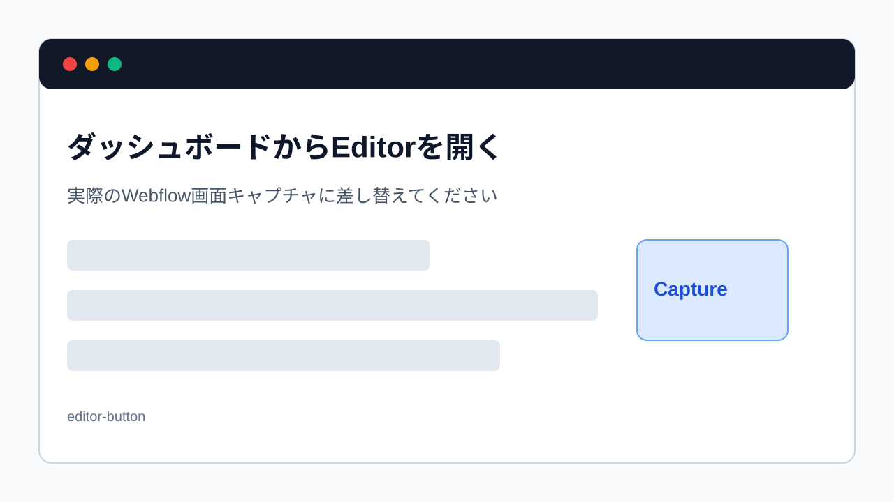 | 未撮影 |
| B. エディター | `src/content/docs/02-editor/01-open-legacy-editor.md` | Content Editor（旧バージョン）を開く入口（補足） |  | 低優先 |
| B. エディター | `src/content/docs/02-editor/02-open-content-editor.md` | Content Editor（最新版）を開いた画面 | 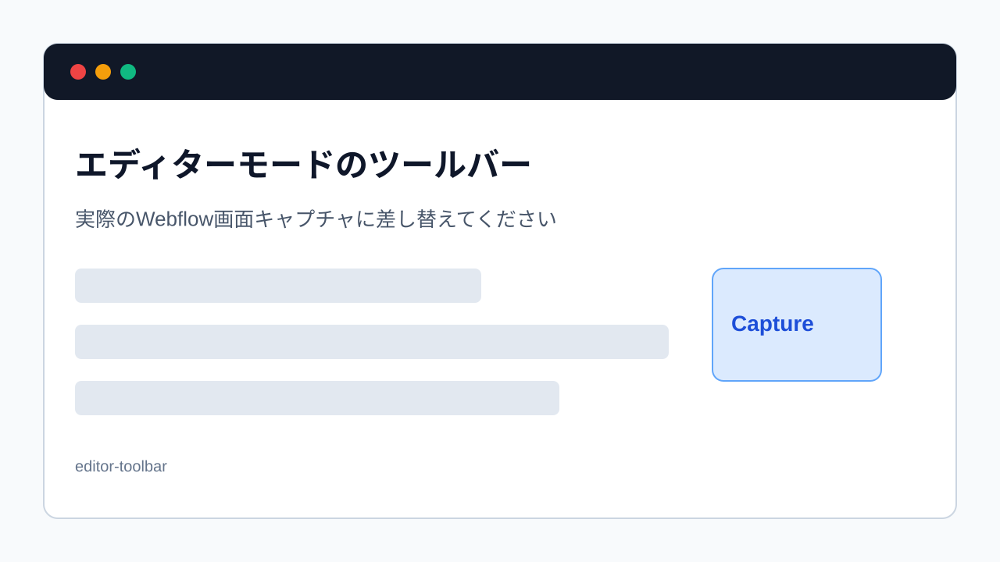 | 未撮影 |
| B. エディター | `src/content/docs/02-editor/03-edit-text.md` | テキスト編集の合図 |  | 未撮影 |
| B. エディター | `src/content/docs/02-editor/04-bold-text.md` | 太字設定メニュー | 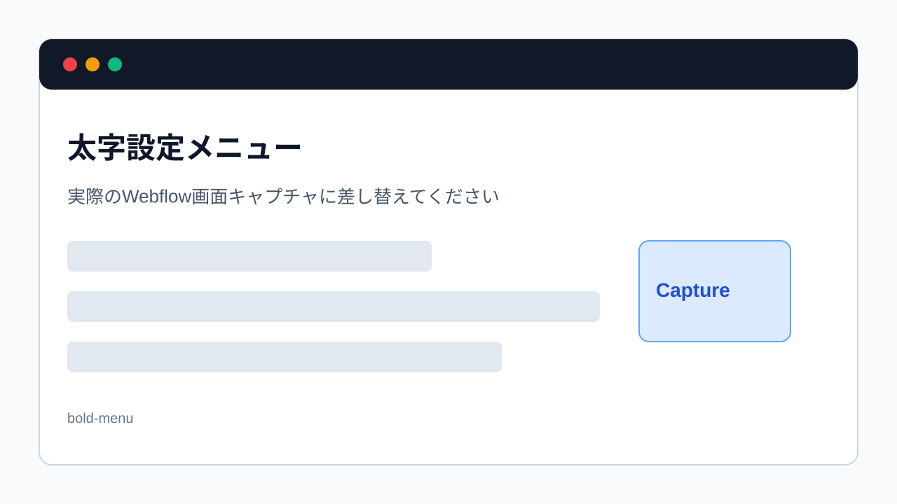 | 未撮影 |
| B. エディター | `src/content/docs/02-editor/05-add-link.md` | リンク設定画面 | 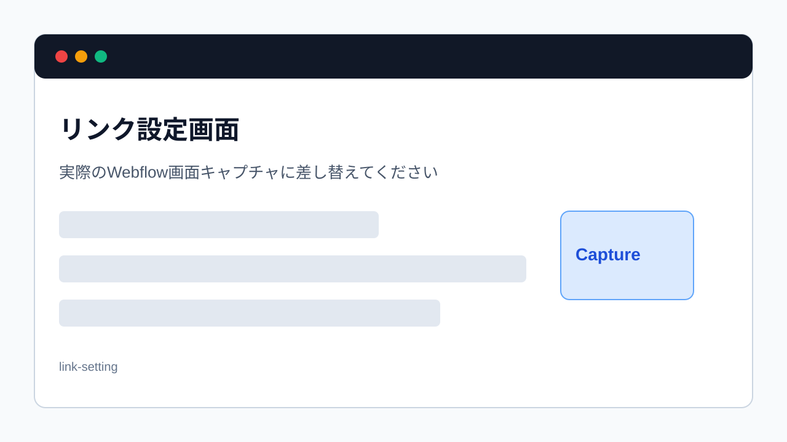 | 未撮影 |
| B. エディター | `src/content/docs/02-editor/06-replace-image.md` | 画像編集の合図 | 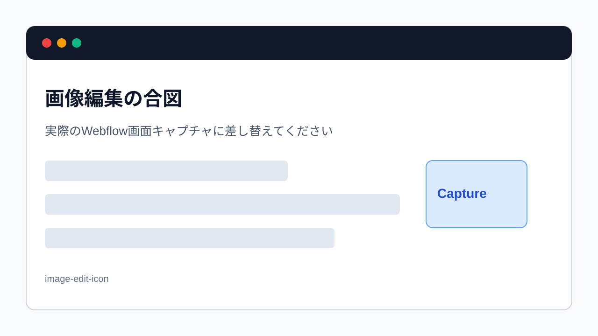 | 未撮影 |
| B. エディター | `src/content/docs/02-editor/07-edit-link-url.md` | リンク設定を開く | 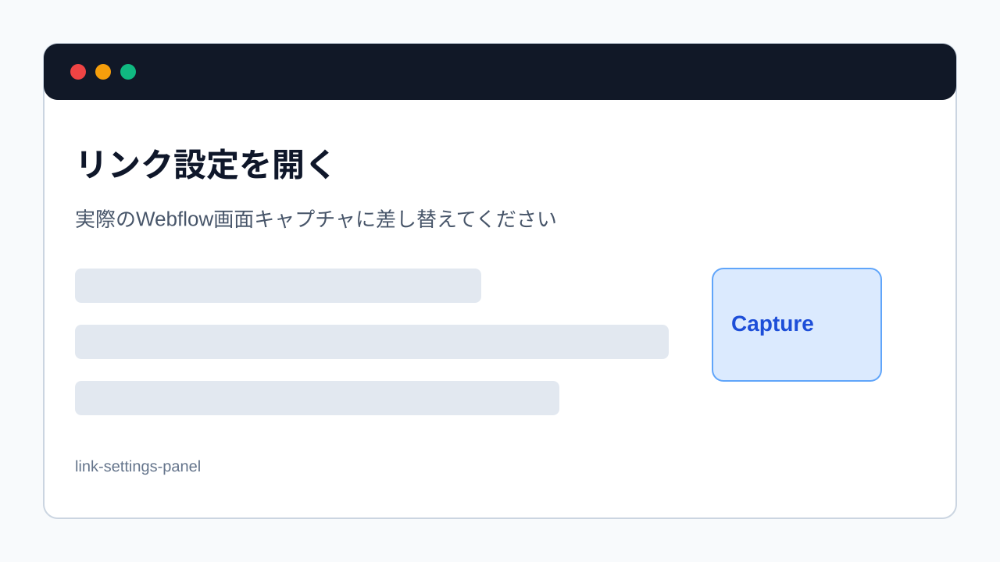 | 未撮影 |
| B. エディター | `src/content/docs/02-editor/08-save-and-publish.md` | Publishボタン |  | 未撮影 |
| C. CMS更新 | `src/content/docs/03-cms/01-where-is-cms.md` | Collectionsタブ |  | 未撮影 |
| C. CMS更新 | `src/content/docs/03-cms/02-create-new-post.md` | 新規追加ボタン |  | 未撮影 |
| C. CMS更新 | `src/content/docs/03-cms/03-post-title.md` | タイトル入力欄 | 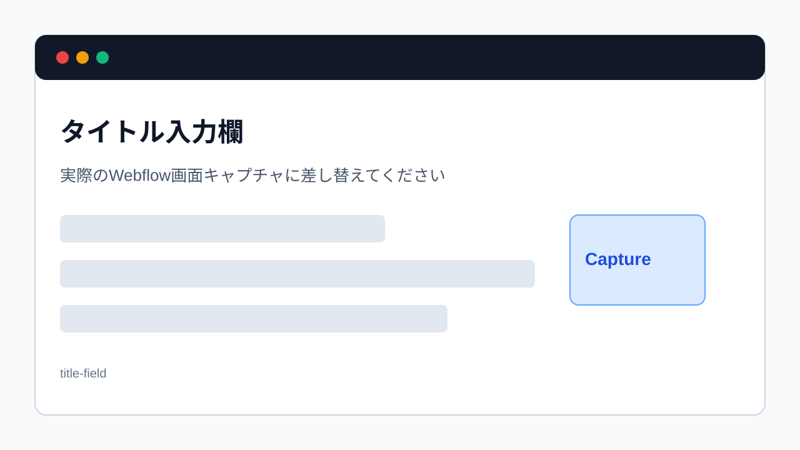 | 未撮影 |
| C. CMS更新 | `src/content/docs/03-cms/04-thumbnail-image.md` | アイキャッチ画像設定欄 | 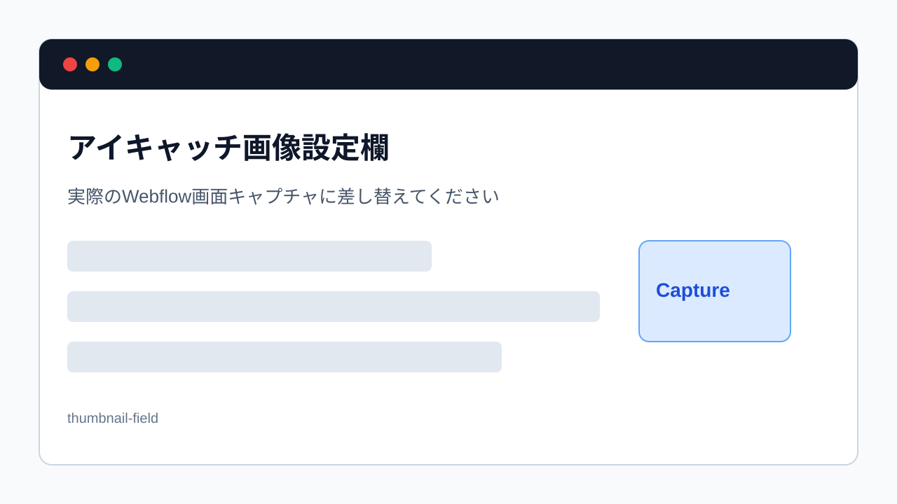 | 未撮影 |
| C. CMS更新 | `src/content/docs/03-cms/05-post-category.md` | ドロップダウン選択 | 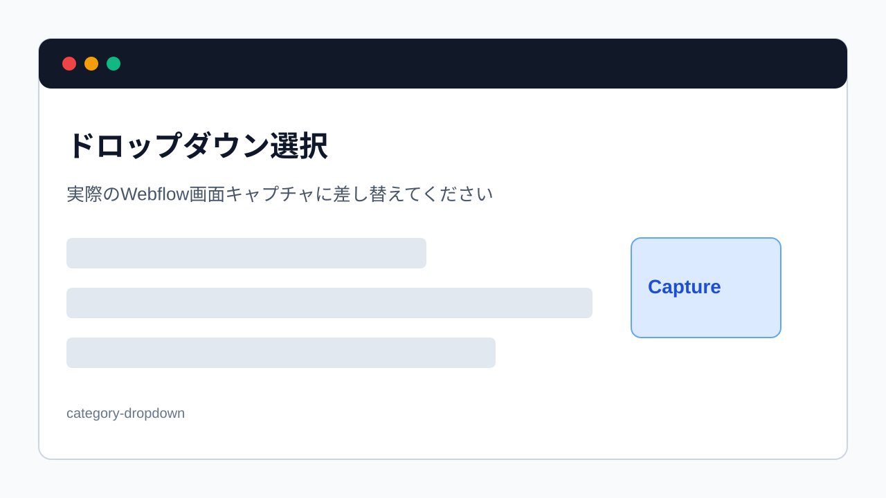 | 未撮影 |
| C. CMS更新 | `src/content/docs/03-cms/05-post-category.md` | 複数選択 | 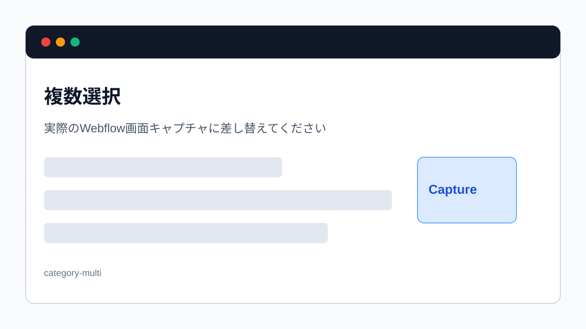 | 未撮影 |
| C. CMS更新 | `src/content/docs/03-cms/06-write-body.md` | リッチテキストフィールド |  | 未撮影 |
| C. CMS更新 | `src/content/docs/03-cms/06-write-body.md` | リッチテキストツールバー |  | 未撮影 |
| C. CMS更新 | `src/content/docs/03-cms/07-bold-italic-body.md` | 文字装飾メニュー |  | 未撮影 |
| C. CMS更新 | `src/content/docs/03-cms/08-headings.md` | 見出し設定メニュー |  | 未撮影 |
| C. CMS更新 | `src/content/docs/03-cms/09-bullet-list.md` | リスト作成メニュー | 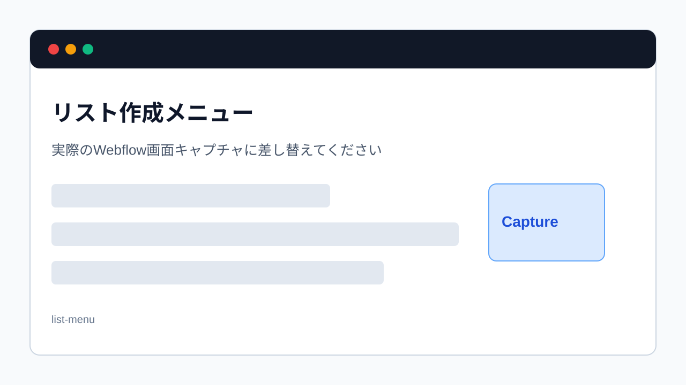 | 未撮影 |
| C. CMS更新 | `src/content/docs/03-cms/10-insert-image.md` | メディア挿入メニュー |  | 未撮影 |
| C. CMS更新 | `src/content/docs/03-cms/11-resize-image.md` | 画像サイズ変更メニュー | 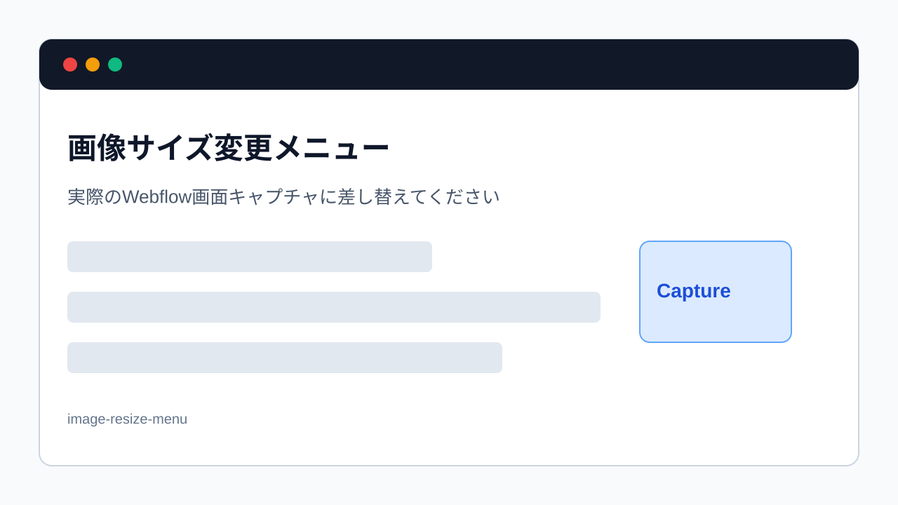 | 未撮影 |
| C. CMS更新 | `src/content/docs/03-cms/12-embed-youtube.md` | YouTube共有URLコピー | 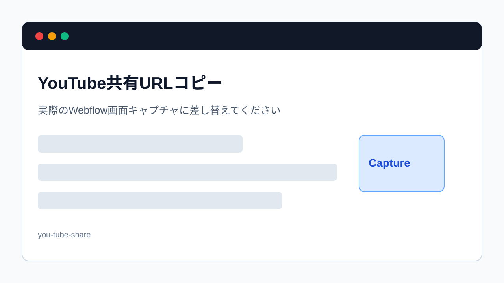 | 未撮影 |
| C. CMS更新 | `src/content/docs/03-cms/13-body-link.md` | リッチテキストリンク設定 | 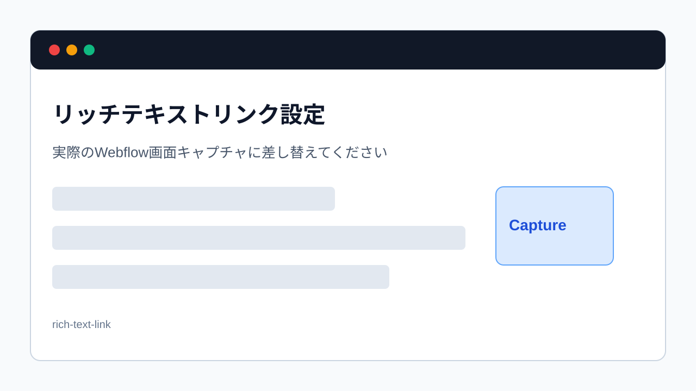 | 未撮影 |
| C. CMS更新 | `src/content/docs/03-cms/14-publish-date.md` | 公開日設定フィールド | 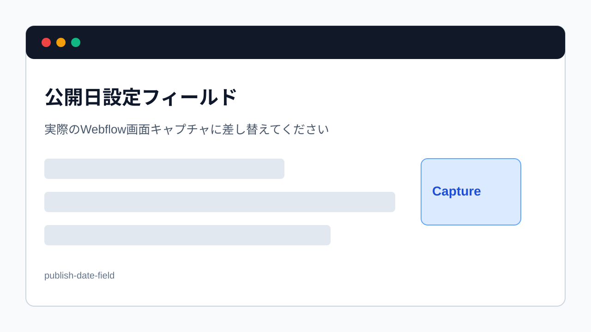 | 未撮影 |
| C. CMS更新 | `src/content/docs/03-cms/15-schedule-publish.md` | 予約公開ボタン | 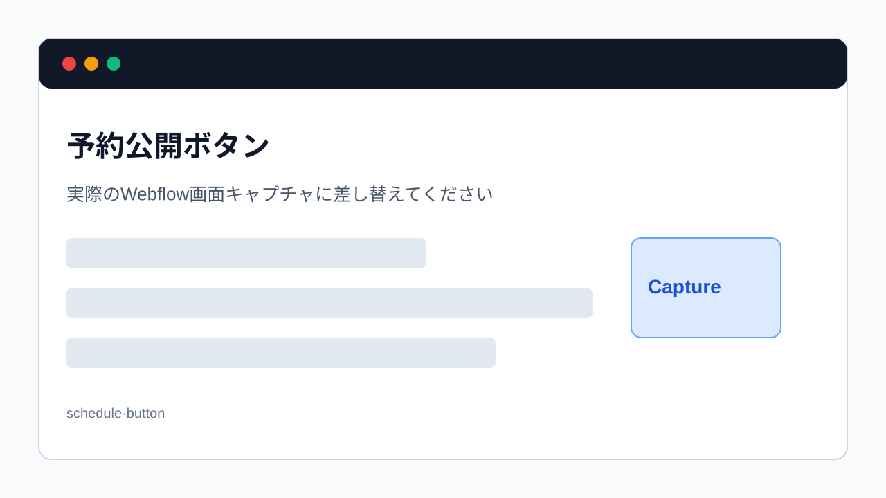 | 未撮影 |
| C. CMS更新 | `src/content/docs/03-cms/16-save-as-draft.md` | 下書き保存ボタン |  | 未撮影 |
| C. CMS更新 | `src/content/docs/03-cms/17-publish-draft.md` | 公開ボタン |  | 未撮影 |
| C. CMS更新 | `src/content/docs/03-cms/18-edit-published.md` | 変更を保存ボタン | 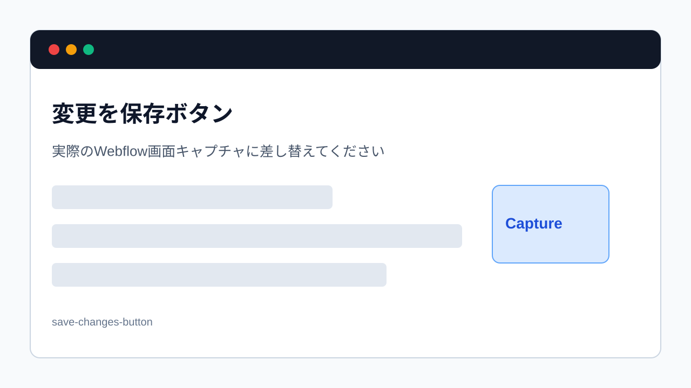 | 未撮影 |
| C. CMS更新 | `src/content/docs/03-cms/19-unpublish.md` | 非公開メニュー |  | 未撮影 |
| C. CMS更新 | `src/content/docs/03-cms/20-archive-post.md` | アーカイブボタン |  | 未撮影 |
| C. CMS更新 | `src/content/docs/03-cms/21-delete-post.md` | 削除ボタン | 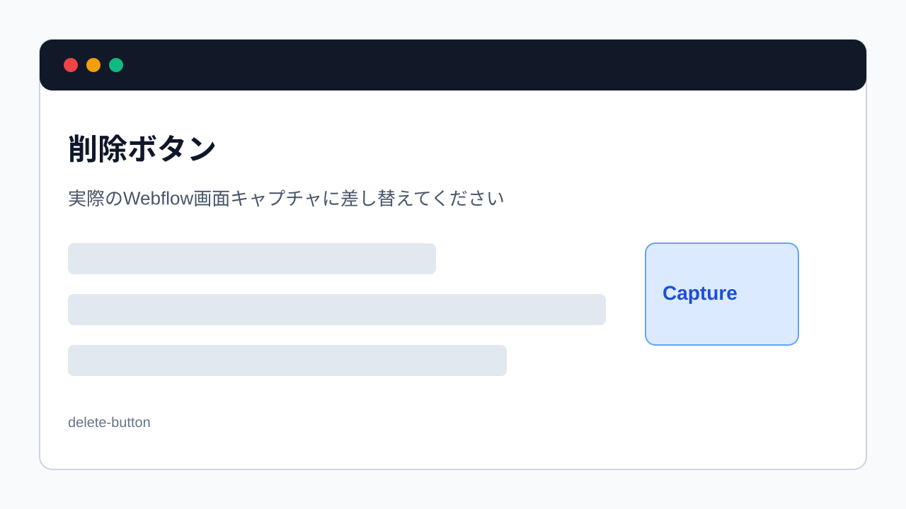 | 未撮影 |
| D. デザイナー | `src/content/docs/04-designer/01-designer-warning.md` | デザイナーボタン |  | 未撮影 |
| D. デザイナー | `src/content/docs/04-designer/05-asset-panel.md` | アセットパネルアイコン |  | 未撮影 |
| D. デザイナー | `src/content/docs/04-designer/07-publish-button.md` | デザイナーPublishボタン |  | 未撮影 |
| E. 便利な設定 | `src/content/docs/05-settings/01-seo-title.md` | 検索結果のページタイトル |  | 未撮影 |
| E. 便利な設定 | `src/content/docs/05-settings/02-seo-description.md` | 検索結果のページ説明文 | 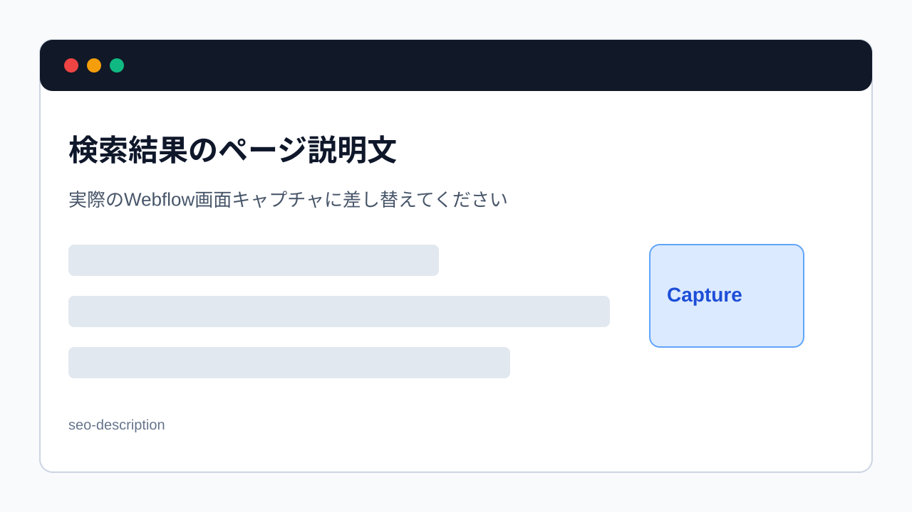 | 未撮影 |
| E. 便利な設定 | `src/content/docs/05-settings/03-ogp-image.md` | OGP表示例 |  | 未撮影 |
| E. 便利な設定 | `src/content/docs/05-settings/04-form-submissions.md` | フォームメニュー | 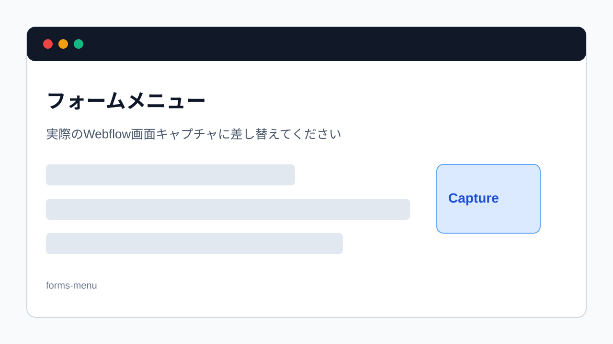 | 未撮影 |
| E. 便利な設定 | `src/content/docs/05-settings/05-form-notification-email.md` | 通知メール設定 | 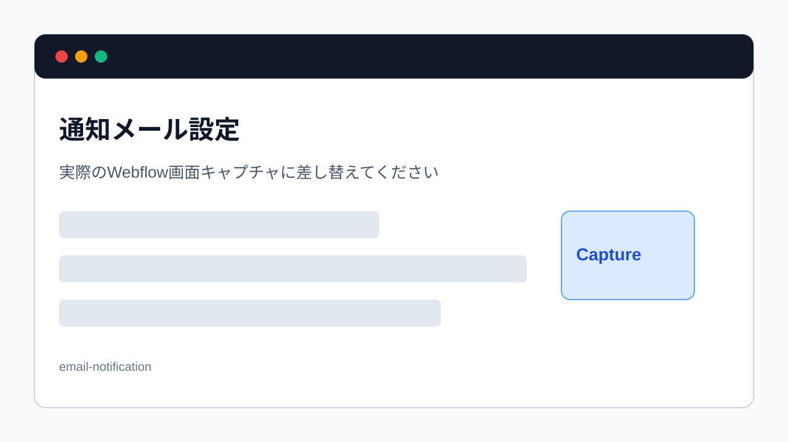 | 未撮影 |
| E. 便利な設定 | `src/content/docs/05-settings/06-form-csv-download.md` | CSVエクスポートボタン | 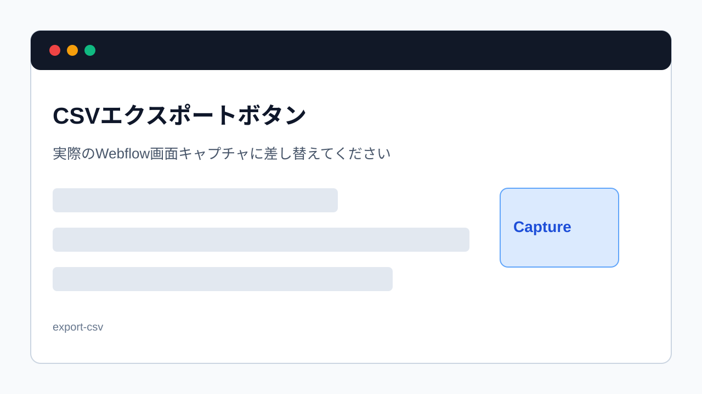 | 未撮影 |
| F. トラブル解決 | `src/content/docs/06-troubleshooting/04-404-not-found.md` | 404 Not Found |  | 未撮影 |
| F. トラブル解決 | `src/content/docs/06-troubleshooting/05-backup-restore.md` | バックアップメニュー | 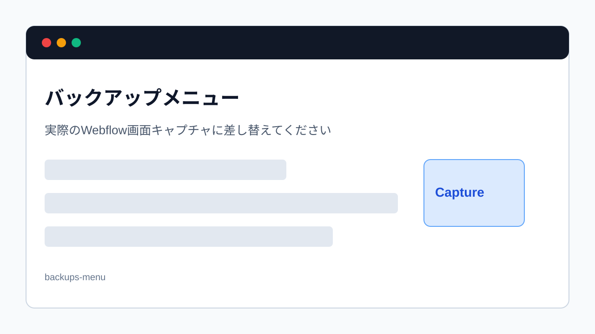 | 未撮影 |
