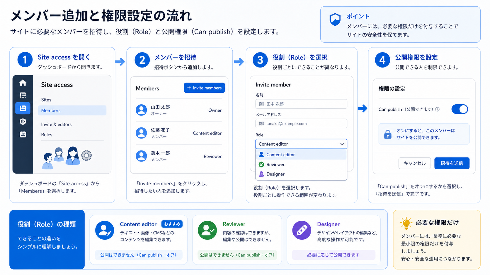

:::note[図解の見方]
招待前に、何をしてほしい人なのかを先に決めます。
:::

## 概要

Webflowでは、メンバーごとにできる作業範囲が変わります。普段の更新担当者には、文章・画像・CMSを更新できる範囲の権限を付けるのが基本です。

権限を強くしすぎると、DesignerやSettingsでサイト全体に影響する操作ができてしまいます。追加前に「その人が何を更新する担当か」を確認しましょう。

## 追加前に確認すること

1. 追加したい人のメールアドレスを確認します。
2. その人が担当する作業を確認します。
3. 必要な権限だけを選びます。
4. Publish権限を付けるかどうかを管理者に確認します。

:::caution[Publish権限]
Publish権限があると、変更内容を公開サイトへ反映できます。権限を付ける前に、公開判断を任せてよい担当者か確認してください。
:::

## 権限の目安

| 担当作業 | 推奨する考え方 |
| --- | --- |
| テキスト・画像更新 | Content editor roleを優先します |
| ブログ・お知らせ更新 | CMSを編集できる権限を確認します |
| レイアウト変更 | Designer権限が必要か制作担当者に確認します |
| 請求・ドメイン変更 | 管理者または制作担当者が対応します |

## 次に進む

次は [A-0-5. サイトの修正画面に入る方法](/01-getting-started/00-open-site/) を確認してください。
