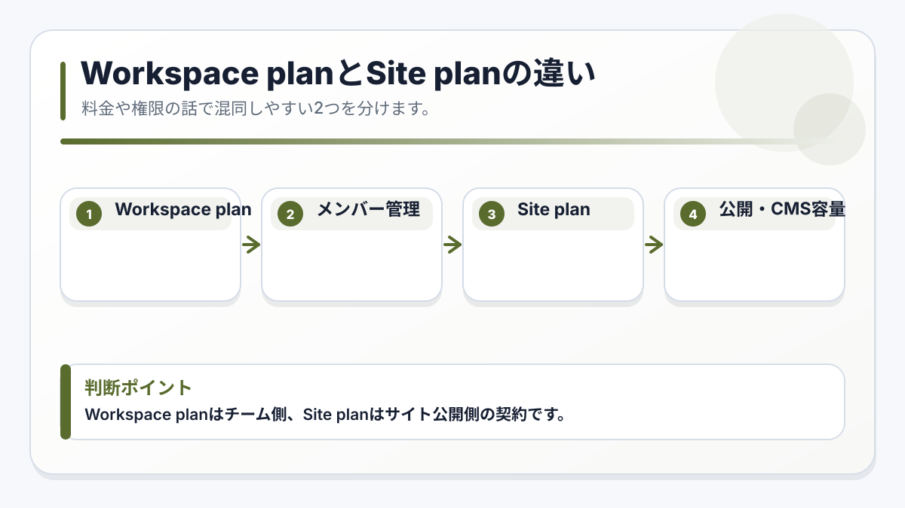

# A-0-6. プラン・権限で迷ったときの見方

:::note[図解の見方]
Workspace planはチーム側、Site planはサイト公開側の契約です。
:::

## 概要

Webflowでは、Workspace plan、Site plan、Seat、Roleという似た言葉が出てきます。どれも「権限」や「契約」に関係しますが、意味は別です。

更新担当者は、細かい料金判断を自分で行う必要はありません。まず「これはWorkspaceの話か」「サイト個別の話か」「人を追加する話か」を分けて見ることをお勧めします。

:::caution[請求に関わる操作]
Upgrade、Billing、Plan変更、Seat購入、Domain設定などは請求や公開状態に関係する可能性があります。更新担当者だけで進めず、社内管理者または制作担当者に確認してください。
:::

## 4つの言葉の違い

| 用語 | 何の話か | 例 |
| --- | --- | --- |
| Workspace plan | チーム全体の作業場所や共同作業の契約 | Workspace内のサイト数、共同作業、権限管理 |
| Site plan | 1つのWebサイトを公開・運用するための契約 | 独自ドメイン、CMS、フォーム、公開サイト |
| Seat | Webflowを使う「人」の枠 | 管理者、編集担当者、Reviewerなど |
| Role | その人ができる操作範囲 | Content editor、Designer、Adminなど |

## 判断のしかた

### 人を追加したい場合

Members、Invite、Seat、Roleが関係します。招待する前に、追加したい人が何をする担当者なのかを決めます。

- 文章・画像・CMS更新だけを行う人: Content editor系の権限を検討します
- デザインやレイアウトも触る人: Designer系の権限が関係します
- 契約、請求、権限管理も行う人: Admin系の権限が関係します

:::tip[最小権限で始める]
通常のクライアント運用では、必要以上に強い権限を付けないことをお勧めします。日常更新だけなら、まずContent editor roleで足りるか確認してください。
:::

### サイトを公開したい場合

Site planやPublishing設定が関係します。独自ドメイン、CMS、フォーム、公開先ドメインはサイトごとに確認します。

### Workspaceの上限や共同作業で迷った場合

Workspace planが関係します。Workspace planは、サイトを置く場所や共同作業の機能に関わります。Webflowのプラン内容は変わることがあるため、最終判断はWebflow公式のPricingまたはHelp Centerで確認してください。

## 触る前に相談する操作

| 画面や操作 | 相談が必要な理由 |
| --- | --- |
| Billing | 請求、支払い方法、契約に関わります |
| Upgrade / Downgrade | プラン変更に関わります |
| Buy seat / Add seat | メンバー追加費用に関わる場合があります |
| Domain / DNS | サイトの表示に関わります |
| Transfer | 所有権や管理場所に関わります |
| Site plan変更 | CMS、フォーム、公開状態に影響する可能性があります |

## 公式情報を確認する場所

Webflowのプランや権限は変更されることがあります。2026年5月時点では、以下のWebflow公式Help Centerで最新情報を確認できます。

- [Choose a Workspace plan](https://help.webflow.com/hc/en-us/articles/33961218263059-Choose-a-Workspace-plan)
- [Workspace and Site plans overview](https://help.webflow.com/hc/en-us/articles/33961379128723)
- [Roles and permissions overview](https://help.webflow.com/hc/en-us/articles/33961273067411-Roles-and-permissions-overview)
- [Site roles and permissions](https://help.webflow.com/hc/en-us/articles/41015796747667-Site-roles-and-permissions)

## 次に進む

メンバー追加の具体的な手順は [A-0-4. メンバー追加と権限](/01-getting-started/00-add-member/) を確認してください。サイトの修正画面に入る場合は [A-0-5. サイトの修正画面に入る方法](/01-getting-started/00-open-site/) に進んでください。
