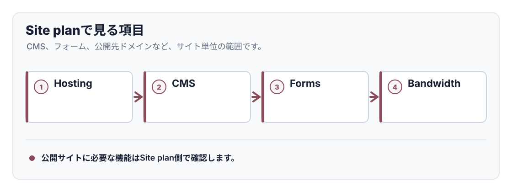

# A-0-3. サイトプランとの違い

:::note[図解の見方]
公開サイトに必要な機能はSite plan側で確認します。
:::

## 概要

Webflowには、WorkspaceプランとSite planがあります。名前が似ていますが、役割は別です。

Workspaceプランは「チームやメンバー管理」のためのプランです。Site planは「公開中のWebサイトを運用する」ためのプランで、CMSやフォーム、独自ドメインなどに関係します。

:::note[キャプチャー指示]
撮影する画面: Site settings内のPlansまたはPublishing周辺で、Site planやCMS Hosting / Business Hostingが分かる画面。
保存ファイル名: `a-08-site-plan-settings.png`
撮影直前の状態: 対象サイトのSite settingsを開き、プラン名や公開設定が表示されている状態。
必ず写すもの: 対象サイト名、Site settingsであること、Site plan名または公開設定。
写さないもの: 請求情報、カード情報、他サイトの情報。
:::

## 違い

| 種類 | 関係するもの | 例 |
| --- | --- | --- |
| Workspaceプラン | メンバー、権限、チーム管理 | メンバーを追加できる人数 |
| Site plan | サイト公開、CMS、フォーム、独自ドメイン | CMS Hosting、Business Hosting |

:::tip[覚え方]
人を増やす話はWorkspace、サイトを公開・運用する話はSite planと覚えると判断しやすくなります。
:::

## 相談が必要なケース

- CMS記事数やフォーム送信数の上限が気になる
- 独自ドメインや公開先を変更したい
- Workspaceに新しいメンバーを追加したい
- BillingやUpgradeの画面が表示された

## 次に進む

次は [A-0-4. メンバー追加と権限](/01-getting-started/00-add-member/) を確認してください。
