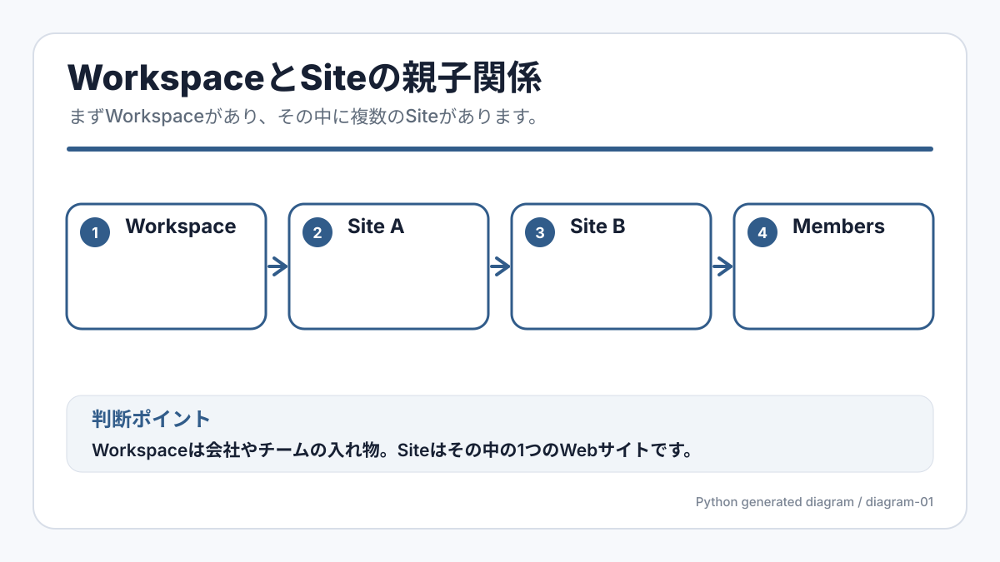

# A-0-1. ワークスペースとは

:::note[図解の見方]
Workspaceは会社やチームの入れ物。Siteはその中の1つのWebサイトです。
:::

## 概要

Workspaceは、Webflowで複数のサイト、メンバー、権限、プランをまとめて管理する単位です。Morbidoの場合は `morbido's Workspace` の中に `Morbido JA Site` などのサイトが入っている、という見方をします。

サイトを更新する時は、まず「どのWorkspaceの、どのサイトを開いているか」を確認すると迷いにくくなります。

:::note[キャプチャー指示]
撮影する画面: Webflow Dashboardで `morbido's Workspace` と対象サイトカードが見えている画面。
保存ファイル名: `a-06-morbido-workspace-overview.png`
撮影直前の状態: Dashboardの読み込み完了後、Workspace名とサイトカードが表示されている状態。
必ず写すもの: Workspace名、対象サイト名、サイトカード、Dashboardであることが分かる左メニューまたは上部UI。
写さないもの: 個人メールアドレス、他社サイト名、請求情報、不要な通知。
:::

## Workspaceで管理するもの

- サイトの一覧
- メンバーと権限
- Workspaceのプラン
- サイトごとの設定画面への入口

:::tip[最初に確認すること]
似た名前のWorkspaceやテストサイトがある場合は、編集前にWorkspace名とサイト名を確認しましょう。間違ったサイトを開くと、別環境を更新してしまう可能性があります。
:::

## サイトとの関係

Workspaceは「会社やチームの管理棚」、サイトは「その棚に入っている個別のWebサイト」と考えると分かりやすいです。

1. Webflowにログインします。
2. DashboardでWorkspace名を確認します。
3. 更新したいサイトカードを探します。
4. そのサイトカードからEditor、Designer、Settingsなどに進みます。

## 次に進む

次は [A-0-2. ワークスペースのプラン](/01-getting-started/00-workspace-plan/) を確認してください。
