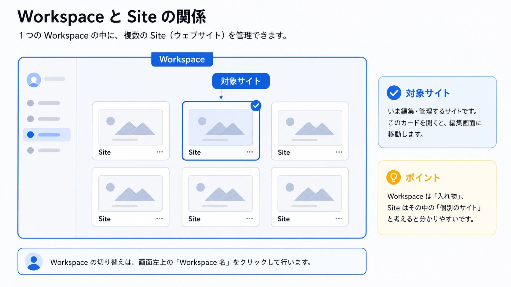
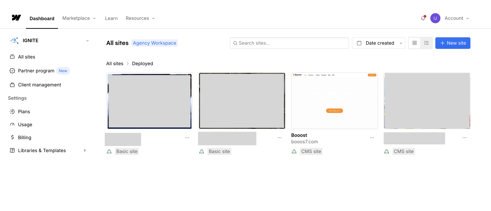
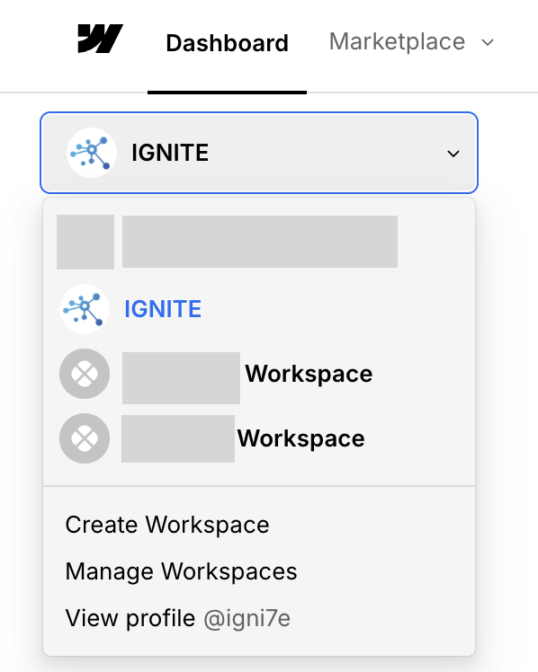
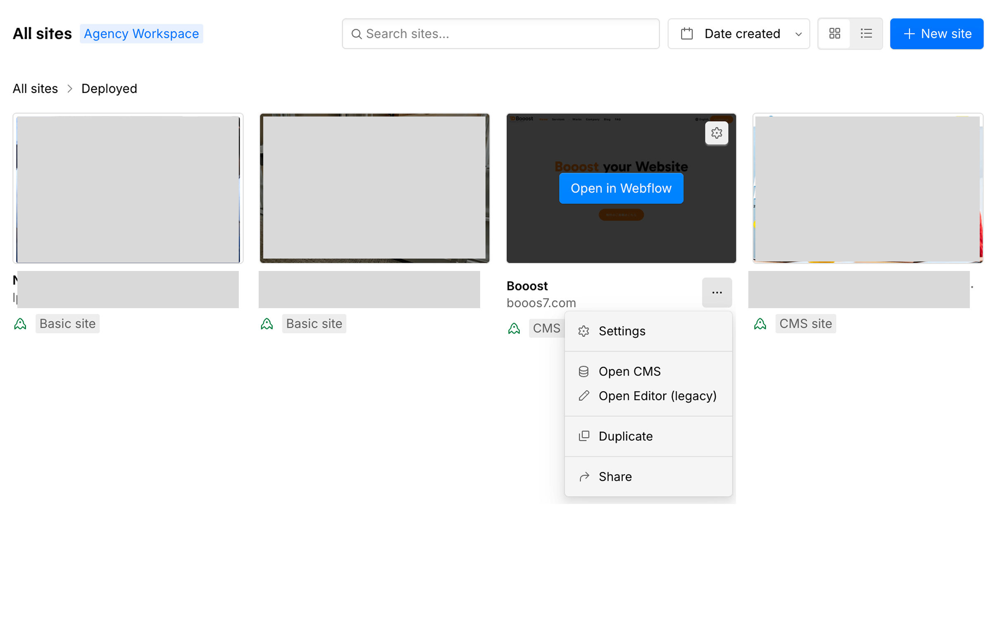

:::note[図解の見方]
Workspaceは会社やチームの入れ物。Siteはその中にある個別のWebサイトです。作業前に、正しいWorkspace内の正しいSite cardを選んでいるか確認します。
:::

## 概要

Workspaceは、Webflowで複数のサイト、メンバー、権限、プランをまとめて管理する単位です。Booostの場合は `Booost Workspace` の中に `Booost JA Site` などのサイトが入っている、という見方をします。

サイトを更新する時は、まず「どのWorkspaceの、どのサイトを開いているか」を確認すると迷いにくくなります。

ログイン直後のDashboardでは、Workspace内のサイトが一覧表示されます。

左上のWorkspace名をクリックすると、別のWorkspaceに切り替えられます。

各サイトカードの「…」メニューから、Settings・CMSなどの入口を開けます。通常の文章・画像更新は、最新版のContent editor roleで開く導線を優先してください。

## Workspaceで管理するもの

- サイトの一覧
- メンバーと権限
- Workspaceのプラン
- サイトごとの設定画面への入口

:::tip[最初に確認すること]
似た名前のWorkspaceやテストサイトがある場合は、編集前にWorkspace名とサイト名を確認しましょう。間違ったサイトを開くと、別環境を更新してしまう可能性があります。
:::

## サイトとの関係

Workspaceは「会社やチームの管理棚」、サイトは「その棚に入っている個別のWebサイト」と考えると分かりやすいです。

1. Webflowにログインします。
2. DashboardでWorkspace名を確認します。
3. 更新したいサイトカードを探します。
4. そのサイトカードからEditor、Designer、Settingsなどに進みます。

## 次に進む

次は [A-0-2. ワークスペースのプラン](/01-getting-started/00-workspace-plan/) を確認してください。
