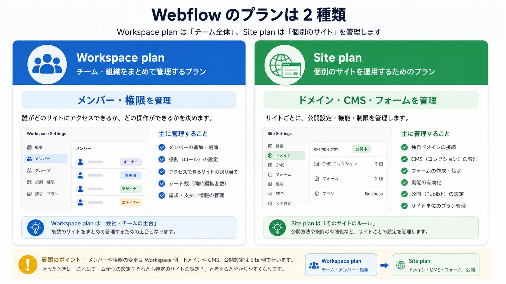
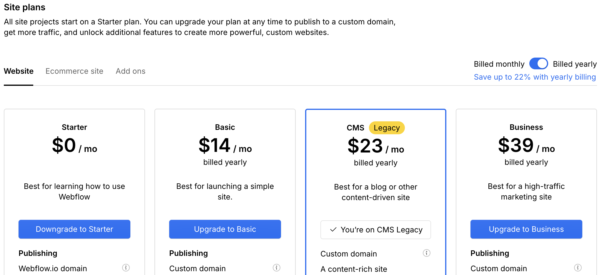
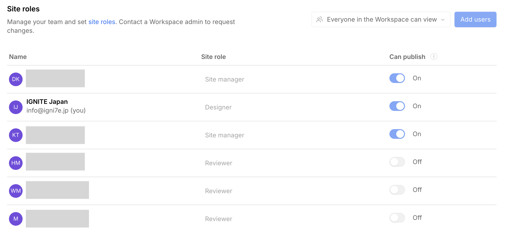
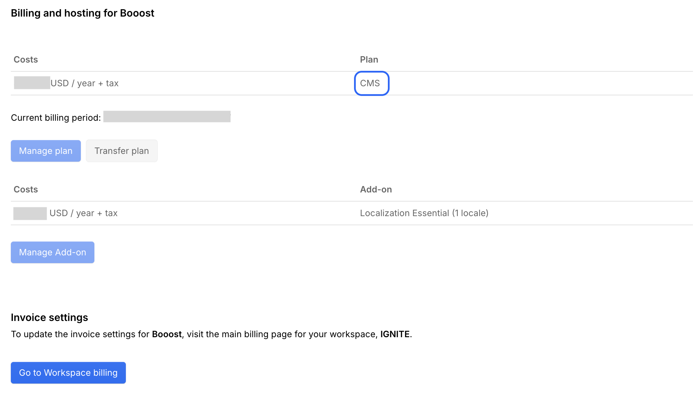

:::note[図解の見方]
Workspace planでは、メンバー数、Seat、Roleなどチームとして使える範囲を確認します。Domain、CMS、フォームなどはSite plan側で確認します。
:::

## 概要

Workspaceプランは、チームとしてWebflowを使うための契約です。メンバーを何人まで追加できるか、どの権限を使えるかに関係します。

無料プランでは人数や権限に制限があります。追加メンバーが必要になった場合は、サイト更新の担当者だけで判断せず、社内管理者または制作担当者に確認してください。

プラン画面では、Starter / Basic / CMS / Businessなどの料金とできることを比較できます。

メンバーごとの役割（Site role）と公開権限は、Members / Site rolesの一覧で確認します。

現在のプランやアドオン、請求内容はBilling and hostingで確認できます。

## 確認するポイント

1. Workspace名が正しいか確認します。
2. MembersまたはPlanの画面を開きます。
3. 追加できるメンバー数や現在のプランを確認します。
4. 人数追加が必要な場合は、管理者に相談します。

:::caution[請求に関わる操作]
Upgrade、Billing、Plan変更などは請求に関わる可能性があります。更新担当者だけで押さず、必ず社内管理者または制作担当者に確認してください。
:::

## よくある判断

| 状況 | 判断 |
| --- | --- |
| 新しい担当者を1名追加したい | まず現在のメンバー数とプランを確認します |
| 複数人で同時に更新したい | Workspaceプランの制限を確認します |
| 請求画面が出てきた | その場で進めず、管理者に確認します |

## 次に進む

次は [A-0-3. サイトプランとの違い](/01-getting-started/00-site-plan/) を確認してください。SeatやRoleの違いで迷う場合は [A-0-6. プラン・権限で迷ったときの見方](/01-getting-started/00-plan-role-decision/) も確認してください。
