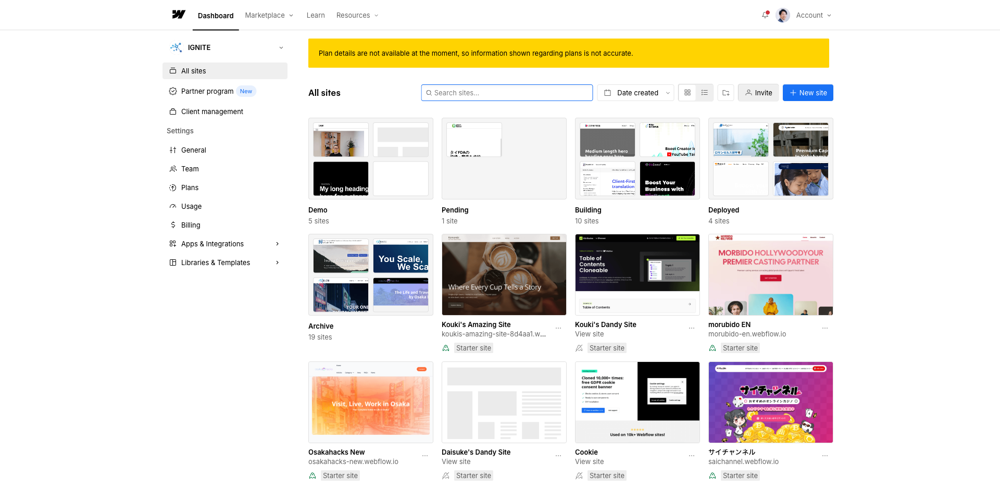

<!-- capture-callout:start -->
:::note[キャプチャー指示]
このページには、撮影後に `src/assets/captures/manual/a-04-webflow-invitation-email.png` を入れてください。
撮影対象: A-04「Webflow招待メールの見本」。`Accept Invitation` が分かること。実メールアドレスや個人名は隠す

Webflow画面は数秒待ってから撮影し、Loading表示、個人情報、未公開情報が写っていない画像だけを使います。
:::
<!-- capture-callout:end -->

<!-- body-callout:start -->
:::note[個人情報の取り扱い]
フォーム送信内容や通知先メールアドレスには個人情報が含まれることがあります。画面共有やキャプチャーを送る時は、氏名、メールアドレス、問い合わせ本文が必要以上に写らないようにしてください。
:::
<!-- body-callout:end -->


> 旧マニュアル番号: [No.1](/01-getting-started/01-invitation-email/)

Webサイトの更新作業を始めるにあたり、最初に行うのがWebflowからの招待メールの確認とアカウント設定です。このマニュアルでは、その最初のステップである「招待メールの確認方法」について詳しく解説します。

---

## 1. なぜこの作業が必要なの？

お客様がご自身のWebサイトを安全に更新できるように、管理者または制作会社がお客様用のWebflowアカウントを招待します。通常の更新担当者には、文章・画像・CMS記事を更新できる <strong>Content editor</strong> などのSite roleが割り当てられます。

この招待メールは、そのアカウントを有効にするための「招待状」です。メール内のリンクをクリックしてアカウント設定を完了することで、初めてサイトの編集画面にログインできるようになります。


*実画面例: 招待を承認してログインできるようになると、Dashboardで対象サイトを確認できるようになります。*

## 2. 招待メールの見本

Webflowからの招待メールは、通常以下のような件名と内容で届きます。

- 件名: `[Your Name] invited you to edit the [Site Name] site`
- 送信元: `Webflow` (`no-reply@webflow.com`)

メール本文の例:

```
--------------------------------------------------
[Site Name]
[Your Name] invited you to edit the [Site Name] site on Webflow.

[ Accept Invitation ] (← このボタンをクリックします)

Thanks,
The Webflow Team
--------------------------------------------------
```

## 3. 招待メールを確認する手順

1.  メールソフトを開く: 普段お使いのメールクライアント（Gmail, Outlookなど）を開きます。
2.  受信トレイを確認: Webflow (`no-reply@webflow.com`) からのメールが届いているか確認します。
3.  迷惑メールフォルダも確認: もし受信トレイに見当たらない場合は、迷惑メールフォルダやプロモーションフォルダに振り分けられている可能性もあります。そちらもご確認ください。
4.  メールを開く: 該当のメールを見つけたら、開いて内容を確認します。
5.  「Accept Invitation」ボタンをクリック: メール本文の中央にある青い「Accept Invitation」ボタンをクリックしてください。

## 4. 見つからない時に確認する場所

招待メールが見つからない場合は、いきなり再送依頼をする前に、次の場所を確認してください。

- 迷惑メールフォルダ
- プロモーション、ソーシャル、その他の受信トレイ
- 会社のメールセキュリティで隔離されているメール
- 招待されたメールアドレスと、普段見ているメールアドレスが同じか
- `Webflow`、`no-reply@webflow.com`、`invited you to edit` でメール検索した結果

それでも見つからない場合は、[IGNITE公式サイトのお問い合わせフォーム](https://igni7e.jp/contact/) から「Webflowの招待メールが届いていない」と連絡してください。その際、招待してほしいメールアドレスも一緒に伝えると、再送がスムーズです。

## 5. 押してよいボタン・押さないボタン

招待メールで押すのは、基本的に `Accept Invitation` です。メール内に別の広告、フッターリンク、利用規約リンクなどがある場合、それらはアカウント作成の入口ではありません。

> <strong>注意</strong>: Webflowに似せた不審なメールが届く可能性もゼロではありません。送信元やURLに不安がある場合は、リンクを押す前に [IGNITE公式サイトのお問い合わせフォーム](https://igni7e.jp/contact/) から確認してください。

## 6. よくある質問 (Q&A)

<details>
<summary>招待メールが届いていません。どうすればいいですか？</summary>

まずは迷惑メールフォルダをご確認ください。それでも見つからない場合は、お手数ですが [IGNITE公式サイトのお問い合わせフォーム](https://igni7e.jp/contact/) から「Webflowの招待メールが届いていない」旨をご連絡ください。再送手続きをいたします。

</details>

<details>
<summary>招待メールの有効期限はありますか？</summary>

はい、招待メールには有効期限が設定されている場合があります。メールが届いたら、なるべく早めにアカウント設定を進めることをお勧めします。もし期限が切れてしまった場合は、同様に [IGNITE公式サイトのお問い合わせフォーム](https://igni7e.jp/contact/) から再送をご依頼ください。

</details>

---

次のステップ:
このメールの確認が終わったら、次は「[No.2](/01-getting-started/02-create-account/) 招待メールからアカウントを作成し、パスワードを設定する方法」に進みます。
