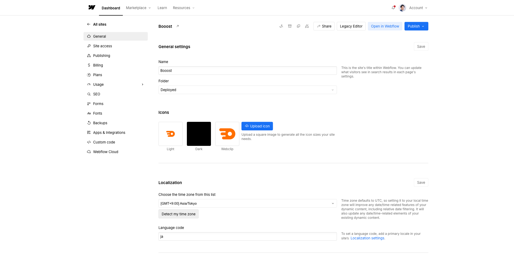

<!-- capture-callout:start -->
:::note[キャプチャー指示]
このページには、撮影後に以下のキャプチャーを入れてください。
- A-01: `src/assets/captures/manual/a-01-dashboard-site-list.png`。Webflow Dashboardのサイト一覧。対象サイトカード、Workspace名、サイト名が分かる状態。個人名は写っても問題ない範囲に調整
- A-02: `src/assets/captures/manual/a-02-site-card-hover-actions.png`。対象サイトカードにカーソルを合わせ、開くボタンが出た状態。`Open in Webflow`、設定メニュー、Designerなどの違いが分かる状態
- A-03: `src/assets/captures/manual/a-03-site-settings-left-menu.png`。対象サイトのSite settings左メニュー。General、Publishing、SEO、Forms、Backupsなどが見える状態

Webflow画面は数秒待ってから撮影し、Loading表示、個人情報、未公開情報が写っていない画像だけを使います。
:::
<!-- capture-callout:end -->

<!-- body-callout:start -->
:::tip[最初に見る場所]
迷った時は、まずDashboardで対象サイト名を確認します。似た名前のサイトやテスト環境がある場合は、編集前に正しいサイトか確認してから進めます。
:::
<!-- body-callout:end -->

> 旧マニュアル番号: [No.6](/01-getting-started/06-dashboard-overview/)

Webflowにログインすると、最初に表示されるのが「ダッシュボード」です。ここからサイトの編集や設定など、様々な操作を開始します。このマニュアルでは、ダッシュボードの基本的な画面構成と各部の役割について解説します。

---

## 1. ダッシュボードの全体像

Webflowのダッシュボードは、あなたがアクセス権を持つサイトの一覧が表示される場所です。複数のサイトに関わっている場合は、ここに複数のサイトが並びます。

通常、クライアントとして招待された場合は、編集対象のサイトが1つだけ表示されているはずです。

*実画面例: 対象サイトを開いた後のSite settings画面。左側にGeneral、Publishing、SEO、Formsなどのメニューが並びます。*

<strong>ダッシュボードの主な構成要素:</strong>

- <strong>サイト一覧:</strong> 中央に、あなたが編集できるサイトのサムネイル画像が表示されます。
- <strong>サイト名:</strong> 各サイトのサムネイルの下に、サイト名が表示されます。
- <strong>（右上の）アカウント設定:</strong> 画面右上のアイコンから、ご自身のアカウント情報（名前やパスワードの変更など）を編集できます。
- <strong>（左上の）Webflowロゴ:</strong> Webflowのホーム画面に戻るためのロゴです。

## 2. サイトを選択して編集を開始する

サイトの更新作業を始めるには、このダッシュボードから目的のサイトを選択する必要があります。

1.  <strong>サイトを探す:</strong>
    ダッシュボードに表示されているサイトの中から、編集したいサイトを見つけます。

2.  <strong>サイトにカーソルを合わせる:</strong>
    サイトのサムネイル画像の上にマウスカーソルを合わせます。

3.  <strong>「Open in Webflow」または編集用ボタンをクリック:</strong>
    カーソルを合わせると、いくつかのボタンが表示されます。2026年現在は、Content editor roleのユーザーもWebflow内のcanvasで編集する流れが基本です。表示されるボタン名はサイトや権限によって異なりますが、制作担当者から案内された編集用ボタンを開いてください。

    :::note[キャプチャー差し込み位置]
    ここには「ダッシュボードからWebflowを開く」が分かる実画面キャプチャーを入れてください。ページ上部のキャプチャー指示にある保存ファイル名へ差し替えます。
    :::

    
    *実画面例: サイトを開くと、左側メニューから設定やフォーム確認に進めます。*

## 3. 最初に押すボタン早見表

ログイン直後に迷った場合は、次の表で判断してください。

| やりたいこと | 押すもの | 押さないもの |
| --- | --- | --- |
| 文章を直したい | Open in Webflow / Content editing | Designer |
| 画像を差し替えたい | Open in Webflow / Content editing | Designer |
| ブログやお知らせを追加したい | CMS / Collections | Delete、Archive |
| サイトの設定を確認したい | Site settings | Billing、Transfer |
| 公開前に見た目を確認したい | Preview | Publish |

より詳しい判断は [ログイン直後に押すもの・押さないもの](/01-getting-started/11-after-login-first-steps/) を確認してください。

## 4. 「Content editor role」と「Designer」

Webflowでは、役割によってできることが変わります。日常更新では、Content editor roleで作業するのが基本です。

- <strong>Content editor role（コンテンツ更新担当）:</strong>
  -   <strong>普段の更新作業で使うモードです。</strong>
  -   文字の修正、画像の差し替え、お知らせやブログの投稿など、日常的な更新はすべてこのモードで行います。
  -   デザインやレイアウトを直接変更できないように制限されているため、安全に作業できます。

- <strong>Designer（デザイナー）:</strong>
  -   サイトの構造やデザインそのものを編集する、より専門的なモードです。
  -   Webサイト制作会社がサイトを構築する際に使用します。
  -   <strong>基本的に、クライアント様がこのモードを操作する必要はありません。</strong> 誤って操作すると、サイトのレイアウトが崩れるなどのトラブルの原因となります。

## 5. まとめ

- <strong>ダッシュボードは、サイト編集の入り口。</strong>
- <strong>サイトを更新する時は、Content editor roleでWebflowを開く。</strong>
- <strong>「Designer」は専門家用なので、触らないようにする。</strong>

---

<strong>次のステップ:</strong>
ダッシュボードの役割が理解できたところで、次は「[No.7](/01-getting-started/07-editor-vs-designer/) 【超重要】「エディター」と「デザイナー」の違いって何？」で、この2つのモードの違いについて、さらに詳しく学んでいきましょう。
