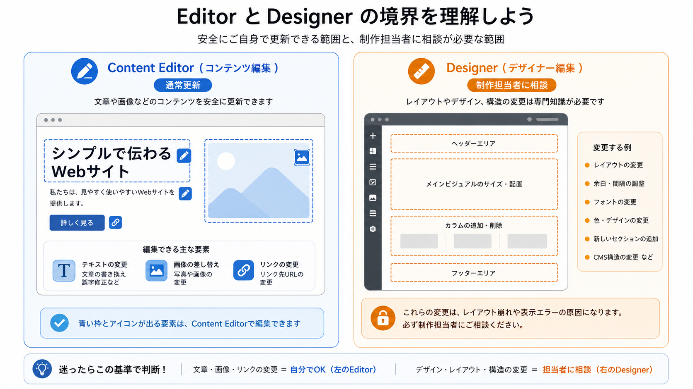

<!-- body-callout:start -->
:::tip[編集の基本]
コンテンツエディターでは、文章、画像、リンクなどの内容を安全に更新できます。レイアウトやデザインを変えたい時は、Designer操作が必要か確認してください。
:::
<!-- body-callout:end -->

Webflowでは、ユーザーごとにSite roleが割り当てられ、できる作業範囲が変わります。通常の更新で使う <strong>Content editor role</strong> と、制作・改修で使う <strong>Designer</strong> の違いを理解することは、安全かつ効率的にサイトを更新するために非常に重要です。
*実画面例: Designerは実際のサイトを見ながら構造やデザインまで触れる画面です。通常更新では必要な時だけ使います。*

---

## 1. 結論：普段の更新はContent editor roleでOK

まず最も重要なことをお伝えします。

<strong>ブログの投稿、お知らせの更新、文章の修正、画像の差し替えなど、日常的な更新作業はContent editor roleで行います。</strong>

「デザイナー」はサイトの骨格やデザインそのものを変更する強力なツールです。開いて画面を確認するだけで問題が起きるわけではありませんが、何かを選択・移動・削除・保存すると、サイト全体のレイアウトや表示に影響する可能性があります。普段の文章修正、画像差し替え、ブログ更新は、<strong>デザイナーではなくContent editor roleで行う</strong> のがお勧めです。

## 2. 各モードの役割を詳しく見てみよう

それぞれのモードの役割を、家のリフォームに例えてみましょう。

### Content editor role：インテリアコーディネーター

Content editor roleは、家の「内装」を変更する役割に似ています。

- <strong>できること:</strong>
  -   壁紙の色を変えるように、<strong>サイトの文字を書き換える</strong>
  -   家具を入れ替えるように、<strong>画像を差し替える</strong>
  -   本棚に新しい本を追加するように、<strong>ブログやお知らせ記事を投稿する</strong>
  -   ポスターを貼り替えるように、<strong>リンク先を変更する</strong>

- <strong>特徴:</strong>
  -   操作が直感的で分かりやすい。
  -   決められた範囲内での編集しかできないため、家の構造（サイトのレイアウト）を壊してしまう心配が少ない。
  -   <strong>安全に日々の更新作業を行うための役割です。</strong>

### Designer（デザイナー）：建築家・設計士

デザイナーは、家の「構造」そのものを設計・変更する役割に似ています。

- <strong>できること:</strong>
  -   壁を壊して新しい部屋を作るように、<strong>新しいページやセクションを追加する</strong>
  -   柱の位置を変えたり、窓の大きさを変更するように、<strong>サイトのレイアウトやデザインを根本から変更する</strong>
  -   電気の配線や水道管をいじるように、<strong>複雑なアニメーションや連携機能を設定する</strong>

- <strong>特徴:</strong>
  -   非常に多機能で専門的な知識が必要。
  -   操作を誤ると、家全体が傾いてしまうように、<strong>サイト全体のデザインが崩壊するリスクがある。</strong>
  -   <strong>Webサイト制作のプロが、サイトを構築・大規模改修するために使用するモードです。</strong>

## 3. デザイナーを開いた時の注意

デザイナーモードは、開くだけでサイトが変わる画面ではありません。画面構成を確認する、制作担当者から指示された場所を見る、といった目的で開くこと自体は問題ありません。

ただし、デザイナー上で要素を移動する、設定を変える、削除する、保存・Publishするなどの変更を加えた場合は、意図しない形でサイトに影響が出る可能性があります。制作担当者から明確な指示がない場合、普段の変更はContent editor roleで行い、デザイナーで変更する必要がある作業は事前に確認してください。

:::caution[変更した場合の責任範囲]
Designerで加えた変更は、レイアウト崩れや他ページへの影響につながることがあります。自分で判断して変更した場合、修正や復旧が追加対応になる可能性があります。迷った時は、変更前にスクリーンショットを撮って制作担当者へ確認してください。
:::

---

<strong>次のステップ:</strong>
これで2つの役割の違いが明確になりましたね。次からは、いよいよ実際の更新作業の中心となるContent editor roleでの使い方を学んでいきます。まずは「[普段の更新はContent editor roleでOKです](/01-getting-started/08-editor-only-recommendation/)」で、その安心感について再確認しましょう。

:::note[図解の見方]
文章や画像はEditor、レイアウト変更はDesignerです。
:::
