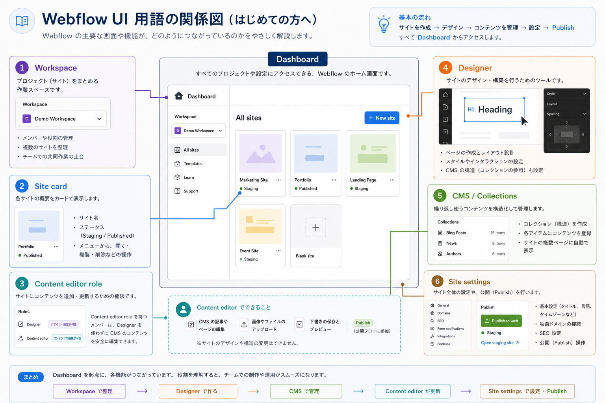

<!-- body-callout:start -->
:::tip[最初に見る場所]
迷った時は、まずDashboardで対象サイト名を確認します。似た名前のサイトやテスト環境がある場合は、編集前に正しいサイトか確認してから進めます。
:::
<!-- body-callout:end -->

Webflowでは、画面名やボタン名が英語で表示されることがあります。このページでは、初心者が最初に覚えておくと迷いにくい用語をまとめます。

Webflowの英語UIが不安な場合は、IGNITE提供の [Webflow 日本語化 Chrome拡張機能](https://chromewebstore.google.com/detail/webflow-%E6%97%A5%E6%9C%AC%E8%AA%9E%E5%8C%96/efenpjcceehojemnphkinocffloghhon) を使うと、DashboardやDesignerなどの管理画面を日本語で確認しやすくなります。
*実画面例: Dashboard、Designer、Site settingsなどの英語UIを見ながら、用語の意味を確認します。*

## 画面の名前

| 英語 | 日本語での意味 | 使う場面 |
| --- | --- | --- |
| Dashboard | 管理画面、サイト一覧 | ログイン直後に表示される入口 |
| Content editor role | コンテンツ更新用の役割 | 文章・画像・リンク・CMS投稿を更新する |
| Legacy Editor | 旧エディター画面 | 2026年8月4日から利用できなくなる予定 |
| Designer | 制作用の編集画面 | レイアウトやデザインを変更する |
| CMS | 記事やお知らせの管理機能 | ブログ、ニュース、導入事例などを追加する |
| Site settings | サイト設定 | SEO、フォーム、ドメインなどを確認する |

通常の更新では、まず <strong>Dashboard</strong> から対象サイトを選び、<strong>Content editor role</strong> でWebflowを開きます。<strong>Designer</strong> は影響範囲が大きいため、必要な時だけ開きます。

## よく押すボタン

| 英語 | 日本語での意味 | 注意点 |
| --- | --- | --- |
| Edit | 編集する | 文章や画像を変更する入口です |
| Save | 保存する | 保存だけでは公開されない場合があります |
| Publish | 公開する | 公開サイトに反映されます |
| Preview | 確認する | 公開前に見た目を確認します |
| Cancel | キャンセル | 変更をやめる時に使います |
| Delete | 削除する | 元に戻せない場合があります |
| Archive | アーカイブする | 一覧から外す、非表示に近い操作です |

## CMSでよく見る言葉

| 英語 | 日本語での意味 | 注意点 |
| --- | --- | --- |
| Collection | 投稿をまとめる箱 | Blog Posts、Newsなどサイトごとに名前が違います |
| Collection item | 1件の記事やお知らせ | 1つの記事、1つのニュースです |
| Name / Title | タイトル | 一覧や記事ページに表示されます |
| Slug | URLの末尾 | 公開後に変えるとURLが変わります |
| Draft | 下書き | まだ公開されていません |
| Published | 公開済み | 公開サイトに表示される状態です |
| Scheduled | 予約公開 | 指定日時に公開されます |

## 公開前に特に注意する言葉

次の言葉が出たら、すぐに押さずに内容を確認してください。

- <strong>Publish</strong>: 公開サイトに反映される操作です。
- <strong>Delete</strong>: 削除操作です。元に戻せない場合があります。
- <strong>Archive</strong>: 表示対象から外れる場合があります。
- <strong>Designer</strong>: サイト構造やデザインを触れる画面です。
- <strong>Custom domain</strong>: 本番公開用のドメインです。

## Webflow Universityでの考え方

Webflowの最新ドキュメントでは、従来のLegacy Editorではなく <strong>Content editor role</strong> による編集が中心になっています。Content editor roleは、Designerのようにレイアウトやスタイルを変更せず、canvas上で文章・画像・CMSコンテンツを更新するための役割です。

CMSは、記事やお知らせなどを <strong>Collection</strong> に保存し、1件ずつ <strong>Collection item</strong> として管理する仕組みです。ブログやニュースの更新では、この考え方を覚えておくと画面の意味が分かりやすくなります。

## 次に進む

ログイン直後に何を押すか迷う場合は [ログイン直後に押すもの・押さないもの](/01-getting-started/11-after-login-first-steps/) を確認してください。

:::note[図解の見方]
単語を単体で覚えるより、どこで使う言葉かで覚えます。
:::
