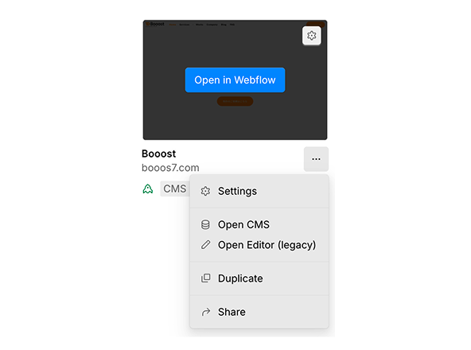

<!-- body-callout:start -->
:::tip[編集の基本]
Webflowでは、コンテンツ管理にコンテンツエディター（CMS編集モード）を使います。文章・画像・リンクなどの内容を安全に更新できる仕組みで、レイアウトやデザインを変えたい時はDesigner操作が必要か確認してください。
:::
<!-- body-callout:end -->

コンテンツエディターは、Webflowサイトの見た目を確認しながら、文章・画像・リンクなどのコンテンツを更新するための編集画面です。サイトの構造やデザインを変更せずに作業できるため、日常的な更新はContent editor roleで行うのが安全です。

従来のLegacy Editorは2026年8月4日から利用できなくなる予定です。この章では、公開版として最新のContent editor roleを前提に説明します。Dashboardに「Open Editor (Legacy)」が表示される場合だけ、旧バージョンの入口ページを確認してください。
*実画面例: Dashboardでは、通常の編集入口と旧Legacy Editorの入口を見分けてから作業に入ります。*

## 作業全体の流れ

1. Content editor roleでWebflowを開きます。
2. 更新したいテキストを編集します。
3. 必要に応じて画像を差し替えます。
4. ボタンや文章のリンク先を確認・変更します。
5. 変更内容を確認します。
6. 問題がなければPublishします。

## Webflowを開く

WebflowにログインしてDashboardから対象サイトを開く方法と、サイトURLの末尾に `?update` を付けて直接開く方法があります。サイトごとに権限や案内URLが異なる場合があるため、初回は制作担当者から共有された方法を優先してください。

最新版の詳しい手順は [B-2. Content Editor（最新版）でWebflowを開く方法](/02-editor/02-open-content-editor/) を確認してください。旧Legacy Editorの入口が表示される場合は [B-1. Content Editor（旧バージョン）でWebflowを開く方法](/02-editor/01-open-legacy-editor/) を確認してください。

最新版の画面でPages、CMS、Assets、編集アイコン、Publishの位置に迷った場合は [B-13. 最新Content Editor画面の見方](/02-editor/13-latest-content-editor-screen-guide/) を先に確認してください。

## テキストを編集する

1. 編集したい文章にマウスを合わせます。
2. 編集アイコン、または編集可能なテキスト部分をクリックします。
3. 文章を直接入力・削除します。
4. 長い文章は、先にGoogle Docsやメモ帳で作ってから貼り付けると安全です。

詳しい手順は [サイトの文字を書き換える方法](/02-editor/03-edit-text/) を確認してください。

## 画像を差し替える

1. 差し替えたい画像にマウスを合わせます。
2. 画像編集アイコンをクリックします。
3. 新しい画像ファイルを選択またはドラッグしてアップロードします。
4. 公開前に、画像が粗くないか、縦横比が崩れていないか確認します。

画像がアップロードできない場合は [画像アップロードのトラブル](/06-troubleshooting/02-image-upload-failed/) も確認してください。

## リンクを編集する

ボタンや文章リンクのリンク先を変更する場合は、リンク設定画面でURLを確認します。外部サイトへ飛ばすリンクは、必要に応じて新しいタブで開く設定にします。

リンク作成は [文章にリンクを設定する方法](/02-editor/05-add-link/)、リンク先変更は [リンク先URLを変更する方法](/02-editor/07-edit-link-url/) を確認してください。

## Publish前に確認する

- 文章に誤字脱字がない
- 元の意味と違う文章になっていない
- 画像が正しく表示されている
- ボタンやリンクをクリックしたときの遷移先が正しい
- スマートフォン表示で文字や画像が崩れていない
- 変更してはいけない共通パーツを触っていない

詳しい確認項目は [Editor公開前チェックリスト](/02-editor/12-before-publish-checklist/) を使ってください。

## Publishする

編集内容は、Publishするまで一般の閲覧者には反映されません。内容を確認したら、Publish権限がある担当者が公開しましょう。公開後は実際のWebサイトを開き、変更が反映されているか確認してください。

詳しい手順は [変更を保存してサイトに反映させる方法](/02-editor/08-save-and-publish/) を確認してください。

## よくあるつまずき

| 症状 | 確認すること |
| --- | --- |
| 編集アイコンが出ない | ログイン状態、Content editor role、編集不可エリアを確認する |
| Publishしたのに反映されない | ブラウザのキャッシュを削除、または強制再読み込みする |
| 画像が大きすぎる | 画像サイズを調整してからアップロードする |
| リンク先が違う | URLの入力ミス、外部リンク設定、新しいタブ設定を確認する |
| Pages、CMS、Assetsの違いが分からない | [最新Content Editor画面の見方](/02-editor/13-latest-content-editor-screen-guide/) を確認する |

## 理解度チェック

1. Content editor roleでの作業として適切なものはどれですか？
   - A. サイト全体のレイアウトを作り直す
   - B. 既存の文章、画像、リンクを更新する
   - C. DNS設定を変更する

#### 答え

正解: B

Content editor roleは、完成済みページのコンテンツ更新に向いています。構造変更やドメイン設定は担当者に確認してください。

2. 外部サイトへのリンクを設定するとき、確認した方がよいことはどれですか？
   - A. URLが正しいか、新しいタブで開く必要があるか
   - B. リンク文字の色だけ
   - C. 画像サイズだけ

#### 答え

正解: A

外部リンクはURLの入力ミスが起きやすいため、クリックして遷移先を確認します。必要に応じて新しいタブで開く設定も確認します。

3. 変更内容が一般公開サイトに反映されるタイミングとして正しいものはどれですか？
   - A. 文字を入力した瞬間
   - B. Previewで見た瞬間
   - C. Publishが完了した後

#### 答え

正解: C

編集内容はPublishするまで一般の閲覧者には反映されません。Publish後は公開サイトで確認します。

## 次に進む

具体的な操作を順番に確認する場合は [B-2. Content Editor（最新版）でWebflowを開く方法](/02-editor/02-open-content-editor/) から進んでください。
