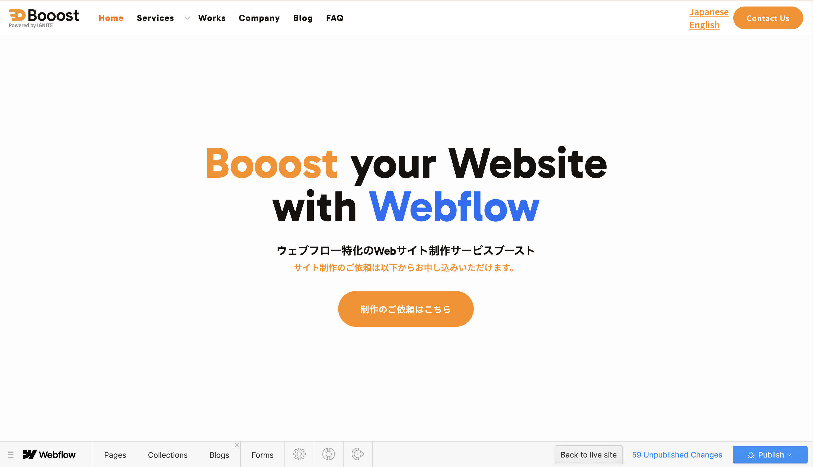

:::caution[旧バージョンの画面です]
このページは、Dashboard上に「Open Editor (Legacy)」が表示される旧バージョン向けです。従来のLegacy Editorは2026年8月4日から利用できなくなる予定のため、今後の通常運用では [B-2. Content Editor（最新版）でWebflowを開く方法](/02-editor/02-open-content-editor/) を優先してください。
:::

*実画面例: 旧Legacy Editorを使う場合だけ、このような旧版の編集画面を確認します。通常は最新版Content editor roleを優先します。*

## 旧バージョンを開く流れ

1. Webflowにログインします。
2. Dashboardで編集したいサイトを探します。
3. サイトカードにマウスを合わせます。
4. 「Open Editor (Legacy)」または制作担当者から案内された旧Editor用ボタンをクリックします。
5. サイト画面が開いたら、編集したい文章・画像・リンクにマウスを合わせて編集できるか確認します。

*実画面例: 旧版の画面が表示された場合は、ボタン名やツールバー位置が最新版と違うため、作業前に案内内容と照合します。*

:::note[旧版を使うケース]
既存の運用案内や権限設定によって、まだ旧Legacy Editorを使う場合があります。ただし、旧版は今後使えなくなる予定のため、新しい操作案内へ切り替えられるか制作担当者に確認してください。
:::

## 旧版で作業する時の注意

- 画面上のボタン名やツールバーの位置が、最新版と異なる場合があります。
- Publish前には、編集したページだけでなく公開サイト側でも反映を確認してください。
- 旧版でしか開けない、または最新版の画面が案内と違う場合は、無理に進めず制作担当者へ相談してください。

<strong>次のステップ:</strong>
最新版の画面で作業する場合は [B-2. Content Editor（最新版）でWebflowを開く方法](/02-editor/02-open-content-editor/) を確認してください。文章の編集へ進む場合は [エディターでサイトの文字を書き換える方法](/02-editor/03-edit-text/) に進みます。
