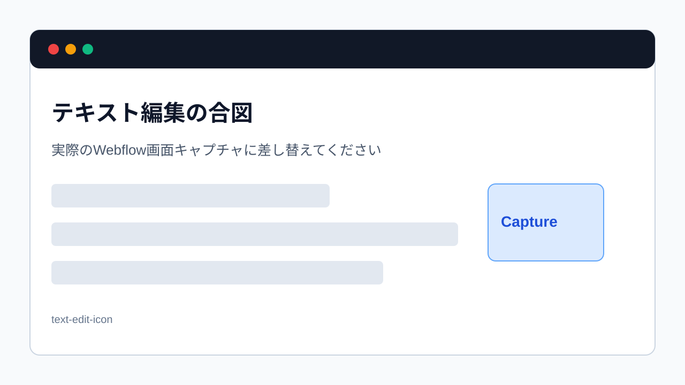

> 旧マニュアル番号: [No.10](/02-editor/02-edit-text/)

Content editor roleでの更新作業のうち、最も頻度が高いのが「文字の書き換え」です。会社情報、サービス内容、ブログ記事の誤字脱字修正など、様々な場面で必要になります。操作は非常に直感的です。

---

## 1. 文字を書き換える基本ステップ

1.  Content editor roleでサイトを開く
2.  書き換えたい文字をクリックする
3.  キーボードで新しい文字を入力する
4.  変更を保存する

## 2. 操作手順の詳細

1.  Webflowを開く:
    「[No.9](/02-editor/01-open-editor/)」の手順で、編集したいサイトをContent editor roleで開きます。

2.  書き換えたい箇所を探す:
    サイトのプレビュー画面をスクロールして、修正したい文字情報がある場所まで移動します。

3.  文字の近くにカーソルを合わせる:
    修正したい文章や見出しの上にマウスカーソルを合わせます。

4.  青い枠と鉛筆アイコンを確認:
    カーソルを合わせると、編集可能なテキストの周りに青い点線の枠が表示され、右上に鉛筆アイコンが現れます。これが「このテキストは編集できますよ」という合図です。

    
    *※画像はイメージです。*

5.  クリックして編集モードに入る:
    書き換えたいテキストをクリックします。すると、カーソルが点滅し、文字を入力できる状態になります。

6.  文字を修正する:
    キーボードを使って、通常の文書作成ソフト（Wordなど）と同じように、文字を削除したり、新しい文字を追加したりします。

7.  編集を確定する:
    修正が終わったら、テキストブロックの外側（何も無いところ）をクリックすると、編集が一旦確定されます。

## 3. どこが変更されたかを確認する

文字を書き換えると、画面下部の黒いツールバーにある「Changes」の隣の数字がカウントアップします。これは「変更点がいくつあるか」を示しています。ここを見れば、自分が何か所変更を加えたかが一目で分かります。

## 4. 【重要】変更をサイトに公開する

文字の修正が終わっただけでは、まだ訪問者が見る実際のサイトには反映されていません。

最後に必ず「[No.15](/02-editor/07-save-and-publish/) 【忘れずに！】変更を保存してサイトに反映させる方法」の手順に沿って、変更を公開（Publish）してください。

---

次のステップ:
文字の書き換えはマスターしましたね。次は、文章にメリハリをつけるための「[No.11](/02-editor/03-bold-text/) エディターで文章の一部を太字にする方法」を学びましょう。
