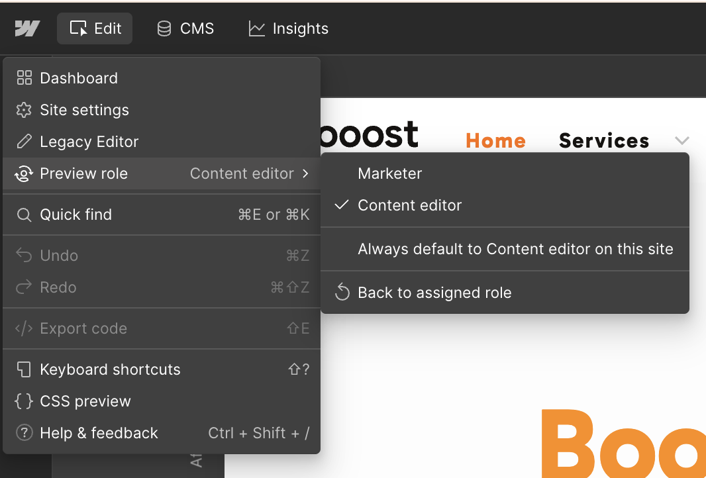
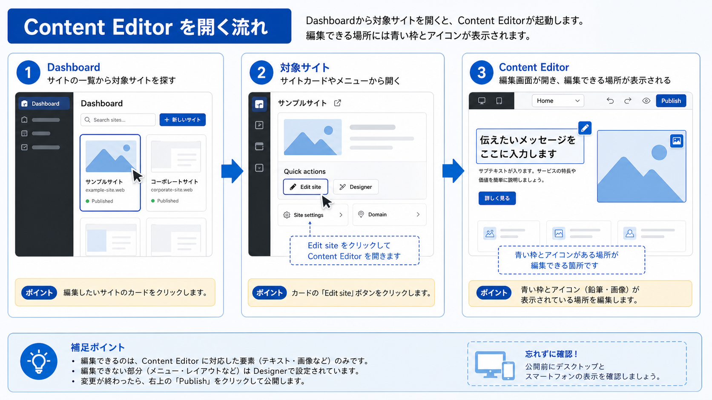

:::tip[通常はこちらを使います]
現在のWebflowでは、Content editor roleとしてcanvasを開き、デザインを触らずにコンテンツだけを更新する流れが推奨されています。日常的な文字・画像・リンクの更新は、この最新版の手順を使ってください。
:::

ここからは、実際のサイト更新作業で最もよく使う <strong>Content editor roleでの開き方</strong> について解説します。

## 1. Dashboardから開く

ログイン後の最初の画面である「Dashboard」から対象サイトを開く、最も基本的な方法です。

1. <strong>Webflowにログイン:</strong>
   [作成したアカウントで初めてサイトにログインする方法](/01-getting-started/03-first-login/)で解説した手順で、まずはWebflowにログインします。

2. <strong>Dashboardでサイトを選択:</strong>
   ログインすると、編集権限のあるサイトが一覧表示されたDashboardが開きます。目的のサイトを探します。

3. <strong>編集用の入口をクリック:</strong>
   「Open in Webflow」または制作担当者から案内された編集用ボタンをクリックします。Content editor roleが付与されている場合、デザイン編集ではなくコンテンツ編集に必要な範囲でWebflowを開けます。

4. <strong>Webflowのcanvasでサイトが開く:</strong>
   サイトの見た目を確認しながら、編集可能なテキスト、画像、リンク、CMSコンテンツを更新できます。

## 2. `?update` で直接開く

毎回Dashboardを経由せず、公開サイトの該当ページから直接Content editor roleの編集画面へ入る方法です。

1. <strong>専用URLにアクセス:</strong>
   お使いのブラウザで、編集したいページのURL末尾に `?update` を付けます。

   <strong>例:</strong>
   `https://www.example.com/service/?update`

2. <strong>ログイン:</strong>
   まだログインしていない場合は、ログイン画面が表示されます。メールアドレスとパスワードを入力してログインしてください。すでにログイン済みの場合は、直接Webflowの編集画面が開きます。

## 3. 編集できる状態の目印

Content editor roleで開けている場合、編集可能なテキスト、画像、リンクにマウスを合わせると編集用のアイコンやアウトラインが表示されます。

編集アイコンが表示されない場合は、ログインしているメールアドレス、Site role、編集対象ページ、編集不可に設定された要素ではないかを確認してください。

最新版のcanvas画面で見る場所、編集アイコン、CMS、Assets、Publishの判断は [B-13. 最新Content Editor画面の見方](/02-editor/13-latest-content-editor-screen-guide/) にまとめています。

## 4. 開いた後にまず見る場所

Webflowが開いたら、すぐに編集を始めず、次の順番で確認します。

1. 正しいサイトを開いているか確認します。
2. 正しいページを開いているか確認します。
3. 文章・画像・リンクにカーソルを合わせ、青いアウトラインや編集アイコンが出るか確認します。
4. CMS記事を触る場合は、CMSパネルまたはCMSテンプレートページを開いているか確認します。
5. Publish権限がある場合も、公開前チェックを済ませてからPublishします。

:::note[キャプチャー差し込み位置]
Content Editorを開いた直後の画面をここに追加します。保存ファイル名は `src/assets/captures/manual/b-02-content-editor-first-check.png`。正しいサイト名、ページ上の編集可能要素、左側のCMSまたはAssets入口が確認できる画角にし、個人情報や未公開ページ名は写さないでください。
:::

:::note[旧版の画面が表示される場合]
Dashboard上に「Open Editor (Legacy)」しか表示されない場合は、旧バージョンの入口です。通常は最新版Content editor roleを優先し、旧版が必要な場合だけ [補足ページ](/02-editor/01-open-legacy-editor/) を確認してください。
:::

<strong>次のステップ:</strong>
無事にWebflowを開くことができたら、まず [B-13. 最新Content Editor画面の見方](/02-editor/13-latest-content-editor-screen-guide/) を確認し、その後 [エディターでサイトの文字を書き換える方法](/02-editor/03-edit-text/) に進みましょう。

:::note[図解の見方]
開いたらすぐ編集せず、ページと権限を確認します。
:::
