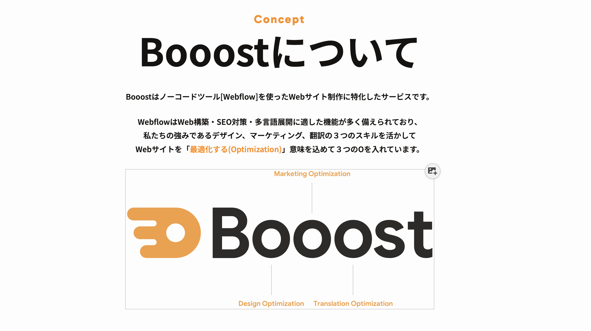
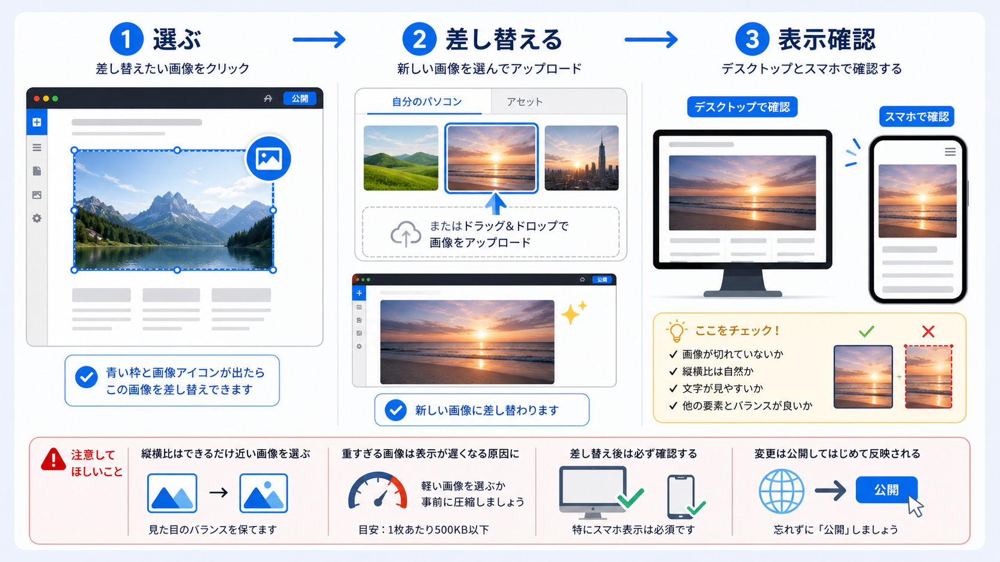

<!-- body-callout:start -->
:::tip[編集の基本]
コンテンツエディターでは、文章、画像、リンクなどの内容を安全に更新できます。レイアウトやデザインを変えたい時は、Designer操作が必要か確認してください。
:::
<!-- body-callout:end -->

Webサイトの印象を大きく左右する「画像」。Content editor roleを使えば、専門知識がなくても既存の画像を新しいものに差し替えることができます。

---

## 1. 画像差し替えの基本ステップ

1.  <strong>差し替えたい画像をクリックする</strong>
2.  <strong>表示されるアイコンから「画像変更」を選択する</strong>
3.  <strong>新しい画像をアップロード、または選択する</strong>
4.  <strong>変更を保存する</strong>

## 2. 操作手順の詳細

1.  <strong>Content editor roleでサイトを開く:</strong>
    まずはWebflowを開き、画像を差し替えたいページを表示します。

2.  <strong>差し替えたい画像にカーソルを合わせる:</strong>
    変更したい画像の上にマウスカーソルを合わせます。

3.  <strong>青い枠と画像アイコンを確認:</strong>
    編集可能な画像の場合、画像の周りに<strong>青い点線の枠</strong>が表示され、右上に<strong>写真のアイコン</strong>が現れます。これが「この画像は変更できますよ」という合図です。

    

4.  <strong>画像アイコンをクリック:</strong>
    右上に表示された写真のアイコンをクリックします。

5.  <strong>ファイル選択ウィンドウが開く:</strong>
    クリックすると、お使いのパソコンのファイル選択ウィンドウ（エクスプローラーやFinder）が開きます。

6.  <strong>新しい画像を選択:</strong>
    あらかじめ用意しておいた、新しい画像ファイルを選択し、「開く」ボタンをクリックします。

7.  <strong>画像のアップロードと反映:</strong>
    選択した画像がWebflowにアップロードされ、サイト上の画像が自動的に新しいものに差し替わります。アップロードには画像のサイズによって少し時間がかかる場合があります。

8.  <strong>差し替え後の確認:</strong>
    意図した通りに画像が差し替わったか、見た目を確認してください。

## 3. 画像に関する注意点

- <strong>画像サイズ（ファイルサイズ）:</strong>
  Webサイトで使用する画像は、ファイルサイズが大きすぎるとページの表示速度が遅くなり、Site usageのBandwidth使用量も増えやすくなります。アップロードする前に、適切なサイズに圧縮しておくことをお勧めします。（目安：1枚あたり500KB前後）
  画像がうまくアップロードできない場合は、[「画像がアップロードできません！」原因と対処法](/06-troubleshooting/02-image-upload-failed/)もご参照ください。画像を多く追加した後は、[Site usageで容量・Bandwidthを確認する](/05-settings/11-site-usage-bandwidth/)も確認します。

- <strong>画像の縦横比:</strong>
  元の画像の縦横比と大きく異なる画像をアップロードすると、デザインによっては画像が歪んだり、意図しない形で切り取られたりする場合があります。できるだけ元の画像の縦横比に近い画像を用意すると、キレイに差し替えることができます。

- <strong>ファイル名:</strong>
  アップロードする画像のファイル名は、半角英数字（例: `service-image-01.jpg`）にすることを推奨します。日本語のファイル名は、予期せぬエラーの原因となる可能性があります。

## 4. 【重要】変更の公開

画像の差し替えが終わったら、忘れずに[変更を保存してサイトに反映させる方法](/02-editor/08-save-and-publish/)の手順で変更を<strong>公開（Publish）</strong>してください。

---

<strong>次のステップ:</strong>
画像の差し替えができると、サイトの印象をガラッと変えられますね。次は、設定済みのリンク先を変更したい場合の「[エディターでリンク先のURLを変更する方法](/02-editor/07-edit-link-url/)」です。

:::note[図解の見方]
画像差し替えは、青い枠と画像アイコンが出る対象を選び、差し替え後にデスクトップとスマートフォンの両方で切れ方を確認します。
:::
