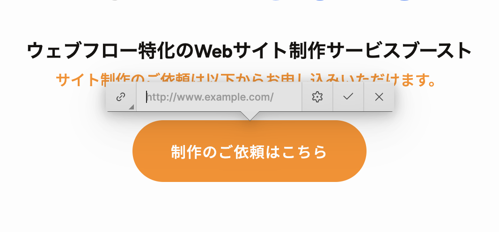

<!-- body-callout:start -->
:::tip[編集の基本]
コンテンツエディターでは、文章、画像、リンクなどの内容を安全に更新できます。レイアウトやデザインを変えたい時は、Designer操作が必要か確認してください。
:::
<!-- body-callout:end -->

一度設定したリンクでも、リンク先のページURLが変更になったり、別のページに誘導したくなったりすることがあります。エディターでは、既存のリンク情報を簡単に確認し、修正することができます。

---

## 1. リンク先変更の対象

このマニュアルで解説する方法は、主に以下の要素に設定されたリンクを変更する場合に利用できます。

-   <strong>テキストリンク:</strong> 文章の一部に設定されたリンク（[エディターで文章にリンクを設定する方法](/02-editor/05-add-link/)で設定したもの）
-   <strong>ボタン:</strong> 「詳しくはこちら」「お問い合わせ」などのボタン
-   <strong>画像リンク:</strong> クリックすると特定のページに移動する画像

## 2. リンク先URLを変更する手順

1.  <strong>Content editor roleでサイトを開く:</strong>
    Webflowを開き、リンクを修正したい要素があるページを表示します。

2.  <strong>修正したい要素にカーソルを合わせる:</strong>
    リンクが設定されているテキスト、ボタン、または画像の上にマウスカーソルを合わせます。

3.  <strong>青い枠と「Settings」アイコンを確認:</strong>
    編集可能な要素には青い枠が表示されます。その右上を見てください。
    -   <strong>テキストリンクの場合:</strong> 鉛筆アイコンが表示されます。まずテキストをクリックして編集モードに入ります。
    -   <strong>ボタンや画像リンクの場合:</strong> <strong>歯車のアイコン（Settings）</strong>が表示されます。これが設定変更の合図です。

4.  <strong>「Settings」アイコンをクリック:</strong>
    歯車のアイコンをクリックします。

5.  <strong>設定パネルで「Link Settings」を開く:</strong>
    クリックすると、その要素に関する設定パネルが開きます。その中から「<strong>Link Settings</strong>」という項目を探し、クリックします。

    

6.  <strong>既存のURLを修正:</strong>
    「Link Settings」の中に、現在設定されているURLが表示されています。このURLを新しいものに書き換えるか、新しいURLを貼り付けます。

7.  <strong>必要に応じて「別タブで開く」を設定:</strong>
    [エディターで文章にリンクを設定する方法](/02-editor/05-add-link/)で解説したように、外部リンクの場合は「Open in new tab」をオンにすることを推奨します。

8.  <strong>設定を閉じる:</strong>
    URLの修正が終わったら、設定パネルの外側をクリックしてパネルを閉じます。これで変更は適用されます。

## 3. 【重要】変更の公開

この作業の後も、変更を実際のサイトに反映させるためには「公開（Publish）」作業が必要です。
忘れずに「[変更を保存してサイトに反映させる方法](/02-editor/08-save-and-publish/)」を実行してください。

---

<strong>次のステップ:</strong>
基本的な編集作業はこれで一通り学びました。次は、これまでの作業を無駄にしないための、最も重要な工程「[変更を保存してサイトに反映させる方法](/02-editor/08-save-and-publish/)」です。
