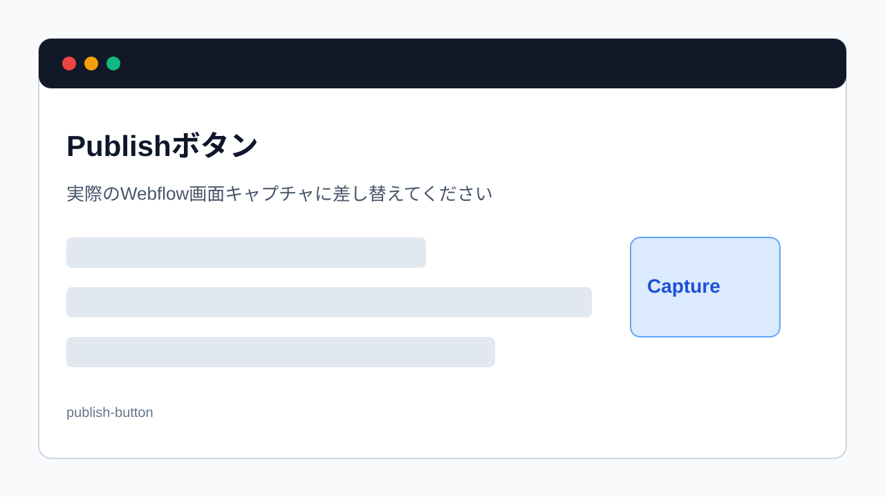

> 旧マニュアル番号: [No.15](/02-editor/07-save-and-publish/)

<strong>このマニュアルは、エディターでの作業において最も重要な手順の一つです。</strong>

これまで行ってきた文字の修正や画像の差し替えは、この「公開（Publish）」という操作を完了して初めて、一般のサイト訪問者が見るWebサイトに反映されます。ただし、PublishできるかどうかはSite roleと <strong>Can publish</strong> 設定によって変わります。

---

## 1. 「公開（Publish）」とは？

エディターで行った変更は、最初は「下書き」のような状態です。これを、インターネット上の誰もが見られる「本番環境」にアップロードする作業が「公開（Publish）」です。

<strong>編集作業の最後には、公開してよい内容か確認し、Publish権限を持つ担当者が公開します。</strong>

## 2. 変更を公開する手順

1.  <strong>未公開の変更を確認:</strong>
    Webflow上で変更内容のサマリーや未公開の変更を確認します。複数人で作業している場合、自分以外の変更が一緒に公開対象になることがあります。

2.  <strong>青い「Publish」ボタンをクリック:</strong>
    ツールバーの右側にある、青い<strong>「Publish」</strong>ボタンをクリックします。

    
    *※画像はイメージです。*

3.  <strong>公開内容と公開先の確認:</strong>
    公開前に、変更内容、公開対象のページ、公開先ドメインを確認します。本番ドメインに公開してよいか不安な場合は、制作担当者または管理者へ確認してください。

4.  <strong>公開処理の実行:</strong>
    公開処理が始まります。緑色のバーが進み、クルクルとアイコンが回ります。変更内容によっては少し時間がかかる場合がありますので、このまま待ちます。

5.  <strong>公開完了の確認:</strong>
    処理が完了すると、公開完了のメッセージが表示されます。これで、あなたの変更が選択した公開先に反映されます。

6.  <strong>ウィンドウを閉じる:</strong>
    右上の「×」ボタンをクリックして、ポップアップウィンドウを閉じます。

## 3. 実際のサイトを確認しよう

公開が完了したら、実際にあなたのWebサイトにアクセスして、変更が正しく反映されているかをご自身の目でも確認しましょう。

もし変更が反映されていないように見える場合は、「[No.53](/06-troubleshooting/01-cache-not-reflecting/)」で解説する「キャッシュ」、公開先ドメインの選択、CMS itemの公開状態、Can publish権限を確認してください。

## 4. Legacy Editorから公開する場合の注意

2026年8月4日までは、既存ユーザーがLegacy Editorを使える場合があります。ただし、Legacy EditorからPublishすると、`webflow.io` のステージングドメインとカスタムドメインの両方に公開される場合があります。また、自分以外の未公開変更も一緒に公開される可能性があります。

公開版のこのマニュアルでは、Content editor roleまたはWebflowの通常画面から、公開対象と公開先を確認してPublishする運用を推奨します。

---

<strong>次のステップ:</strong>
公開方法をマスターすれば、基本的な更新は一人で完結できます。次は、安心して作業するためのお守りとして、「[No.16](/02-editor/08-discard-changes/) 【安心】変更をやめて、保存せずに終了する方法」を覚えておきましょう。
