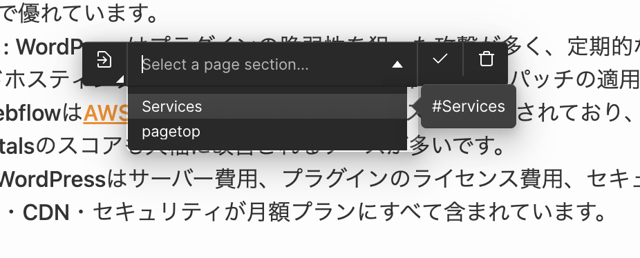

<!-- body-callout:start -->
:::tip[編集の基本]
コンテンツエディターでは、文章、画像、リンクなどの内容を安全に更新できます。レイアウトやデザインを変えたい時は、Designer操作が必要か確認してください。
:::
<!-- body-callout:end -->

長いページの中で、目次から各セクションへジャンプさせたい時や、CTA ボタンから「お問い合わせフォーム」までスクロールさせたい時に使うのが <strong>アンカーリンク</strong> です。

---

## 1. アンカーリンクとは？

ページ内の <strong>特定の場所（見出しやセクション）</strong> にジャンプするリンクです。URL の末尾に `#セクションID` を付けることで動作します。

例: `https://example.com/about/#contact` → 「about」ページの「contact」というIDが付いた要素までスクロールします。

## 2. アンカーリンクを貼る前提条件

ジャンプ先のセクションに <strong>「ID（識別名）」</strong> が設定されている必要があります。これは Designer モードで制作担当者が事前に設定済みのケースがほとんどです。

サイトに既に存在するアンカーIDの例:
- `#contact` → お問い合わせフォーム
- `#features` → 特徴セクション
- `#faq` → よくある質問

> <strong>ヒント</strong>: ID が分からない場合は [IGNITE公式サイトのお問い合わせフォーム](https://igni7e.jp/contact/) から確認してください。

## 3. エディターでアンカーリンクを設定する

1. リンクを貼りたいテキスト（例: 「お問い合わせはこちら」）を選択
2. ツールバーの <strong>リンク（鎖アイコン）</strong> をクリック
3. URL 欄に <strong>`#contact`</strong> のように `#` から始まる ID を入力（同じページ内へのリンクの場合）
4. 別ページの特定箇所へリンクする場合は <strong>`/about/#contact`</strong> のように完全パスを書く
5. Save をクリック

*実画面例: 同じページ内へ移動する場合は、URL欄に `#contact` のようなIDを入力します。*

## 4. ボタンからアンカーへリンクする場合

ボタンも同じ要領で設定できます。ボタン要素を選択し、Settings パネルの「Link」欄にアンカーIDを入力してください。

## 5. よくある質問 (Q&A)

#### Q. アンカーリンクを設定したのにジャンプしません。

以下のいずれかが原因の可能性があります。

1. ID が間違っている（大文字小文字も区別されます）
2. ジャンプ先の要素にまだIDが設定されていない
3. ヘッダーが固定の場合、ジャンプ先がヘッダーの裏に隠れることがある（Designer 側でスクロールオフセットの調整が必要）

#### Q. 新しくアンカーIDを追加したいです。

ID の追加は Designer モードでの作業が必要です。[IGNITE公式サイトのお問い合わせフォーム](https://igni7e.jp/contact/) からご依頼ください。エディターからは新規追加できません。

---

<strong>次のステップ:</strong>
リンク系の操作はこれで一通り完了です。次は CMS（お知らせ・ブログ）の管理方法を学びましょう → 「お知らせやブログはどこで管理してるの？」
