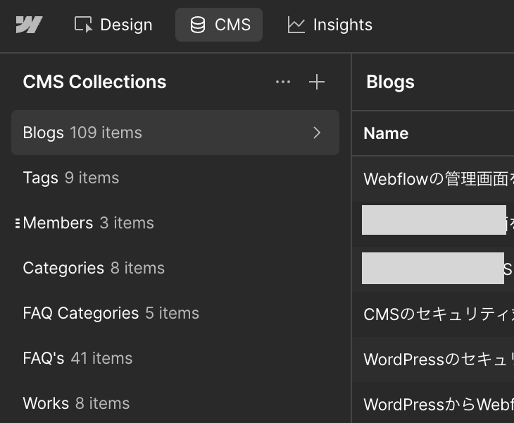
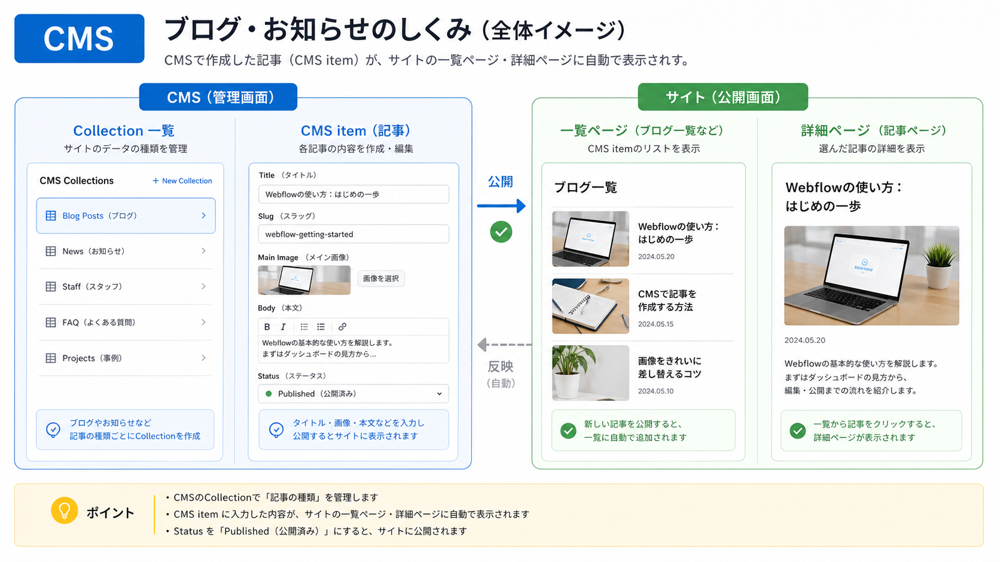

<!-- body-callout:start -->
:::tip[下書きで確認]
CMS記事は、いきなり公開せず下書き状態でタイトル、本文、画像、リンク、公開日を確認します。特に一覧ページと詳細ページの両方で見え方を確認すると安心です。
:::
<!-- body-callout:end -->

:::note[公式画像]
上の画像はWebflow公式CMSページの画像です。実際のBooost投稿画面で入力するFieldはサイトごとに異なるため、具体的な入力欄はこの章の手順と [C-27. Booost記事入力フィールド早見表](/03-cms/26-booost-cms-field-guide/) を確認してください。
:::

:::note[図解の見方]
記事一覧と記事詳細はCMS itemから作られます。
:::

ブログ、お知らせ、導入事例など、同じ形式の記事を追加していく機能は <strong>CMS</strong> で管理します。CMSは「Content Management System」の略で、記事のタイトル、本文、画像、カテゴリー、公開日などを入力して管理する仕組みです。
*実画面例: CMSで更新した記事は、公開後に実際のページや一覧で表示を確認します。*

## 作業全体の流れ

1. CMSを開きます。
2. 対象のCMS一覧を選びます。
3. New ItemまたはNew Blogなどの新規作成ボタンを押します。
4. タイトルとSlugを入力します。
5. サムネイル画像、カテゴリー、概要、公開日を設定します。
6. 本文を入力し、見出し・画像・リンクを整えます。
7. 下書き保存、予約公開、即時公開のいずれかを選びます。
8. 公開後に実際のページを確認します。

## 投稿前に用意するもの

- 記事タイトル
- 記事本文の原稿
- アイキャッチ画像またはサムネイル画像
- カテゴリー
- 記事概要またはDescription
- 公開日
- 本文中で使う画像、動画URL、リンク先URL

## 新規記事を作成する

まずEditorまたはDesigner内のCMSを開き、ブログ・お知らせなどの対象一覧を選びます。表示名はサイトによって `Blog Posts`、`News`、`お知らせ` など異なります。

詳しい手順は [CMSの場所](/03-cms/01-where-is-cms/) と [新しい記事を追加する方法](/03-cms/02-create-new-post/) を確認してください。

## 基本情報を入力する

<strong>Name</strong> または <strong>Title</strong> には記事の正式タイトルを入れます。<strong>Slug</strong> はURLの末尾に使われる文字列です。日本語ではなく、半角英数字とハイフンで、内容が分かる短い文字列にします。

Booostの記事投稿でSummary、Thumbnail、Categoryなどの入力欄に迷う場合は、先に [C-27. Booost記事入力フィールド早見表](/03-cms/26-booost-cms-field-guide/) を確認してください。

例:

- `summer-campaign-2026`
- `how-to-use-webflow-editor`
- `new-service-announcement`

公開後にSlugを変更するとURLが変わるため、公開前に必ず確認してください。

## 本文を作成する

本文は、直接入力するよりもGoogle Docsなどで下書きしてから貼り付けると安全です。貼り付け後は、見出し、太字、箇条書き、画像、リンクを整えます。

| 操作 | 詳細ページ |
| --- | --- |
| 本文を書く | [本文を書き込む](/03-cms/06-write-body/) |
| 太字・斜体 | [太字・斜体にする](/03-cms/07-bold-italic-body/) |
| 見出し | [見出しを付ける](/03-cms/08-headings/) |
| 箇条書き | [箇条書きにする](/03-cms/09-bullet-list/) |
| 画像挿入 | [本文に画像を入れる](/03-cms/10-insert-image/) |
| YouTube埋め込み | [YouTube動画を埋め込む](/03-cms/12-embed-youtube/) |
| 本文リンク | [本文にリンクを貼る](/03-cms/13-body-link/) |

## メタ情報を設定する

記事の表示やSEOに関わる項目です。サイトによって項目名は異なりますが、以下は公開前に必ず確認してください。

- サムネイル画像またはアイキャッチ画像
- カテゴリー
- Post summaryまたはDescription
- 公開日
- 画像のaltテキスト
- 関連記事や一覧ページでの表示

公開前の抜け漏れ確認には [CMS記事の公開前チェックリスト](/03-cms/25-cms-before-publish-checklist/) を使ってください。

## 公開方法を選ぶ

すぐに公開する場合はPublish、後で公開する場合はSchedule、まだ完成していない場合はSave as Draftを使います。誤って公開しないよう、公開ボタンを押す前に内容を再確認してください。

| 公開方法 | 詳細ページ |
| --- | --- |
| 公開日を設定する | [公開日を設定する](/03-cms/14-publish-date/) |
| 予約公開する | [公開を予約する](/03-cms/15-schedule-publish/) |
| 下書き保存する | [下書きで保存する](/03-cms/16-save-as-draft/) |
| 下書きを公開する | [下書きを公開する](/03-cms/17-publish-draft/) |

## 公開後チェック

- 記事ページが表示される
- 一覧ページにも表示される
- タイトルと画像が正しい
- リンクが切れていない
- スマートフォンで読みやすい
- SNSで共有する場合、タイトル・説明文・画像が意図通りになっている

表示されない場合は [トラブル時にまず確認するチェックリスト](/06-troubleshooting/00-common-checklist/) を確認してください。

## 理解度チェック

1. Slugの説明として正しいものはどれですか？
   - A. 記事URLの末尾に使われる文字列
   - B. 記事本文の文字数
   - C. 画像のファイルサイズ

#### 答え

正解: A

Slugは記事URLに使われます。公開後に変更するとURLが変わるため、公開前に確認します。

2. 記事がまだ完成していない場合に選ぶべき状態はどれですか？
   - A. Publish
   - B. Save as Draft
   - C. Delete

#### 答え

正解: B

未完成の記事は下書きとして保存します。Publishは一般公開する操作、Deleteは削除です。

3. CMS記事の公開前に確認するものとして正しい組み合わせはどれですか？
   - A. タイトル、Slug、本文、画像、リンク、スマートフォン表示
   - B. タイトルだけ
   - C. 公開日だけ

#### 答え

正解: A

記事は一覧ページ、詳細ページ、SNS共有にも影響するため、複数の項目をまとめて確認します。

## 次に進む

実際の操作に入る場合は [CMSの場所](/03-cms/01-where-is-cms/) から進んでください。入力欄の意味を先に整理したい場合は [C-27. Booost記事入力フィールド早見表](/03-cms/26-booost-cms-field-guide/) を確認してください。
