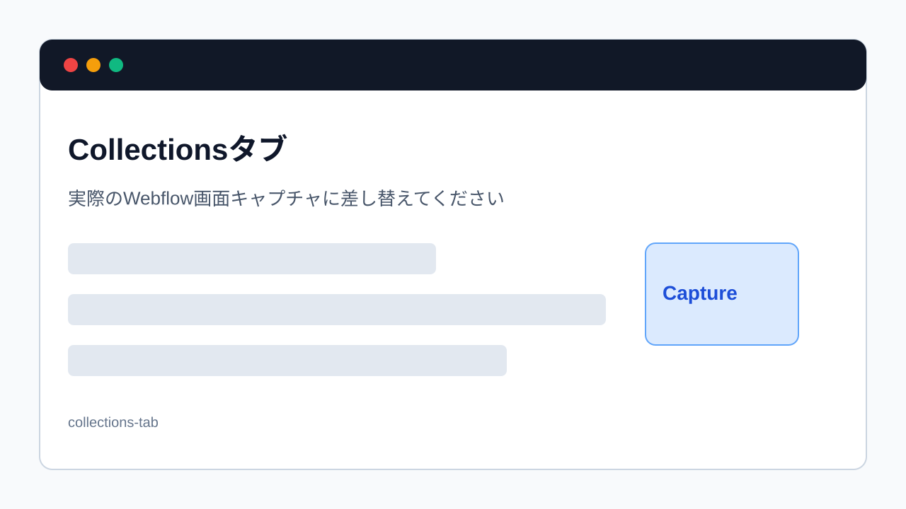

> 旧マニュアル番号: [No.17](/03-cms/01-where-is-cms/)

Webサイトで頻繁に更新される「お知らせ」「ブログ」「導入事例」「よくある質問」といったコンテンツは、これまでのページ編集とは少し違う、特別な管理画面で一元管理されています。この仕組みを「CMS（コンテンツ・マネジメント・システム）」と呼びます。

---

## 1. CMSとは？

CMSを簡単に言うと、<strong>「決まったフォーマット（型）の情報を、データベースのように効率よく管理するための仕組み」</strong>です。

-   <strong>フォーマット（型）の例:</strong>
    -   ブログ記事なら、「タイトル」「公開日」「カテゴリー」「アイキャッチ画像」「本文」といった項目が決まっています。
    -   導入事例なら、「お客様名」「導入サービス」「課題」「解決策」「お客様の声」といった項目が決まっています。

-   <strong>メリット:</strong>
    -   デザインを意識しなくても、項目を埋めていくだけで、統一感のあるキレイなページが作成できます。
    -   たくさんの記事を、一覧で管理・検索・修正するのが簡単になります。
    -   トップページに「最新のお知らせ5件」を自動で表示する、といった連携も可能です。

## 2. CMSで管理されることが多い内容

サイトによって名称は異なりますが、次のような「同じ形式で何件も増えていく情報」はCMSで管理されることが多いです。

| 種類 | よくある入力項目 | 表示される場所 |
| --- | --- | --- |
| お知らせ | タイトル、公開日、本文、カテゴリー | お知らせ一覧、トップページの最新情報 |
| ブログ | タイトル、Slug、アイキャッチ画像、本文、著者、カテゴリー | ブログ一覧、記事詳細ページ |
| 導入事例 | 会社名、課題、解決策、成果、画像 | 事例一覧、事例詳細ページ |
| よくある質問 | 質問、回答、カテゴリー | FAQページ |

CMSは「ページをデザインする場所」ではなく、「決まった項目に情報を入れる場所」と考えると分かりやすいです。

## 3. 通常のページ編集との違い

| 比較項目 | 通常のページ編集 | CMS編集 |
| --- | --- | --- |
| 主な対象 | 既存ページ内の文章、画像、リンク | お知らせ、ブログ、事例などの一覧化される情報 |
| 入力方法 | ページ上の編集できる箇所を直接変更 | フォームの項目を上から順に入力 |
| 表示先 | そのページ内 | 一覧ページ、詳細ページ、トップページなど複数箇所 |
| 注意点 | 変更箇所を見た目で確認する | タイトル、Slug、公開状態、一覧表示も確認する |

CMSで記事を追加すると、記事詳細ページだけでなく、一覧ページやトップページの「最新情報」欄にも反映される場合があります。そのため、公開前に複数の表示場所を確認してください。

## 4. CMS管理画面へのアクセス方法

この便利なCMSの管理画面は、Content editor roleでWebflowを開いた状態からアクセスします。

1.  <strong>Content editor roleでサイトを開く:</strong>
    まずは、通常通りWebflowを開きます。

2.  <strong>画面下部ツールバーの「Collections」をクリック:</strong>
    画面下部の黒いツールバーの中に、<strong>「Collections」</strong>というタブがあります。これは「情報の集まり」を意味し、CMS機能のことを指します。この「Collections」タブをクリックしてください。

    
    *※画像はイメージです。*

3.  <strong>CMSアイテムの一覧（コレクションリスト）が表示される:</strong>
    クリックすると、画面の左側に、このサイトで管理されているCMSの一覧（例: `お知らせ`, `ブログ記事`, `導入事例`など）が表示されます。

4.  <strong>編集したいコレクションを選択:</strong>
    このリストの中から、あなたが更新したい項目（例: `お知らせ`）をクリックします。

5.  <strong>記事の一覧ページが開く:</strong>
    クリックすると、そのコレクションに含まれる記事が一覧で表示された管理ページに切り替わります。ここが、お知らせやブログ記事を集中管理する場所です。

## 5. この画面でできること

このCMS管理画面では、主に以下の操作を行います。

-   <strong>新規記事の追加</strong>
-   <strong>既存記事の編集・修正</strong>
-   <strong>記事の公開・非公開の切り替え</strong>
-   <strong>不要な記事の削除</strong>

これらの具体的な操作方法は、次のマニュアルから一つずつ詳しく解説していきます。

## 6. 初心者が最初に覚えること

まずは次の4つだけ覚えてください。

1. `Collections` は、お知らせやブログの管理入口です。
2. `New` は、新しい記事を追加するボタンです。
3. `Save as Draft` は、まだ公開しない下書き保存です。
4. `Publish` は、公開サイトに反映する操作です。

> <strong>注意</strong>: `Delete` は完全削除につながる操作です。不要な記事でも、最初は削除ではなく `Archive` や下書き化を検討してください。

---

<strong>次のステップ:</strong>
CMSの入り口が分かりましたね。それでは早速、新しい記事を追加してみましょう。「[No.18](/03-cms/02-create-new-post/) 新しい「お知らせ（ブログ記事）」を追加する方法」に進みます。
