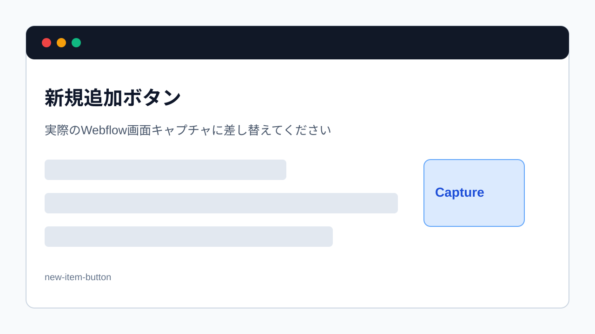

> 旧マニュアル番号: [No.18](/03-cms/02-create-new-post/)

CMSの管理画面にアクセスできるようになったら、次はいよいよ新しい記事を追加してみましょう。ここでは例として「お知らせ」を新規作成する手順を解説しますが、「ブログ記事」や「導入事例」など、他のCMSコンテンツでも基本的な流れは同じです。

---

## 1. 新規記事追加の基本ステップ

1.  <strong>CMS管理画面を開く</strong>
2.  <strong>「New」ボタンをクリックする</strong>
3.  <strong>記事の各項目（タイトル、本文など）を入力する</strong>
4.  <strong>記事を保存・公開する</strong>

## 2. 作成前に用意するもの

記事作成画面を開く前に、次の素材を先に用意しておくと作業が止まりにくくなります。

- 記事タイトル
- 本文原稿
- アイキャッチ画像またはサムネイル画像
- カテゴリー
- 公開日
- リンク先URL
- 本文に入れる画像やYouTube URL
- 公開前に確認する担当者

下書きがまだ固まっていない場合は、Webflow上で直接書き始めるより、Google Docsなどで先に原稿を作ってから貼り付ける方が安全です。

## 3. 操作手順の詳細

1.  <strong>CMS管理画面を開く:</strong>
    「[No.17](/03-cms/01-where-is-cms/)」の手順に従って、WebflowのCMSまたはCollectionsから追加したいコンテンツ（例: `お知らせ`）を選択します。すると、そのコンテンツの記事一覧画面が表示されます。

2.  <strong>「New」ボタンをクリック:</strong>
    画面の右上を見てください。<strong>「+ New [コレクション名]」</strong>（例: `+ New Announcement`）という青いボタンがあります。これが新規追加ボタンです。このボタンをクリックします。

    
    *※画像はイメージです。コレクション名はサイトによって異なります。*

キャプチャー指示: Collection一覧からNewボタンを押す直前の画面

- 保存名: `03-02-new-cms-item-button.png`
- 差し込み位置: 手順2の画像を実キャプチャーに差し替える
- 撮影画面: CMSまたはCollectionsで対象Collectionの記事一覧を開いた状態
- 事前状態: デモ用Collection名は `News` または `Blog` にする
- 強調箇所: 左側のCollection名、右上の `New` ボタン、既存記事一覧
- 隠す情報: 実在の記事タイトル、公開前記事、顧客名、担当者名
- 撮影後チェック: 読者が「どの一覧画面でNewを押すか」を迷わないこと

3.  <strong>記事の入力フォームが開く:</strong>
    クリックすると、新しい記事の情報を入力するための専用フォーム（編集パネル）が画面右側に表示されます。ここには、「タイトル」「公開日」「本文」など、あらかじめ制作会社が設定した項目が並んでいます。

キャプチャー指示: 新規CMS itemの入力フォームが開いた画面

- 保存名: `03-02-new-cms-item-form.png`
- 差し込み位置: 手順3の直後
- 撮影画面: `New` を押して新規記事フォームが開いた状態
- 事前状態: 入力前の空フォームを表示する。可能ならTitle、Slug、Main image、Bodyが見える位置で撮る
- 強調箇所: 入力フォーム全体、必須項目、保存・公開ボタン
- 隠す情報: 既存記事名、顧客固有のCollection名、社内メモ
- 撮影後チェック: 記事はページ上で直接書くのではなく、フォーム項目を埋めるものだと分かること

4.  <strong>各項目を埋めていく:</strong>
    このフォームの上から順に、必要な情報を入力したり、設定したりしていきます。
    具体的な入力方法については、次のマニュアルから一つずつ詳しく解説します。
    -   [No.19 記事の「タイトル」を入力する](/03-cms/03-post-title/)
    -   [No.20 記事の「アイキャッチ画像」を設定する方法](/03-cms/04-thumbnail-image/)
    -   [No.21 記事の「カテゴリー」を選択する方法](/03-cms/05-post-category/)
    -   [No.22 記事の「本文」を書き込む](/03-cms/06-write-body/)
    など。

5.  <strong>記事を保存または公開する:</strong>
    すべての項目を入力し終えたら、最後にこの記事をどうするかを決めます。
    -   <strong>すぐに公開したい場合:</strong> 「Publish」ボタンをクリックします。（→ [No.33 下書きした記事を公開する方法](/03-cms/17-publish-draft/)）
    -   <strong>一旦下書きとして保存したい場合:</strong> 「Save as Draft」ボタンをクリックします。（→ [No.32 下書きで保存する方法](/03-cms/16-save-as-draft/)）
    -   <strong>未来の日時で公開を予約したい場合:</strong> 公開日時を設定して「Schedule」ボタンをクリックします。（→ [No.31 未来の日時で公開を予約する方法](/03-cms/15-schedule-publish/)）

## 4. 保存方法の選び方

| 状況 | 選ぶ操作 | 理由 |
| --- | --- | --- |
| まだ内容確認中 | `Save as Draft` | 公開されず、あとで編集できます |
| 公開日時が決まっている | `Schedule` | 指定した日時に公開できます |
| 今すぐ公開してよい | `Publish` | 公開サイトに反映されます |

迷った場合は、まず `Save as Draft` を選んでください。公開は、内容確認が終わってからでも問題ありません。

## 5. 公開前に必ず見る場所

CMS記事は、1つの記事ページだけでなく複数の場所に表示されることがあります。

- 記事の詳細ページ
- 記事一覧ページ
- トップページの最新情報欄
- 関連記事やカテゴリー一覧
- SNSで共有した時の表示

公開後に「一覧には出ているが詳細ページが変」「トップページの表示だけ崩れている」といったことが起きないよう、複数箇所で確認してください。

## 6. まとめ

新しい記事を追加する流れは、<strong>「CMS管理画面へ行く → 新規追加ボタンを押す → フォームを埋める → 保存/公開する」</strong>というシンプルなものです。まずはこの大きな流れを掴んでください。

---

<strong>次のステップ:</strong>
記事の入力フォームを開くところまでできました。次からは、各入力項目の詳細な設定方法を見ていきましょう。まずは最も基本の「[No.19](/03-cms/03-post-title/) 記事の「タイトル」を入力する」です。
