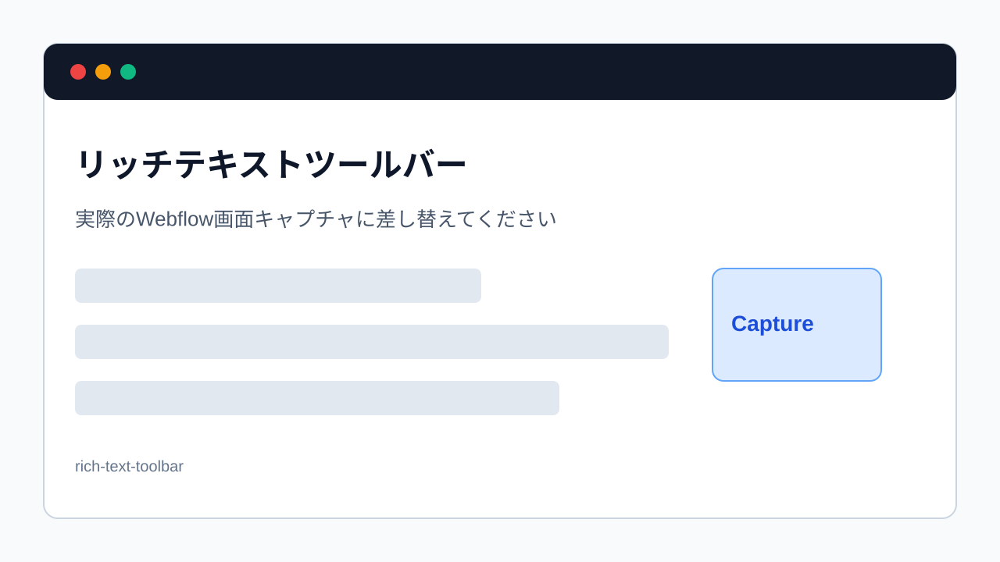

> 旧マニュアル番号: [No.22](/03-cms/06-write-body/)

ここからが、記事の内容そのものを作成していく中心的な作業です。WebflowのCMSには「リッチテキスト」という高機能な入力フィールドが用意されており、まるでWordのように、文章の装飾や画像の挿入などを簡単に行うことができます。

---

## 1. リッチテキストフィールドとは？

リッチテキストフィールドは、単なるテキスト入力欄ではありません。以下のような、様々な要素を一つの入力エリア内で自由に組み合わせることができる、ブログ記事の執筆に最適なエディターです。

-   **テキスト（文章）**
-   **見出し（H2, H3, H4...）**
-   **太字、斜体**
-   **箇条書きリスト**
-   **画像**
-   **動画の埋め込み**
-   **リンク**

## 2. 本文入力欄の特定

CMSの入力フォームの中で、ひときわ大きな入力エリアが、本文を書き込むためのリッチテキストフィールドです。通常、「**Body**」「**本文**」「**記事内容**」といった名前が付いています。

*※画像はイメージです。*

## 3. 文章を書き込む手順

1.  **リッチテキストフィールド内をクリック:**
    本文入力エリアをクリックすると、カーソルが点滅し、文字を入力できる状態になります。

2.  **キーボードで文章を入力:**
    伝えたい内容を、キーボードで自由に書き込んでいきます。改行したい場合は `Enter` キーを押します。

3.  **テキストの貼り付けも可能:**
    あらかじめ別のエディタ（Word、Googleドキュメント、メモ帳など）で下書きしておいた文章をコピーし、このフィールドに貼り付けることも可能です。
    ただし、元の書式が崩れる場合があるため、貼り付け後にWebflowのエディターで適切に再設定することをお勧めします。

## 4. 本文編集のツールバー

リッチテキストフィールド内で改行したり、特定のテキストを選択したりすると、小さなツールバーが表示されます。このツールバーを使って、様々な書式設定や要素の追加を行います。

*※画像はイメージです。*

-   **文字の装飾:** 太字、斜体、リンク設定など
-   **ブロックの変更:** 通常の文章を「見出し」や「箇条書き」に変更
-   **メディアの挿入:** `+` アイコンから画像や動画を追加

これらの具体的な使い方は、次のマニュアルから一つずつ詳しく解説していきます。

---

**次のステップ:**
まずは文章の入力が基本です。次は、文章にメリハリをつけるための装飾「[No.23](/03-cms/07-bold-italic-body/) 本文の文字を太字にする・斜体にする」を学びましょう。
