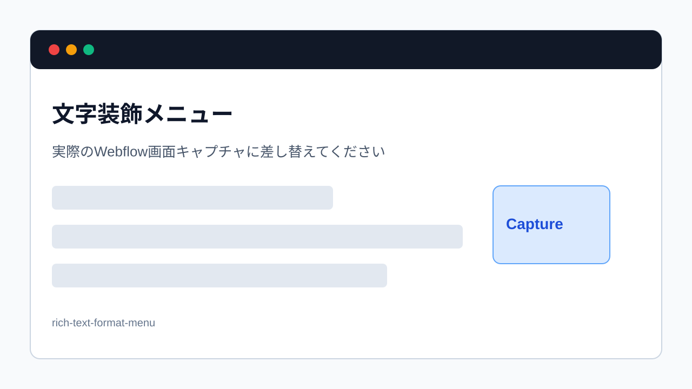

> 旧マニュアル番号: [No.23](/03-cms/07-bold-italic-body/)

リッチテキストエディター内で、文章の特定の部分を強調したい時には「太字」や「斜体」が役立ちます。操作方法は、トップページなどを直接編集した時とほとんど同じで、非常に直感的です。

---

## 1. 太字・斜体の使い分け

-   <strong>太字 (Bold):</strong>
    最も強調したいキーワード、重要なメッセージ、小見出しなどに使用します。視覚的に目立つため、多用しすぎると読みにくくなるので注意が必要です。

-   <strong>斜体 (Italic):</strong>
    少しニュアンスを変えたい時、専門用語、書籍名、外国語、会話文の心の声などに使用します。太字ほどの強い強調ではありませんが、文章にリズムが生まれます。

## 2. 操作手順

1.  <strong>リッチテキストフィールド内で作業:</strong>
    「[No.22](/03-cms/06-write-body/)」で解説した、本文を入力するリッチテキストフィールド内で操作します。

2.  <strong>装飾したい文字をドラッグして選択:</strong>
    マウスを使って、太字または斜体にしたい部分のテキストをドラッグし、反転表示させます。

3.  <strong>フローティングメニューを表示させる:</strong>
    文字を選択すると、そのすぐ上に小さな黒いメニュー（フローティングメニュー）が自動的に表示されます。

    
    *※画像はイメージです。*

4.  <strong>アイコンをクリック:</strong>
    -   <strong>太字にする場合:</strong> メニューの中にある「<strong>B</strong>」（Bold）のアイコンをクリックします。
    -   <strong>斜体にする場合:</strong> メニューの中にある「*<strong>I</strong>*」（Italic）のアイコンをクリックします。

5.  <strong>装飾されたことを確認:</strong>
    クリックすると、選択していた文字が即座に太字、または斜体になります。意図した通りに装飾されたかを確認してください。

## 3. 装飾を解除する方法

間違えて装飾してしまった場合や、元に戻したい場合は、とても簡単です。

1.  <strong>装飾を解除したい文字を再度選択</strong>します。
2.  フローティングメニューに表示されている、<strong>ハイライトされた状態の「B」や「I」のアイコンをもう一度クリック</strong>します。

すると、文字の装飾が解除され、通常のテキストに戻ります。

---

<strong>次のステップ:</strong>
文字の強調はバッチリですね。次は、長文を読みやすく構成するために不可欠な「[No.24](/03-cms/08-headings/) 本文に見出し（大・中・小）を付ける方法」を学びましょう。
