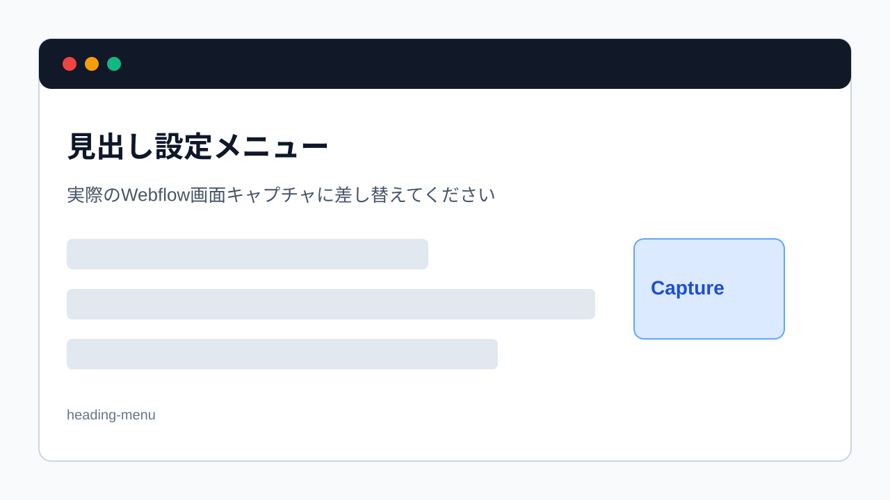

> 旧マニュアル番号: [No.24](/03-cms/08-headings/)

長い文章をただ書き連ねるだけでは、読者はどこに何が書いてあるのか分かりにくく、途中で読むのをやめてしまうかもしれません。「見出し」を適切に使うことで、文章に構造が生まれ、格段に読みやすくなります。

---

## 1. なぜ見出しが重要か？

-   **可読性の向上:** 見出しは、本の「章」や「節」のような役割を果たします。読者は見出しを拾い読みするだけで、記事全体の概要を把握できます。
-   **SEO効果:** 検索エンジンは、見出し（特にH2, H3タグ）を重要なキーワードが含まれる場所として認識します。適切に見出しを設定することは、SEO対策の基本です。
-   **デザイン性:** 見出しは通常のテキストよりも大きく、または太く表示されるため、ページの見た目にメリハリが生まれます。

## 2. 見出しの種類（H2, H3, H4...）

Webでは、見出しに「Hタグ」というものが使われ、階層構造になっています。

-   **H1 (大見出し):** 記事のタイトルに使われます。**本文中で使うことはありません。**
-   **H2 (中見出し):** 記事の大きなセクション分けに使います。最も使用頻度が高い見出しです。
-   **H3 (小見出し):** H2のセクションを、さらに細かく分ける時に使います。
-   **H4, H5, H6:** さらに細かい見出しですが、通常はH2とH3を適切に使えれば十分です。

**正しい使い方:**
H2 → H3 → H4 のように、必ず階層を守って使います。H2の次にいきなりH4を使う、といった飛ばし方はしません。

## 3. 見出しを設定する手順

1.  **見出しにしたい行にカーソルを置く:**
    リッチテキストフィールド内で、見出しに設定したい文章の行にカーソルを置きます。（行全体を選択する必要はありません）

2.  **フローティングメニューを表示:**
    カーソルを置くと、フローティングメニューが表示されます。

3.  **見出しアイコンをクリック:**
    メニューの中から、**「H」**の形をしたアイコン（Heading）をクリックします。

4.  **見出しレベルを選択:**
    クリックすると、「H2」「H3」「H4」などの選択肢が表示されます。設定したい見出しレベル（通常はまず「H2」）をクリックします。

    
    *※画像はイメージです。*

5.  **見出しになったことを確認:**
    選択した行のテキストが、あらかじめデザインされた見出しのスタイル（大きく、太くなるなど）に変化したことを確認します。

## 4. 見出しを通常の文章に戻す方法

見出しに設定した行を、元の通常の文章（段落）に戻したい場合も簡単です。

1.  **元に戻したい見出しの行にカーソルを置きます。**
2.  フローティングメニューから、**人型のアイコン（Normal text）**をクリックします。

これで、見出しスタイルが解除され、通常のテキストに戻ります。

---

**次のステップ:**
見出しで文章の骨格が作れるようになりました。次は、項目を分かりやすく整理するための「[No.25](/03-cms/09-bullet-list/) 本文を箇条書き（リスト）にする方法」です。
