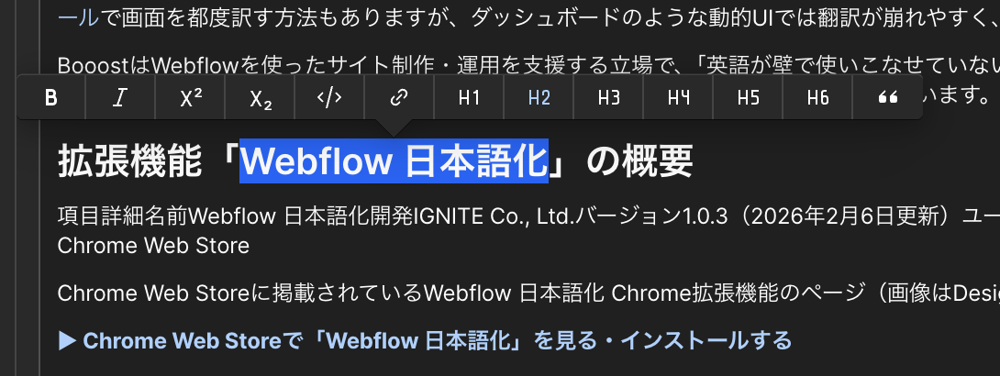

<!-- body-callout:start -->
:::tip[下書きで確認]
CMS記事は、いきなり公開せず下書き状態でタイトル、本文、画像、リンク、公開日を確認します。特に一覧ページと詳細ページの両方で見え方を確認すると安心です。
:::
<!-- body-callout:end -->

手順、材料、注意点、サービスの特長など、複数の項目を並べて伝えたい時、「箇条書き（リスト）」を使うと、情報が整理されて非常に分かりやすくなります。リッチテキストエディターでは、2種類のリストを簡単に作成できます。

---

## 1. 箇条書きリストの種類

### ・番号なしリスト（Unordered List）

-   各項目の先頭に「・」（黒丸）が付く、最も一般的なリストです。
-   項目の順序に意味がない場合（例: 特徴、持ち物リストなど）に使用します。

### 1. 番号付きリスト（Ordered List）

-   各項目の先頭に「1.」「2.」「3.」と自動で番号が振られるリストです。
-   手順やランキングなど、項目の順序に意味がある場合に使用します。

## 2. 箇条書きリストを作成する手順

### 方法A：先に文章を書いてからリスト化する

1.  <strong>リストにしたい項目を改行して入力:</strong>
    まずは通常の文章として、リストにしたい項目を一つずつ改行しながら入力します。

2.  <strong>リスト化したい範囲をすべて選択:</strong>
    マウスで、リストにしたい行をすべてドラッグして選択します。

3.  <strong>フローティングメニューからアイコンを選択:</strong>
    表示されたフローティングメニューから、使いたいリストのアイコンをクリックします。
    -   <strong>番号なしリストの場合:</strong> 横線が3本並んだアイコン
    -   <strong>番号付きリストの場合:</strong> 数字の「1, 2, 3」が並んだアイコン

    

4.  <strong>リスト化されたことを確認:</strong>
    選択した範囲が、箇条書きリストのスタイルに変化したことを確認します。

### 方法B：リストを先に作成してから入力する

1.  <strong>リストを開始したい行でアイコンをクリック:</strong>
    まだ何も入力していない行で、フローティングメニューから使いたいリストのアイコンをクリックします。

2.  <strong>最初のリスト項目が作成される:</strong>
    「・」や「1.」が表示され、リストの入力が開始されます。

3.  <strong>文字を入力してEnterキーを押す:</strong>
    最初の項目を入力し、キーボードの `Enter` キーを押すと、自動的に次のリスト項目（次の「・」や「2.」）が作成されます。

## 3. リストを終了する方法

リストを書き終えて、次の行からまた通常の文章に戻りたい場合は、<strong>リストの項目が何もない空の行で、もう一度 `Enter` キーを押します。</strong>

すると、リストが終了し、通常の段落入力に戻ります。

## 4. リストを通常の文章に戻す方法

一度リスト化した部分を、元のただの文章に戻したい場合は、該当するリストの行を選択し、再度フローティングメニューで選択されているリストのアイコンをクリックすると、リスト化が解除されます。

---

<strong>次のステップ:</strong>
箇条書きで情報がスッキリしましたね。次は、文章だけでは伝わりにくい情報を補う[本文に「写真（画像）」を入れる方法](/03-cms/10-insert-image/)です。
