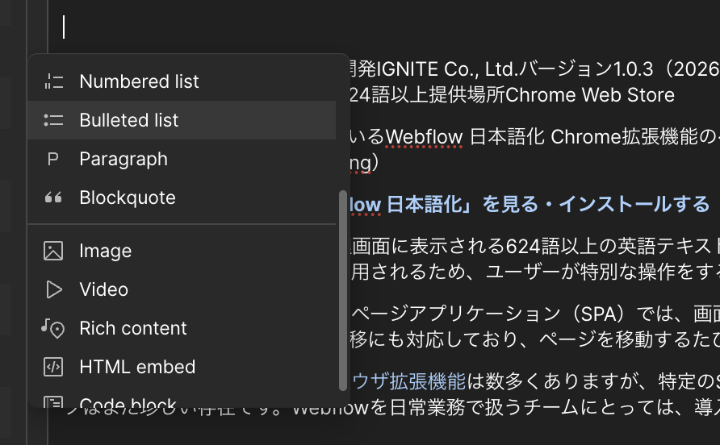

<!-- body-callout:start -->
:::tip[下書きで確認]
CMS記事は、いきなり公開せず下書き状態でタイトル、本文、画像、リンク、公開日を確認します。特に一覧ページと詳細ページの両方で見え方を確認すると安心です。
:::
<!-- body-callout:end -->

ブログ記事やお知らせの本文中に画像を挿入することで、読者の理解を助け、文章だけの場合よりも格段に表現力豊かなコンテンツを作成することができます。製品の写真、イベントの様子、グラフや図解など、様々な用途で活用できます。

---

## 1. 画像を挿入する場所

リッチテキストフィールド内であれば、基本的にはどこでも画像を挿入できます。文章と文章の間、見出しの下など、最も効果的だと思われる場所に配置しましょう。

## 2. 画像を挿入する手順

1.  <strong>画像を挿入したい行にカーソルを置く:</strong>
    リッチテキストフィールド内で、画像を挿入したい場所をクリックしてカーソルを置きます。新しい行（空の行）にしてから挿入するのが一般的です。

2.  <strong>フローティングメニューの「+」アイコンをクリック:</strong>
    カーソルを置くと、行の左側、または表示されるフローティングメニューの中に<strong>「+」</strong>アイコンが表示されます。これをクリックします。

3.  <strong>メディア挿入オプションを表示:</strong>
    「+」をクリックすると、何を追加するかを選択するメニューが表示されます。この中から<strong>「Image」</strong>（写真のアイコン）を選択します。

    

4.  <strong>画像アップロード画面が表示される:</strong>
    「Image」を選択すると、画像のアップロードを促す画面（`Upload Image` または `Choose Image`）がリッチテキスト内に表示されます。

5.  <strong>画像を選択してアップロード:</strong>
    このエリアをクリックすると、お使いのパソコンのファイル選択ウィンドウが開きます。挿入したい画像ファイルを選択し、「開く」をクリックしてアップロードします。

6.  <strong>画像が挿入されたことを確認:</strong>
    アップロードが完了すると、リッチテキストフィールド内に画像が表示されます。意図した場所に、意図した画像が挿入されたかを確認してください。

## 3. 挿入した画像にキャプションを付ける

挿入した画像の下には、「Type caption for image」という文字が薄く表示されています。ここをクリックして、画像の説明文（キャプション）を入力することができます。キャプションは、画像の内容を補足説明したり、著作権情報を記載したりするのに便利です。

## 4. 画像に関する注意点

-   <strong>ファイルサイズ（容量）:</strong> ページの表示速度に影響するため、本文中に多くの画像を挿入する場合は特に、1枚あたりのファイル容量を小さく（目安: 500KB以下）圧縮しておくことが重要です。
-   <strong>ファイル名:</strong> アップロードするファイル名は、半角英数字にしてください。（例: `step-by-step-01.jpg`）
-   <strong>著作権:</strong> 使用する画像は、著作権に問題がないものを必ず使用してください。

---

<strong>次のステップ:</strong>
画像を挿入できましたが、思ったより大きく（または小さく）表示されてしまうことがあるかもしれません。次は「[本文に入れた写真のサイズを変更する方法](/03-cms/11-resize-image/)」を学びましょう。
