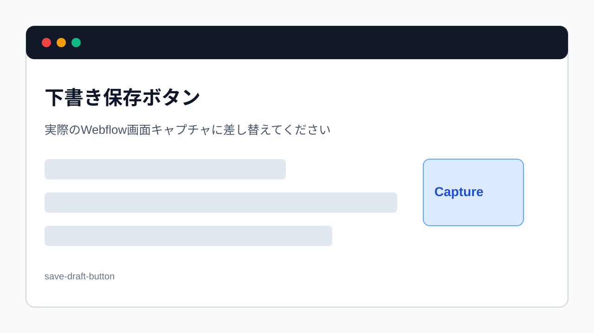

> 旧マニュアル番号: [No.32](/03-cms/16-save-as-draft/)

記事を作成している途中で作業を中断したい時や、まだ公開する段階ではないけれど、書いた内容を保存しておきたい場合に使うのが「下書き（Draft）」保存機能です。

---

## 1. 下書き保存とは？

-   **サイトには公開されない:** 下書き状態で保存された記事は、管理者や編集者だけがCMSの管理画面から見ることができ、一般のサイト訪問者には表示されません。
-   **いつでも編集を再開できる:** 保存した下書きは、後からいつでも開いて編集を再開することができます。
-   **複数人でのレビューに便利:** 記事を公開する前に、他の担当者に内容を確認してもらう（校正・レビュー）といった使い方ができます。

## 2. 記事を下書きで保存する手順

### 新規記事の場合

1.  **記事のコンテンツを入力:**
    タイトルや本文など、保存しておきたい内容をCMSの入力フォームに入力します。

2.  **「Save as Draft」をクリック:**
    編集パネルの右下を見てください。青い「Create」や「Publish」ボタンの隣に、通常は**「Save as Draft」**というボタンがあります。これをクリックします。

    
    *※画像はイメージです。*

3.  **下書き保存完了:**
    クリックすると、記事が下書きとして保存され、CMSの記事一覧画面に戻ります。一覧画面では、その記事のステータスが「**Draft**」と表示されているはずです。

### 公開済みの記事を編集している場合

一度公開した記事を編集している途中で、その変更内容をまだ公開したくない場合は、編集パネルの右上にある「**Save**」ボタンをクリックします。これにより、変更内容は下書きとして保存されますが、**サイト上で公開されているのは変更前のバージョンのまま**となります。

## 3. 下書き記事の注意点

-   **公開日を設定していても公開されない:** たとえ公開日を過去の日付に設定していても、ステータスが「Draft」である限り、その記事がサイト上に表示されることはありません。
-   **下書きのまま放置しない:** 下書き機能は便利ですが、公開するつもりの記事をいつまでも下書きのままにしておくと、情報発信の機会を逃してしまいます。定期的にCMS管理画面を確認し、不要な下書きは削除するか、完成させて公開するようにしましょう。

---

**次のステップ:**
下書きの保存方法がわかりましたね。それでは、完成した下書きをいよいよ世に出すための手順、「[No.33](/03-cms/17-publish-draft/) 下書きした記事を「公開」する方法」に進みましょう。
