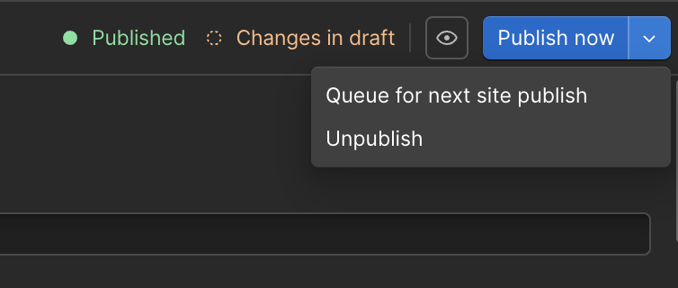
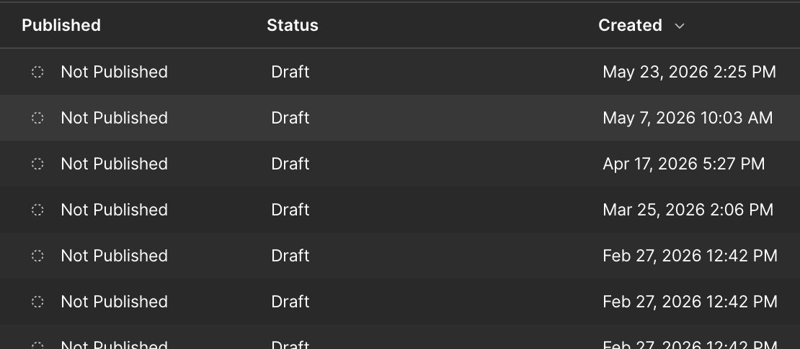
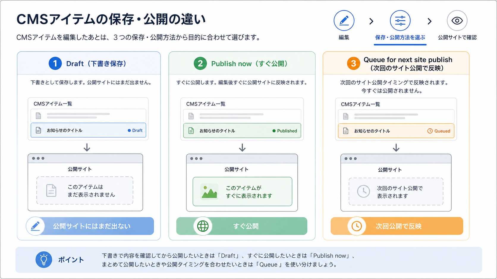

<!-- body-callout:start -->
:::tip[下書きで確認]
CMS記事は、いきなり公開せず下書き状態でタイトル、本文、画像、リンク、公開日を確認します。特に一覧ページと詳細ページの両方で見え方を確認すると安心です。
:::
<!-- body-callout:end -->

:::note[公式画像]
WebflowではCMS編集の保存・公開まわりのUIが継続的に改善されています。実際のBooost画面では、表示されるボタン名や公開状態を確認してから操作してください。
:::

記事を作成している途中で作業を中断したい時や、まだ公開する段階ではないけれど、書いた内容を保存しておきたい場合に使うのが「下書き（Draft）」保存機能です。

---

## 1. 下書き保存とは？

-   <strong>サイトには公開されない:</strong> 下書き状態で保存された記事は、管理者や編集者だけがCMSの管理画面から見ることができ、一般のサイト訪問者には表示されません。
-   <strong>いつでも編集を再開できる:</strong> 保存した下書きは、後からいつでも開いて編集を再開することができます。
-   <strong>複数人でのレビューに便利:</strong> 記事を公開する前に、他の担当者に内容を確認してもらう（校正・レビュー）といった使い方ができます。

## 2. 記事を下書きで保存する手順

### 新規記事の場合

1.  <strong>記事のコンテンツを入力:</strong>
    タイトルや本文など、保存しておきたい内容をCMSの入力フォームに入力します。

2.  <strong>「Save as Draft」をクリック:</strong>
    編集パネルの右下を見てください。青い「Create」や「Publish」ボタンの隣に、通常は<strong>「Save as Draft」</strong>というボタンがあります。これをクリックします。

    

3.  <strong>下書き保存完了:</strong>
    クリックすると、記事が下書きとして保存され、CMSの記事一覧画面に戻ります。一覧画面では、その記事のステータスが「<strong>Draft</strong>」と表示されているはずです。

    

### 公開済みの記事を編集している場合

一度公開した記事を編集している途中で、その変更内容をまだ公開したくない場合は、編集パネルの右上にある「<strong>Save</strong>」ボタンをクリックします。これにより、変更内容は下書きとして保存されますが、<strong>サイト上で公開されているのは変更前のバージョンのまま</strong>となります。

## 3. 下書き記事の注意点

-   <strong>公開日を設定していても公開されない:</strong> たとえ公開日を過去の日付に設定していても、ステータスが「Draft」である限り、その記事がサイト上に表示されることはありません。
-   <strong>下書きのまま放置しない:</strong> 下書き機能は便利ですが、公開するつもりの記事をいつまでも下書きのままにしておくと、情報発信の機会を逃してしまいます。定期的にCMS管理画面を確認し、不要な下書きは削除するか、完成させて公開するようにしましょう。

---

<strong>次のステップ:</strong>
下書きの保存方法がわかりましたね。それでは、完成した下書きをいよいよ世に出すための[下書きした記事を「公開」する方法](/03-cms/17-publish-draft/)に進みましょう。

:::note[図解の見方]
今どの状態かを確認してから操作します。
:::
