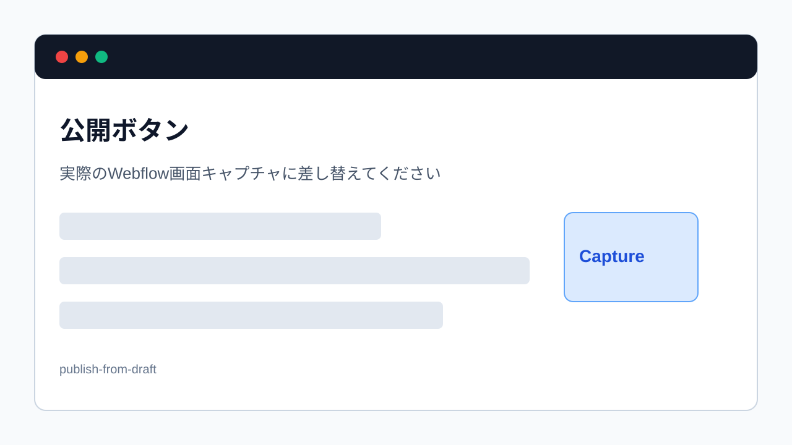

> 旧マニュアル番号: [No.33](/03-cms/17-publish-draft/)

「下書き（Draft）」として保存しておいた記事が完成し、いよいよサイトに公開する準備が整いました。このマニュアルでは、下書き記事を本番のサイトに反映させるための「公開」手順を解説します。

---

## 1. 下書き記事を公開する流れ

1.  **CMS管理画面で、公開したい下書き記事を探す**
2.  **記事を開いて、最終確認をする**
3.  **「Publish」ボタンを押す**

## 2. 操作手順の詳細

1.  **CMS管理画面を開く:**
    WebflowのCMSまたはCollectionsを開き、目的のコレクション（例: `お知らせ`）を選択して、記事一覧画面に移動します。

2.  **公開したい下書き記事を探す:**
    記事一覧の中から、公開したい記事を探します。ステータスが「**Draft**」になっているものが下書き記事です。目的の記事をクリックして、編集パネルを開きます。

3.  **内容の最終チェック:**
    公開する前に、誤字脱字はないか、画像やリンクの設定は正しいかなど、記事の内容を最後にもう一度見直しましょう。

4.  **公開日を確認・設定:**
    「公開日（Published On）」のフィールドを確認します。もし公開日を「今」にしたい場合は、日付や時刻を現在の日時に設定してください。

5.  **「Publish」ボタンをクリック:**
    編集パネルの右下にある、青い**「Publish」**（公開する）ボタンをクリックします。

    
    *※画像はイメージです。*

6.  **公開の確認:**
    クリックすると、「`Publish 1 item`」のような確認メッセージが表示されます。問題がなければ、もう一度「**Publish now**」ボタンをクリックします。

7.  **公開完了:**
    「Published successfully!」というメッセージが表示されれば、公開は成功です。CMSの記事一覧画面に戻ると、該当記事のステータスが「**Published**」に変わっているはずです。

## 3. 公開後の確認

操作が完了したら、必ず実際のWebサイトにアクセスし、以下の点を確認しましょう。

-   記事一覧ページに、新しい記事が意図した通りに表示されているか？
-   記事の詳細ページの内容は、正しく表示されているか？
-   リンクや画像の表示は問題ないか？

もし変更が反映されていないように見える場合は、「[No.53](/06-troubleshooting/01-cache-not-reflecting/)」で解説する「キャッシュ」が影響している可能性があります。ブラウザのスーパーリロード（`Ctrl+F5` / `Cmd+Shift+R`）を試してみてください。

---

**次のステップ:**
これで新規記事の作成から公開までの一連の流れが完了しました。次は、すでに公開されている記事の内容を修正したい場合の「[No.34](/03-cms/18-edit-published/) 一度公開した記事を「修正」する方法」です。
