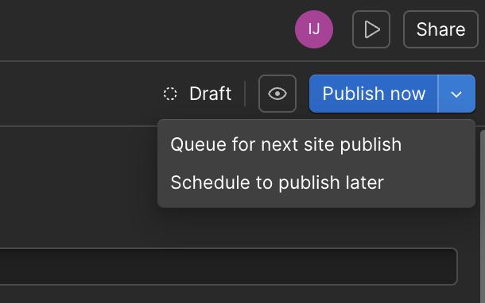

<!-- body-callout:start -->
:::caution[公開前チェック]
Publishする前に、公開先ドメイン、変更したページ、スマートフォン表示、リンク先を確認します。公開後は一般の閲覧者に見えるため、少しでも不安があればスクリーンショットを撮って確認してから進めます。
:::
<!-- body-callout:end -->

:::note[公式画像]
公開済みCMS itemを編集する場合は、下書き変更、個別公開、サイト全体Publishの違いを確認します。公開前には、一覧ページと詳細ページの両方で表示崩れがないか確認してください。
:::

Webサイトは公開して終わりではありません。情報が古くなったり、誤りが見つかったりした場合には、速やかに内容を修正する必要があります。一度公開した記事でも、CMSを使えば簡単に修正し、更新することができます。

---

## 1. 公開済み記事を修正する流れ

1.  <strong>CMS管理画面で、修正したい記事を探す</strong>
2.  <strong>記事を開き、内容を編集する</strong>
3.  <strong>変更を保存・公開する</strong>

## 2. 操作手順の詳細

1.  <strong>CMS管理画面を開く:</strong>
    WebflowのCMSを開き、修正したい記事が含まれる一覧（例: `ブログ記事`）を選択します。

2.  <strong>修正したい記事を探す:</strong>
    記事一覧の中から、修正したい記事を探します。ステータスが「<strong>Published</strong>」になっているものが公開済みの記事です。目的の記事をクリックして、編集パネルを開きます。

    

3.  <strong>内容を修正する:</strong>
    編集パネルが開き、現在の記事の内容が表示されます。タイトル、本文、画像、カテゴリーなど、修正したい箇所を自由に変更してください。操作方法は、新規記事を作成した時と全く同じです。

4.  <strong>変更を保存し、公開方法を選ぶ:</strong>
    公開済みCMS itemを編集した場合、変更内容はまず下書きとして保存されます。公開サイトに反映するには、<strong>Publish now</strong>、または <strong>Queue for next site publish</strong> などの公開操作を選びます。

    

5.  <strong>公開処理の実行:</strong>
    今すぐ反映する場合は <strong>Publish now</strong>、サイト全体の次回Publishに合わせる場合は <strong>Queue for next site publish</strong> を選びます。完了後はCMS一覧でstatusを確認し、公開サイトでも表示を確認します。

## 3. 「Save」ボタンと「Publish」ボタンの違い

-   <strong>新規記事・下書き記事の場合:</strong> `Save as Draft` は下書き保存、`Publish now` はすぐ公開、`Queue for next site publish` は次回のサイト全体Publish時に公開する操作です。
-   <strong>公開済み記事の場合:</strong> 編集内容は下書き変更として保存されます。公開サイトへ反映するには、`Publish now` または `Queue for next site publish` などの公開操作を選びます。

## 4. 更新後の確認

修正が完了したら、必ず実際のサイトで該当ページを開き、変更が正しく反映されているかを確認してください。古い情報が残って見える場合は、ブラウザのキャッシュをクリア（スーパーリロード）してみてください。

---

<strong>次のステップ:</strong>
記事のメンテナンスもバッチリですね。次は、一度公開したけれど、一時的に非表示にしたい場合に使う「[公開中の記事を「非公開（下書き）」に戻す方法](/03-cms/19-unpublish/)」に戻す方法」です。

:::note[図解の見方]
公開済み記事は変更後の反映タイミングに注意します。
:::
