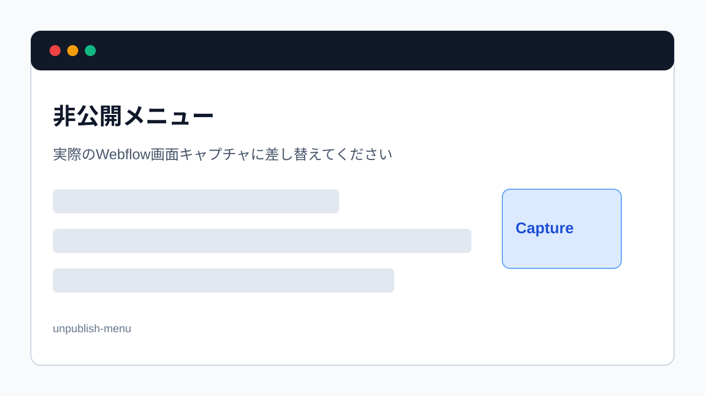

> 旧マニュアル番号: [No.35](/03-cms/19-unpublish/)

キャンペーン期間が終了した告知記事や、内容を大幅に見直す必要が出てきたブログ記事など、一度公開した記事を、サイト上から一時的に非表示にしたい場合があります。この記事を完全に削除するのではなく、後で再利用する可能性もある…そんな時に使うのが「非公開（下書きに戻す）」機能です。

---

## 1. 非公開（下書きに戻す）とは？

-   **サイト上から見えなくなる:** この操作を行うと、記事はWebサイトのどのページ（一覧ページ、記事詳細ページなど）からもアクセスできなくなります。
-   **データは消えない:** 記事のデータそのものはCMS内に「下書き（Draft）」として安全に保管されます。
-   **いつでも再公開できる:** 必要になれば、いつでも内容を修正し、再度公開（Publish）することが可能です。

## 2. 記事を非公開にする手順

1.  **CMS管理画面で非公開にしたい記事を開く:**
    CMSの記事一覧から、非公開にしたい「Published」状態の記事をクリックして、編集パネルを開きます。

2.  **「Save」ボタンの隣にある下向き矢印をクリック:**
    編集パネルの右下にある、青い「Save」ボタンのすぐ右隣に、小さな**下向きの矢印 `▼`** があります。これをクリックします。

3.  **ドロップダウンメニューから「Unpublish」を選択:**
    矢印をクリックすると、いくつかの選択肢がドロップダウンメニューで表示されます。この中から**「Unpublish」**（公開を取りやめる）を選択します。

    
    *※画像はイメージです。*

4.  **非公開処理の実行:**
    「Unpublish」をクリックすると、確認メッセージなしで即座に処理が実行されます。

5.  **ステータスの確認:**
    処理が完了すると、編集パネルの右下のボタンが「Publish」に変わります。CMSの記事一覧画面に戻ると、該当記事のステータスが「Published」から「**Draft**」に変わっていることを確認してください。

## 3. 非公開にした後の確認

操作が完了したら、念のため実際のサイトで、その記事が表示されなくなっていることを確認しましょう。

-   記事一覧ページから、該当記事が消えているか。
-   もし記事のURLを直接知っている場合は、そのURLにアクセスしてみて、「404 Not Found」ページが表示されるか。

---

**次のステップ:**
記事の公開・非公開を自由にコントロールできるようになりました。次は、記事としてはもう使わないけれど、記録として残しておきたい場合に使う「[No.36](/03-cms/20-archive-post/) 不要になった記事を「アーカイブ（保管）」する方法」です。
