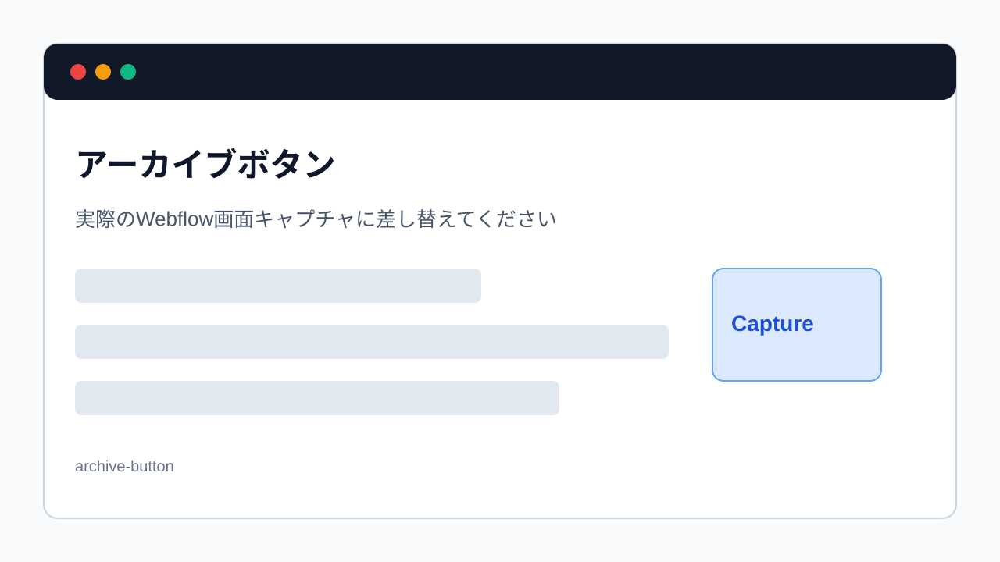

> 旧マニュアル番号: [No.36](/03-cms/20-archive-post/)

古くなった情報や、季節限定のキャンペーン記事など、サイト上には表示する必要はないけれど、完全に削除してしまうのはためらわれる…そんな記事を整理・保管しておくための機能が「アーカイブ」です。

---

## 1. 「アーカイブ」と「削除」の違い

-   **アーカイブ (Archive):**
    -   記事を「保管庫」に移動させるイメージです。
    -   サイト上には表示されなくなります。
    -   CMSの管理画面からも、通常の記事一覧からは見えなくなります。
    -   **いつでも元に戻す（復元する）ことができます。**

-   **削除 (Delete):**
    -   記事を完全に消去します。
    -   **一度削除すると、基本的には元に戻すことはできません。**
    -   本当に全く不要になった場合にのみ使用します。

迷った場合は、まず「アーカイブ」を選択するのが安全です。

## 2. 記事をアーカイブする手順

1.  **CMSの記事一覧画面を開く:**
    CMSで、アーカイブしたい記事があるコレクションの一覧画面を開きます。

2.  **アーカイブしたい記事を選択:**
    一覧の中から、アーカイブしたい記事にマウスカーソルを合わせると、行の左側に**チェックボックス**が表示されます。これをクリックして、チェックを入れます。（複数選択も可能です）

3.  **上部の「Archive」ボタンをクリック:**
    記事を選択すると、一覧の上部にメニューが表示されます。この中から**「Archive」**ボタンをクリックします。

    
    *※画像はイメージです。*

4.  **確認メッセージで再度「Archive」をクリック:**
    「`Are you sure you want to archive 1 item?`」（本当に1個のアイテムをアーカイブしますか？）という確認メッセージが表示されます。問題なければ、もう一度「Archive」ボタンをクリックします。

5.  **アーカイブ完了:**
    選択した記事が一覧から消え、アーカイブが完了します。

## 3. アーカイブした記事を確認・復元する方法

1.  **記事一覧画面の右上にあるフォルダアイコンをクリック:**
    記事一覧画面の右上、検索バーの隣あたりに、**フォルダに下向き矢印が入ったようなアイコン（Archived）**があります。これをクリックします。

2.  **アーカイブ済み記事の一覧が表示される:**
    クリックすると、そのコレクションでアーカイブされている記事だけが一覧で表示されます。

3.  **記事を復元（Unarchive）する:**
    元に戻したい記事を選択（チェックボックスにチェックを入れる）し、上部に表示される**「Unarchive」**ボタンをクリックします。

4.  **復元完了:**
    記事が通常の記事一覧に戻ります。復元された記事は「下書き（Draft）」の状態になっているので、再度公開したい場合は「Publish」する必要があります。

---

**次のステップ:**
安全な記事の整理方法がわかりました。次は、本当に不要な記事を完全に消し去る最終手段、「[No.37](/03-cms/21-delete-post/) 不要になった記事を完全に「削除」する方法」です。
