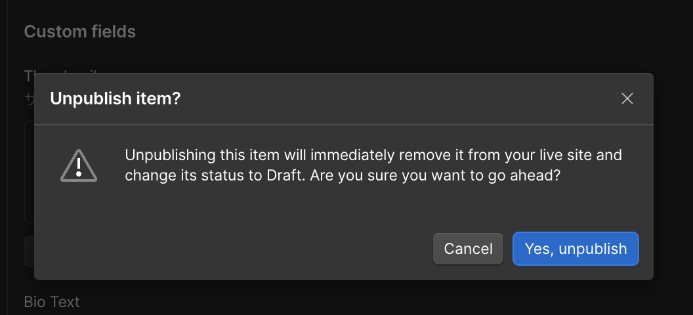

<!-- body-callout:start -->
:::caution[作業前に止まるポイント]
削除、復元、非公開、公開設定、Designer操作は影響が大きい作業です。実行ボタンを押す前に、対象ページ名、対象アイテム、公開先をもう一度確認してください。迷う場合は作業を止めて担当者へ共有します。
:::
<!-- body-callout:end -->

<strong>この操作は、一度実行すると元に戻すことができません。実行する前には、本当に削除して良いか、細心の注意を払ってください。</strong>

テストで作成した記事、重複して作成してしまった記事など、今後一切使用する予定がなく、記録として残しておく必要もない記事は、この「削除」機能を使って完全に消去することができます。

---

## 1. 「削除」の前に、まず「アーカイブ」を検討

前回のマニュアル（[不要になった記事を「アーカイブ（保管）」する方法](/03-cms/20-archive-post/)）でも説明しましたが、少しでも「後で必要になるかもしれない」という可能性がある場合は、削除ではなく<strong>「アーカイブ」</strong>機能を使うことを強くお勧めします。

アーカイブであれば、いつでも安全に元の状態に戻すことができます。

## 2. 記事を完全に削除する手順

1.  <strong>CMSの記事一覧画面を開く:</strong>
    CMSで、削除したい記事があるコレクションの一覧画面を開きます。

2.  <strong>削除したい記事を選択:</strong>
    一覧の中から、完全に削除したい記事にマウスカーソルを合わせ、左側の<strong>チェックボックス</strong>にチェックを入れます。（複数選択も可能です）

3.  <strong>上部の「Delete」ボタンをクリック:</strong>
    記事を選択すると、一覧の上部にメニューが表示されます。この中から<strong>「Delete」</strong>（削除）ボタンをクリックします。

    

4.  <strong>【最終確認】警告メッセージで再度「Delete」をクリック:</strong>
    「`Are you sure you want to delete 1 item? This action cannot be undone.`」（本当に1個のアイテムを削除しますか？この操作は元に戻せません。）という、非常に強い警告メッセージが表示されます。
    内容をよく読み、本当に削除して問題がないことを最終確認した上で、赤い<strong>「Delete」</strong>ボタンをクリックします。

5.  <strong>削除完了:</strong>
    選択した記事が一覧から完全に消去され、削除が完了します。

## 3. 削除操作の注意点

-   <strong>復元はできません:</strong> Webflowの標準機能では、一度削除したCMSアイテムを元に戻す方法はありません。サイトのバックアップから復元する（[サイトのバックアップを確認・復元する方法](/06-troubleshooting/05-backup-restore/)参照）という大掛かりな方法しかなく、他の変更内容にも影響を与えてしまうため、現実的ではありません。
-   <strong>リンク切れに注意:</strong> もし削除した記事に対して、サイト内の他のページからリンクが貼られていた場合、そのリンクは「リンク切れ（クリックしてもページが表示されない）」の状態になります。記事を削除する際は、その記事への内部リンクがないかも確認するのが理想的です。

---

<strong>次のステップ:</strong>
CMSの基本的な管理方法はこれで一通り完了です。お疲れ様でした。次からは、普段は触る必要はないけれど、どうしてもという時のために知っておきたい「D：「デザイナー」でのピンポイント修正」について学んでいきます。まずは「[デザイナーモードを開く時の注意点](/04-designer/01-designer-warning/)」からです。
