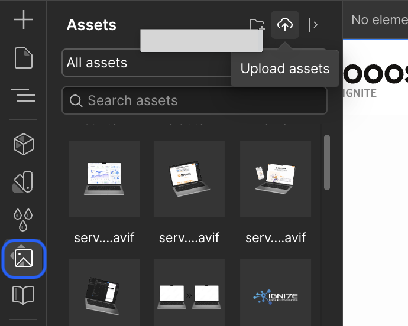

<!-- body-callout:start -->
:::tip[下書きで確認]
CMS記事は、いきなり公開せず下書き状態でタイトル、本文、画像、リンク、公開日を確認します。特に一覧ページと詳細ページの両方で見え方を確認すると安心です。
:::
<!-- body-callout:end -->

> 新規追加（標準スコープ補完）

「会社案内のPDFをダウンロードできるようにしたい」「セミナー資料を本文からリンクしたい」といった時に使うのが <strong>ファイル添付（リンク）</strong> です。
*実画面例: 資料リンクを入れる場合は、公開ページでリンク導線が自然に見えるか確認します。*

---

## 1. ファイル添付の基本方針

Webflow では、<strong>ファイルを直接埋め込む</strong> のではなく、<strong>「アセットにアップロード → リンクとして本文に貼る」</strong> という流れが基本です。

対応形式の例（一般的なもの）:
- PDF（最も多い）
- Word（.docx）
- Excel（.xlsx）
- PowerPoint（.pptx）
- ZIP

> <strong>注意</strong>: <strong>アップロード可能な最大サイズは 10MB</strong> が目安です。それ以上は分割するか圧縮してください。

## 2. アップロードと添付の手順

### Step 1: アセットにファイルをアップロード

1. Designer モードまたは CMS の編集画面で、画像挿入と同じ要領で <strong>「Asset Manager（アセットマネージャー）」</strong> を開く
2. <strong>「Upload」</strong> をクリックしてファイルを選択
3. アップロード完了後、ファイルの <strong>URL をコピー</strong>

### Step 2: 本文にダウンロードリンクを貼る

1. CMS の本文エディタで、リンクにしたいテキスト（例:「会社案内PDF（2.3MB）」）を選択
2. ツールバーの <strong>リンク（鎖アイコン）</strong> をクリック
3. <strong>コピーした URL</strong> を貼り付け
4. <strong>「Open in new tab」をON</strong>（PDF は別タブで開くのが安全）
5. Save

## 3. リンクテキストの書き方（おすすめ）

ユーザーが安心してクリックできるよう、<strong>ファイルの種類とサイズ</strong> を明記しましょう：

- 良い例: 「会社案内をダウンロード（PDF / 2.3MB）」
- 良い例: 「料金表（Excel / 120KB）」
- 悪い例: 「こちら」「資料」（何が開くか分からない）

## 4. ファイルを差し替える時

<strong>同じ URL を維持したい</strong> 場合は、Asset Manager で <strong>既存ファイルの「Replace」</strong> 機能を使うのがおすすめです。これにより、本文中のリンクを編集しなくてもファイル内容が更新されます。

1. Asset Manager で対象ファイルを選択
2. <strong>「Replace asset」</strong> をクリック
3. 新しいファイルを選択してアップロード
4. URL は変わらないので、本文側の編集は不要

## 5. よくある質問 (Q&A)

PDFが直接サイト内で表示されません。

PDF は基本的に「ダウンロード」または「ブラウザの新しいタブで表示」という挙動になります。サイト内に埋め込み表示したい場合は、別途 PDF ビューア機能の実装が必要です（[IGNITE公式サイトのお問い合わせフォーム](https://igni7e.jp/contact/) からご相談ください）。

アップロードしたファイルを削除したいです。

Asset Manager から削除できます。ただし <strong>本文にリンクが残っている場合、リンク切れ（404）</strong> になります。事前に本文を確認してから削除してください。

10MBを超えるファイルはどうすれば？

圧縮（ZIP化）するか、Google Drive 等の外部ストレージにアップロードしてリンクを貼る方法があります。

---

<strong>次のステップ:</strong>
これで CMS の基本機能は一通り完了です。次は Designer モード編へ進みましょう → 「デザイナーモードを開く時の注意点」
