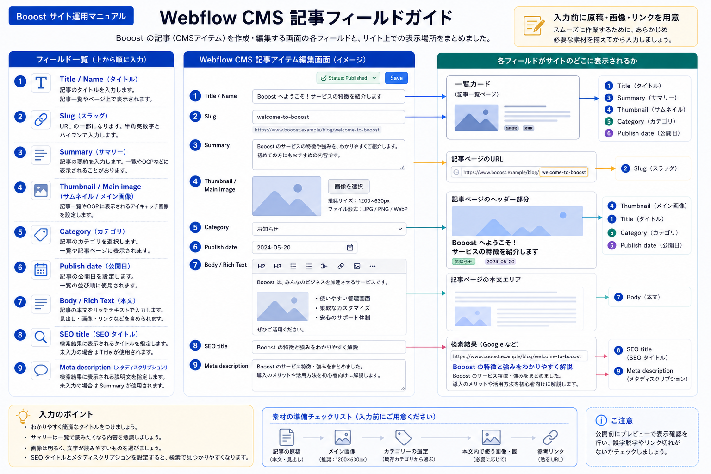
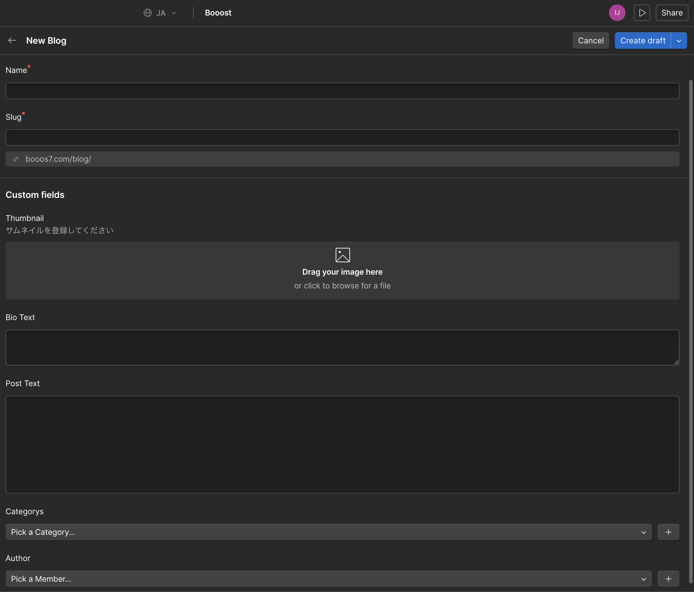

# C-27. Booost記事入力フィールド早見表

:::note[図解の見方]
どこに表示されるFieldか確認してから入力します。
:::

## こんなときに使います

Booostのブログやお知らせを作成する時に、CMS画面の入力欄を見て「どこに何を入れるのか」が分からなくなった場合に使います。

CMSの項目名はサイトごとに少し違います。このページでは、Booostの記事投稿で迷いやすい項目を、初心者向けにまとめます。

## 入力欄の見方

| 入力欄 | 入れる内容 | 注意点 |
| --- | --- | --- |
| Name / Title | 記事の正式タイトル | 一覧ページや記事ページに表示されます |
| Slug | URLの末尾 | 半角英数字とハイフンで短く作ります |
| Summary / Post Summary | 記事の短い説明文 | 一覧ページやSNS表示で使われる場合があります |
| Thumbnail / Main image | 一覧や記事上部に出る画像 | 横長・高画質の画像を使うことをお勧めします |
| Category | 記事の分類 | 選択肢から近いものを選びます |
| Publish date | 表示したい日付 | 過去日・未来日を間違えないように確認します |
| Body / Post Text | 記事本文 | 見出し、画像、リンク、箇条書きを整えます |
| SEO title | 検索結果向けのタイトル | 空欄の場合は通常タイトルが使われる場合があります |
| Meta description | 検索結果向けの説明文 | 長すぎず、記事内容が分かる文章にします |

## 入力する順番

1. Titleを入れます。
2. Slugを確認します。
3. Summaryを入れます。
4. ThumbnailまたはMain imageを設定します。
5. Categoryを選びます。
6. Publish dateを確認します。
7. Bodyに本文を入れます。
8. SEO titleとMeta descriptionを確認します。
9. 下書き保存して、一覧ページと詳細ページを確認します。

:::tip[先に原稿を用意する]
CMS画面に直接長文を書き始めるより、Google Docsなどでタイトル、Summary、本文、画像、リンクを用意してから入力することをお勧めします。入力漏れや途中保存忘れを防ぎやすくなります。
:::

## Slugの決め方

Slugは記事URLの末尾に使われます。日本語ではなく、半角英数字とハイフンで作ります。

良い例:

- `summer-campaign-2026`
- `new-menu-announcement`
- `how-to-book-online`

避けたい例:

- `test`
- `blog-1`
- `新しい記事`
- `2026-05-22-修正版-final`

:::caution[公開後のSlug変更]
公開後にSlugを変えると、以前のURLで記事が開けなくなる場合があります。公開前に必ず確認してください。
:::

## Summaryを書く時の目安

Summaryは、記事一覧やSNS表示で使われることがあります。本文の最初の一文をそのまま貼るよりも、「この記事で何が分かるか」を短く書くと伝わりやすくなります。

目安:

- 1〜2文で書く
- 具体的な内容を入れる
- 日付、キャンペーン名、対象サービス名を間違えない
- 誇張表現を避ける

## 画像を入れる時の確認

- 画像が粗くない
- 横に伸びたり、縦に潰れたりしていない
- 重要な文字や顔が切れていない
- 使用許可のある画像である
- 必要に応じてaltテキストを入れている

画像の詳しい操作は [サムネイル画像を設定する](/03-cms/04-thumbnail-image/) と [画像のaltテキストを入れる](/03-cms/22-image-alt/) を確認してください。

## 保存・公開前の確認

最後に、次の順で確認します。

1. Save as Draftで保存します。
2. Previewまたは下書き状態で記事ページを確認します。
3. 一覧ページに出るタイトル、画像、Summaryを確認します。
4. スマートフォン表示で本文が読みにくくないか確認します。
5. 問題がなければPublishします。

## 次に進む

新規投稿の全体手順は [C-1. ブログ記事を新規投稿する完全ガイド](/03-cms/00-blog-post-complete-guide/) を確認してください。公開前の最終確認は [C-26. CMS記事の公開前チェックリスト](/03-cms/25-cms-before-publish-checklist/) を使ってください。
