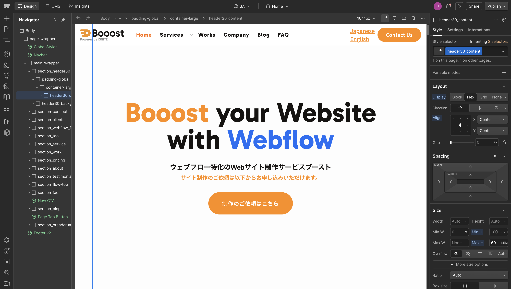

<!-- body-callout:start -->
:::caution[作業前に止まるポイント]
削除、復元、非公開、公開設定、Designer操作は影響が大きい作業です。実行ボタンを押す前に、対象ページ名、対象アイテム、公開先をもう一度確認してください。迷う場合は作業を止めて担当者へ共有します。
:::
<!-- body-callout:end -->

<strong>ここからのセクションで解説する「デザイナーモード」での操作は、Webサイトの構造やデザインに直接影響を与えるため、非常に高いリスクを伴います。</strong>

これまで何度も説明してきた通り、<strong>日常的な更新作業はContent editor roleで行うのが原則</strong>です。このセクションは、Webサイト制作会社から特別な指示があった場合や、どうしてもContent editor roleでは編集できない箇所を、リスクを十分に理解した上でピンポイントで修正するための、いわば「最終手段」のマニュアルです。

---

## 1. デザイナーモードを触る前の心構え

- <strong>自己責任の原則:</strong> デザイナーモードでの操作によってサイトの表示が崩れたり、正常に機能しなくなったりした場合、その復旧は多くの場合、制作会社の有償サポートとなります。操作は自己責任で行うという強い認識を持ってください。

- <strong>目的意識を明確に:</strong> 「なんとなく触ってみる」のは絶対にやめてください。「トップページのこの一文だけを修正する」というように、目的と操作箇所を明確に限定し、それ以外の場所は絶対に触らないようにしてください。

- <strong>バックアップの確認:</strong> 操作を行う前に、サイトのバックアップが正常に取られているかを確認することをお勧めします（[サイトのバックアップを確認・復元する方法](/06-troubleshooting/05-backup-restore/)参照）。万が一の時に、操作前の状態に戻せるようにしておくことが重要です。

- <strong>迷ったら触らない:</strong> 少しでも操作に不安を感じたり、画面の意味が理解できない場合は、すぐに作業を中断し、[IGNITE公式サイトのお問い合わせフォーム](https://igni7e.jp/contact/) から相談してください。それが最も安全で確実な方法です。

> <strong>保守依頼の目安</strong>: Designerでの操作に不安がある場合、IGNITEでは表示崩れの調査・復旧、テキスト修正、画像差し替え、CMS投稿支援、フォームの微修正などの保守・補修にも対応しています。詳しくは [任せたい時の保守・補修依頼](/06-troubleshooting/07-maintenance-request/) を確認してください。

## 2. デザイナーモードの開き方

1. <strong>Webflowにログインし、ダッシュボードを開きます。</strong>
2. 編集したいサイトのサムネイルにマウスカーソルを合わせます。
3. 表示されるメニューの中から、<strong>Wのロゴが入った「Designer」</strong>ボタンをクリックします。

   

4. 非常に多機能で複雑な、Webサイトの設計図とも言える「デザイナー」画面が起動します。

## 3. デザイナーモードの画面構成

デザイナーモードは、左側にHTML要素の階層（ナビゲーター）、右側にCSSのデザイン設定（スタイルパネル）など、専門的なパネルが多数配置されています。これらのパネルの意味を完全に理解する必要はありません。目的の箇所以外はクリックしないように、細心の注意を払いましょう。
*実画面例: Designerではサイト画面を見ながら編集します。表示されているページ以外の設定や構造にも触れるため、目的の箇所以外は操作しないでください。*

PDF資料では、Designerで文章を修正する時の入口として次のような見分け方を紹介しています。

| 画面上の状態 | 基本の考え方 |
| --- | --- |
| 青いテキストボックスとして選択できる | ダブルクリックで直接編集できる場合があります |
| 緑色のテキストボックスとして表示される | 鉛筆マークなどの編集アイコンから編集する場合があります |
| 右側パネルに文字が表示される | 右側の設定欄から編集する場合があります |

ただし、サイト構造によって画面の見え方は異なります。上記と違う表示になった場合は、自己判断で進めず [IGNITE公式サイトのお問い合わせフォーム](https://igni7e.jp/contact/) から確認してください。

---

<strong>次のステップ:</strong>
以上の注意点を十分に理解し、覚悟が決まったら、次のマニュアルに進んでください。まずは、比較的リスクの低いテキストの修正から、「[デザイナーモードで「トップページの文章」を変える方法](/04-designer/02-edit-homepage-text/)」を変える方法」を見ていきましょう。
