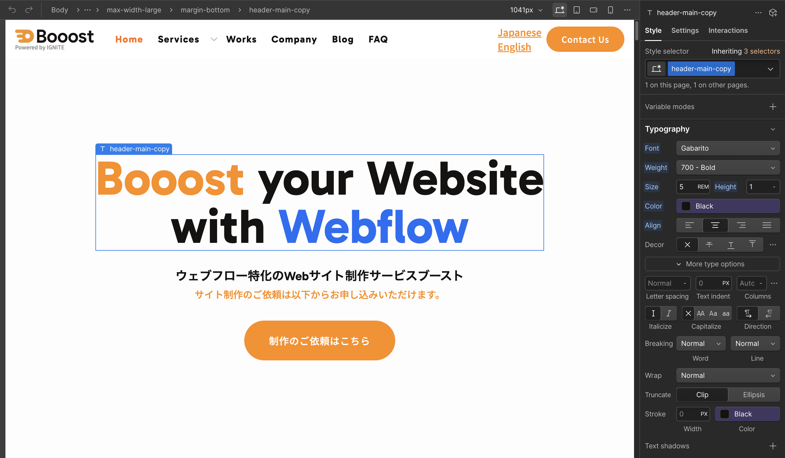

<!-- body-callout:start -->
:::caution[Designer操作の注意]
Designerはサイト全体の見た目や構造を変更できる画面です。小さな変更でも他のページに影響することがあるため、変更前後の画面を見比べながら慎重に進めます。
:::
<!-- body-callout:end -->

<strong>【注意】この操作は「デザイナーモード」で行います。[デザイナーモードを開く時の注意点](/04-designer/01-designer-warning/)の注意点を必ず読んでから、自己責任の上で実行してください。</strong>

Webサイトのフッター（最下部）などに記載されている会社の住所、電話番号、設立年月日といった情報は、通常、頻繁に変更されるものではないため、エディターではなくデザイナーでのみ編集可能になっていることがあります。ここでは、これらの情報を修正する方法を解説します。
*実画面例: 住所や電話番号の修正では、ヘッダー、フッター、問い合わせ導線など複数箇所を確認します。*

---

## 1. 対象となる情報

-   <strong>会社所在地、住所</strong>
-   <strong>電話番号、FAX番号</strong>
-   <strong>コピーライト表記の年号</strong>
-   <strong>その他、全ページ共通で表示されるが、CMS管理ではないテキスト情報</strong>

これらの多くは「シンボル（Symbol）」という、サイト全体で共通利用されるパーツの中に設定されていることが多いです。

## 2. 操作手順

操作手順は、基本的に[デザイナーモードで「トップページの文章」を変える方法](/04-designer/02-edit-homepage-text/)で解説したトップページの文章修正と全く同じです。

1.  <strong>デザイナーモードを開きます。</strong>

2.  <strong>修正したい情報があるページを表示させます。</strong>
    （フッターの情報などは、どのページを開いても表示されています）

3.  <strong>修正したい住所や電話番号のテキストをダブルクリックします。</strong>
    -   <strong>シンボル（緑色）の場合:</strong> シンボルは、最初に編集しようとすると緑色の枠で囲まれています。ダブルクリックすると、シンボルの編集モードに入り、背景が暗くなります。その状態で、さらに修正したいテキストをダブルクリックしてください。

4.  <strong>キーボードで新しい情報に書き換えます。</strong>

5.  <strong>編集が終わったら、テキストブロックの外側をクリックして確定します。</strong>
    （シンボルの編集モードに入っている場合は、右上の「Done」ボタンなどをクリックして通常モードに戻ります）

## 3. 特に注意すべき点

-   <strong>シンボル（Symbol）の編集:</strong>
    フッターなどの共通パーツは「シンボル」になっていることがほとんどです。シンボル内の要素を一つ変更すると、<strong>そのシンボルが使われているサイト内のすべてのページに、その変更が適用されます。</strong> 例えば、フッターの住所を修正すれば、全ページのフッターの住所が一括で更新されるため非常に便利ですが、間違った情報を入力すると全ページに影響が及ぶことを理解しておいてください。

-   <strong>構造は絶対に変えない:</strong>
    住所の「郵便番号」と「住所」が別々のテキストブロックになっている場合など、見た目以上に複雑な構造になっていることがあります。<strong>テキストの書き換え以外の操作（要素の移動や削除など）は絶対に行わないでください。</strong>

## 4. 【最重要】変更を公開する

修正が終わったら、必ず[変更をサイトに反映させる「Publish」ボタンの押し方](/04-designer/07-publish-button/)の手順に従って<strong>「Publish」</strong>（公開）作業を行い、変更をサイトに反映させてください。

---

<strong>次のステップ:</strong>
テキスト情報の修正はマスターしましたね。次は、少し難易度が上がる「[デザイナーモードで「ロゴ画像」を差し替える方法](/04-designer/04-replace-logo/)」を差し替える方法」です。
