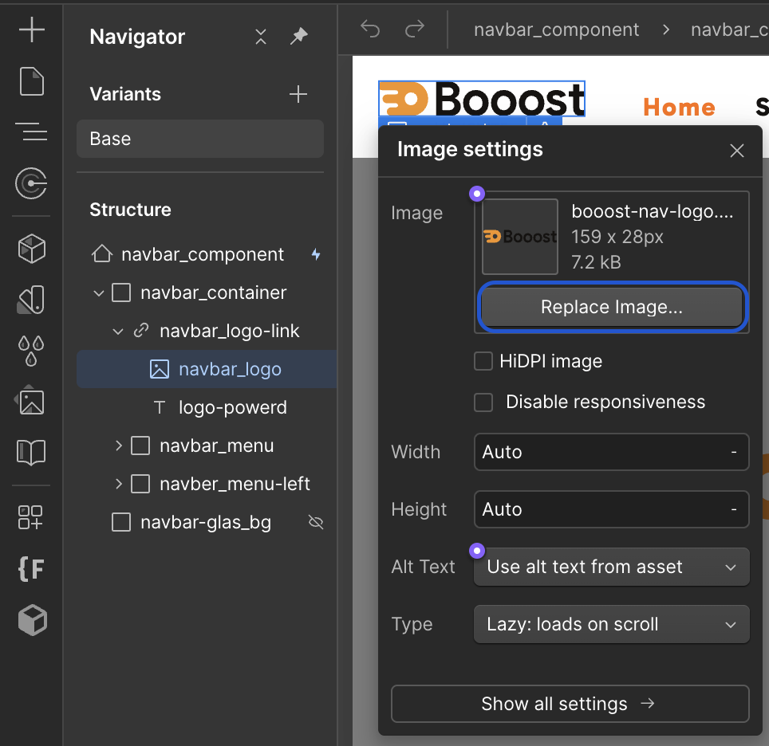
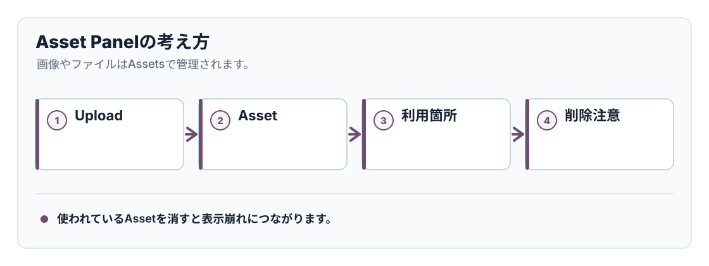

<!-- body-callout:start -->
:::caution[Designer操作の注意]
Designerはサイト全体の見た目や構造を変更できる画面です。小さな変更でも他のページに影響することがあるため、変更前後の画面を見比べながら慎重に進めます。
:::
<!-- body-callout:end -->

<strong>【注意】この操作は「デザイナーモード」で行います。[デザイナーモードを開く時の注意点](/04-designer/01-designer-warning/)の注意点を必ず読んでから、自己責任の上で実行してください。</strong>

「アセットパネル（Assets Panel）」は、このWebサイトで使用されているすべての画像、ロゴ、アイコン、PDFファイルなどを一元管理している場所です。いわば、サイト専用のファイル倉庫のようなものです。

---

## 1. アセットパネルの役割

-   <strong>ファイルの一元管理:</strong> サイト内で使用するすべての画像などを、ここにまとめてアップロードし、管理します。
-   <strong>画像の再利用:</strong> 一度アセットパネルにアップロードした画像は、サイト内の別の場所で何度も簡単に再利用することができます。
-   <strong>不要なファイルの削除:</strong> サイトで使われなくなった画像をサーバーから削除し、整理することができます。

## 2. アセットパネルの開き方

デザイナーモードの左側にある、縦に並んだアイコンメニューの中から、<strong>写真のようなアイコン</strong>をクリックします。これがアセットパネルを開くボタンです。

クリックすると、画面の左側にアセットパネルが開き、アップロード済みの画像などが一覧で表示されます。

## 3. アセットパネルの基本的な使い方

### 画像をアップロードする方法

1.  アセットパネルの上部にある、雲のマークの「<strong>Upload</strong>」ボタンをクリックします。
2.  PCのファイル選択ウィンドウが開くので、アップロードしたい画像ファイル（複数選択可）を選び、「開く」をクリックします。
3.  選択したファイルがアセットパネルにアップロードされます。

### 画像を検索する方法

画像が増えてくると、目的の画像を探すのが大変になります。アセットパネルの上部にある<strong>検索バー</strong>にファイル名の一部を入力すると、該当する画像を絞り込んで表示することができます。

### 表示形式を切り替える方法

検索バーの右側にあるアイコンで、画像の表示を大きなグリッド表示と、ファイル名が見やすいリスト表示に切り替えることができます。

## 4. アセットパネルを使う上での注意点

-   <strong>整理整頓を心がける:</strong> 同じ画像を何度もアップロードしたり、使わない画像を放置したりすると、アセットパネルが煩雑になり、サイトの管理がしにくくなります。定期的な整理を心がけましょう。
-   <strong>ファイル名は分かりやすく:</strong> アップロードするファイルには、`hero-image-01.jpg` や `service-icon-blue.svg` のように、内容が推測しやすい半角英数字の名前を付けておくと、後から検索しやすくなります。

---

<strong>次のステップ:</strong>
アセットパネルの役割がわかりました。次は、このパネルを使って、不要になった画像をサーバーから完全に削除する方法「[不要になった画像をサーバーから削除する方法](/04-designer/06-delete-asset/)」です。

:::note[図解の見方]
使われているAssetを消すと表示崩れにつながります。
:::

