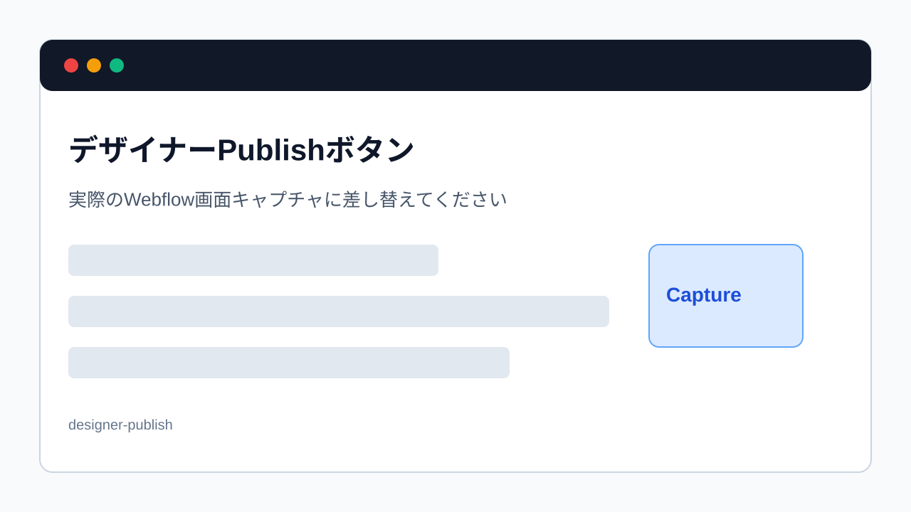

> 旧マニュアル番号: [No.44](/04-designer/07-publish-button/)

<strong>このマニュアルは、デザイナーモードでの作業において、[No.15](/02-editor/07-save-and-publish/)と並んで最も重要な手順です。</strong>

デザイナーモードでテキストや画像をどれだけ変更しても、この「公開（Publish）」作業を完了しない限り、その変更は一般のサイト訪問者には一切見えません。すべてのデザイナーモードでの作業の締めくくりとなる、必須の操作です。

---

## 1. デザイナーモードでの「Publish」とは？

デザイナーモードで行った変更（下書き状態）を、インターネット上の本番環境のサイトにアップロードし、全世界に公開する作業です。Content editor roleでのPublishと役割は同じですが、操作する場所や公開範囲が異なる場合があります。

## 2. 公開する手順

1.  <strong>デザイナーモードの右上にある「Publish」ボタンを探す:</strong>
    デザイナーモードの画面、右上の青いボタン群の中に、<strong>「Publish」</strong>という一番目立つボタンがあります。これをクリックします。

    
    *※画像はイメージです。*

2.  <strong>公開先ドメインの確認:</strong>
    クリックすると、公開先のドメイン（Webサイトのアドレス）が表示されたポップアップウィンドウが開きます。通常、本番用のドメイン（例: `www.your-site.com`）にチェックが入っています。この設定は変更する必要はありません。

3.  <strong>「Publish to Selected Domains」ボタンをクリック:</strong>
    ウィンドウの右下にある、青い<strong>「Publish to Selected Domains」</strong>（選択したドメインに公開）ボタンをクリックします。

4.  <strong>公開処理の実行:</strong>
    公開処理が始まります。緑色のプログレスバーが表示され、処理中はクルクルとアイコンが回ります。サイトの規模によっては、完了まで数十秒〜数分かかる場合があります。このまま待ちます。

5.  <strong>公開完了の確認:</strong>
    処理が完了すると、「<strong>Published successfully!</strong>」というメッセージと緑色のチェックマークが表示されます。これで、デザイナーモードで行ったすべての変更が、本番のWebサイトに無事反映されました。

6.  <strong>ウィンドウを閉じる:</strong>
    ポップアップウィンドウの外側をクリックするか、右上の「×」ボタンでウィンドウを閉じます。

## 3. 公開後の最終確認

操作が完了したら、必ず実際のWebサイト（シークレットモードや別のブラウザで開くと、より確実です）にアクセスし、変更が意図した通りに反映されているかを、ご自身の目で最終確認してください。

可能であれば、いきなり本番ドメインだけで確認せず、テスト用ドメインやWebflow側のプレビューで表示を確認してから本番公開してください。多言語サイトの場合は、JapaneseとEnglishなど、変更したLocaleの公開状態も確認します。

もし変更が反映されていないように見える場合は、「[No.53](/06-troubleshooting/01-cache-not-reflecting/)」で解説する「キャッシュ」が原因の可能性があります。ブラウザのスーパーリロード（`Ctrl+F5` / `Cmd+Shift+R`）を試してみてください。

---

<strong>次のステップ:</strong>
デザイナーモードでの公開作業、お疲れ様でした。次は、万が一の時のためのお守りとなる、「[No.45](/04-designer/08-undo-ctrl-z/) 【お守り】操作を間違えた！一つ前に戻す方法 (Ctrl+Z)」です。
