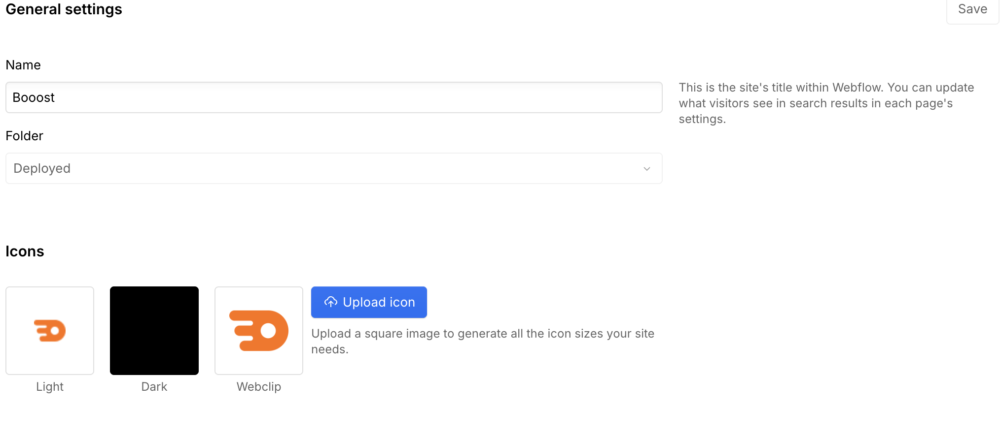

<!-- body-callout:start -->
:::tip[反映タイミングの目安]
Webflow上で保存しても、Google検索結果やSNSのプレビューはすぐに変わらないことがあります。Webflowの公開確認と、検索エンジンやSNS側の反映確認は分けて考えると混乱しにくくなります。
:::
<!-- body-callout:end -->

ブラウザのタブやブックマーク一覧に表示される <strong>小さなアイコン</strong> を「ファビコン（Favicon）」と呼びます。ブランディングの基本要素です。

---

## 1. ファビコンとは？

ブラウザのタブの左端、またはブックマークバーに表示される小さなアイコンのことです。

例:
- Google タブ → カラフルな「G」
- Apple タブ → りんごマーク
- 自社サイト → 自社ロゴの簡易版

ロゴをそのまま小さくしたものや、ロゴの一部（マーク部分のみ）を使うことが多いです。

## 2. 準備するファイル

ファビコンは2種類用意するのがベストプラクティスです：

| 用途 | サイズ | 形式 |
|---|---|---|
| <strong>Favicon（標準）</strong> | 32×32 px | PNG または ICO |
| <strong>Webclip（iOSホーム画面用）</strong> | 256×256 px | PNG |

> <strong>ヒント</strong>: デザイナーが用意したファビコン用画像があるはずです。<strong>制作担当者から受け取ったファイル</strong> を使ってください。

## 3. Webflow での変更手順

1. Webflow にログインし、対象サイトの <strong>Project Settings</strong> を開く
2. 左メニューから <strong>「General」</strong> タブを選択
3. <strong>「Favicon & Webclip」</strong> セクションまでスクロール
4. <strong>Favicon</strong> の <strong>Upload</strong> ボタンをクリックして 32×32 px のファイルをアップロード
5. <strong>Webclip</strong> の <strong>Upload</strong> ボタンをクリックして 256×256 px のファイルをアップロード
6. ページ下部の <strong>Save Changes</strong> をクリック
7. <strong>Designer モードを開いて Publish</strong> することで、サイトに反映されます

*実画面例: FaviconとWebclipは、Project SettingsのGeneral内でそれぞれアップロードします。*

## 4. 反映確認

ファビコンはブラウザに強くキャッシュされるため、<strong>変更後すぐに反映されない</strong> ことがあります。

確認方法:
1. ブラウザで対象サイトを開く
2. <strong>スーパーリロード</strong>（Windows: Ctrl+F5 / Mac: Cmd+Shift+R）
3. それでも反映されない場合は <strong>シークレットモード</strong> で開く
4. しばらく時間を置いて再確認

## 5. よくある質問 (Q&A)

#### Q. ファビコンが正方形でないとどうなりますか？

ブラウザによっては自動で正方形にトリミングされ、変な見た目になります。<strong>必ず正方形（1:1）</strong> で用意してください。

#### Q. ロゴを小さくしただけだと潰れて見えません。どうすれば？

ロゴの一部（マーク部分のみ）を使うか、<strong>32×32 px 専用に再デザイン</strong> されたものを [IGNITE公式サイトのお問い合わせフォーム](https://igni7e.jp/contact/) から依頼するのがおすすめです。

#### Q. SVG 形式は使えますか？

最近の Webflow は SVG ファビコンに対応していますが、<strong>互換性を重視するなら PNG</strong> が無難です。

---

<strong>次のステップ:</strong>
既存ページを複製して新しいページを作る方法を学びましょう → 「既存ページを複製して新しいページを作る」
