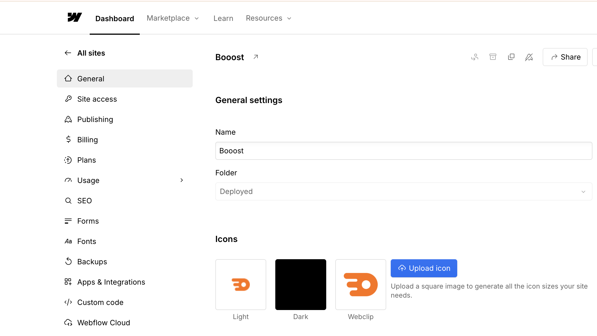

<!-- body-callout:start -->
:::note[個人情報の取り扱い]
フォーム送信内容や通知先メールアドレスには個人情報が含まれることがあります。画面共有やキャプチャーを送る時は、氏名、メールアドレス、問い合わせ本文が必要以上に写らないようにしてください。
:::
<!-- body-callout:end -->

# フォーム回答・CSV・プラン変更の確認ガイド

この章では、サイト運用でよく使う設定・確認作業をまとめます。特にお問い合わせフォームの回答確認、CSVダウンロード、公開前のプラン変更は、運用開始後によく必要になります。
*実画面例: Site settingsでは、左側メニューからForms、SEO、Publishing、Backups、Plansなどを切り替えます。*

## フォーム回答を確認する

Webflowのフォームに送信された内容は、サイト設定やフォーム関連メニューから確認できます。フォームが複数ある場合は、フォーム名を確認して対象を間違えないようにしてください。
*実画面例: Formsでは、フォーム送信履歴や通知設定の確認に進みます。*

詳しい手順は [お問い合わせフォームから連絡が来たか確認する方法](/05-settings/04-form-submissions/) を確認してください。

## CSVでダウンロードする

フォーム回答を集計・分析・バックアップしたい場合は、CSV形式でダウンロードします。CSVはExcelやGoogle Sheetsで開ける表形式のファイルです。

作業の流れ:

1. フォーム回答画面を開きます。
2. 対象フォームを選びます。
3. CSV exportまたはDownload CSVに相当するボタンを探します。
4. ダウンロードしたCSVを開き、文字化けや欠損がないか確認します。
5. ファイル名に日付を入れて保管します。

詳しい手順は [お問い合わせデータをCSVでダウンロードする方法](/05-settings/06-form-csv-download/) を確認してください。

## CSVを開くと文字化けする場合

ExcelでCSVを直接開くと、日本語が文字化けすることがあります。その場合は、Excelの「データ」からCSVを読み込み、文字コードに `UTF-8` を指定してください。

## 通知メールを確認する

フォーム送信に気づけるよう、通知先メールアドレスが正しいか確認してください。担当者変更があった場合は、フォーム通知先も忘れずに更新します。

詳しい手順は [通知メールアドレスを変更する方法](/05-settings/05-form-notification-email/) を確認してください。

## 公開前にプランを確認する

Webflowサイトを独自ドメインで公開したり、CMSを使ったりする場合は、有料プランが必要になることがあります。プラン変更は料金が発生する作業のため、実行前に社内確認を済ませてください。
*実画面例: Plansでは、現在のプランやアップグレード候補を確認します。料金に関わるため、実行前に社内確認が必要です。*

一般的な流れ:

1. Webflow Dashboardで対象サイトを確認します。
2. サイトカードの設定メニューからSite settingsを開きます。
3. Plansを開きます。
4. Website plansを確認します。
5. 必要なプランを選び、支払いサイクルを確認します。
6. 決済内容を確認してから確定します。

## SEO・SNS表示も確認する

公開前後には、検索結果やSNS共有で表示されるタイトル、説明文、OGP画像も確認します。
*実画面例: SEO関連のサイト設定を確認する画面です。ページ単位のSEO設定とは別に、サイト全体の設定も確認できます。*

## 外部連携やカスタムコードは触らない

Apps & IntegrationsやCustom codeは、計測タグ、外部ツール連携、フォーム連携などに関係することがあります。設定を変えると広告計測や問い合わせ通知に影響する可能性があるため、通常は制作担当者に依頼してください。
*実画面例: 外部サービスとの連携を確認する画面です。連携解除や追加は影響が大きいため、自己判断で変更しないでください。*

- [SEOタイトルを変更する](/05-settings/01-seo-title/)
- [SEO説明文を変更する](/05-settings/02-seo-description/)
- [OGP画像を変更する](/05-settings/03-ogp-image/)

## 理解度チェック

1. フォーム回答をCSVでダウンロードする主な目的として正しいものはどれですか？
   - A. 問い合わせ内容を集計、分析、バックアップするため
   - B. サイトのデザインを変更するため
   - C. Webflowのパスワードを変更するため

#### 答え

正解: A

CSVはフォーム回答を表形式で扱うためのファイルです。集計や保管に向いています。

2. CSVをExcelで開いたときに日本語が文字化けした場合、まず試すことはどれですか？
   - A. 文字コードをUTF-8として読み込む
   - B. フォームを削除する
   - C. Webflowのプランを解約する

#### 答え

正解: A

日本語CSVは文字コードの扱いで文字化けすることがあります。UTF-8で読み込むと改善する場合があります。

3. プラン変更を実行する前に必要なことはどれですか？
   - A. 料金が発生するため、社内確認を済ませる
   - B. 何も確認せずすぐ決済する
   - C. フォーム回答をすべて削除する

#### 答え

正解: A

プラン変更は請求に関わるため、権限者や社内ルールを確認してから進めます。

## 次に進む

フォーム回答を確認したい場合は [お問い合わせフォームの確認](/05-settings/04-form-submissions/) へ進んでください。CSVが必要な場合は [CSVダウンロード](/05-settings/06-form-csv-download/) を確認してください。
