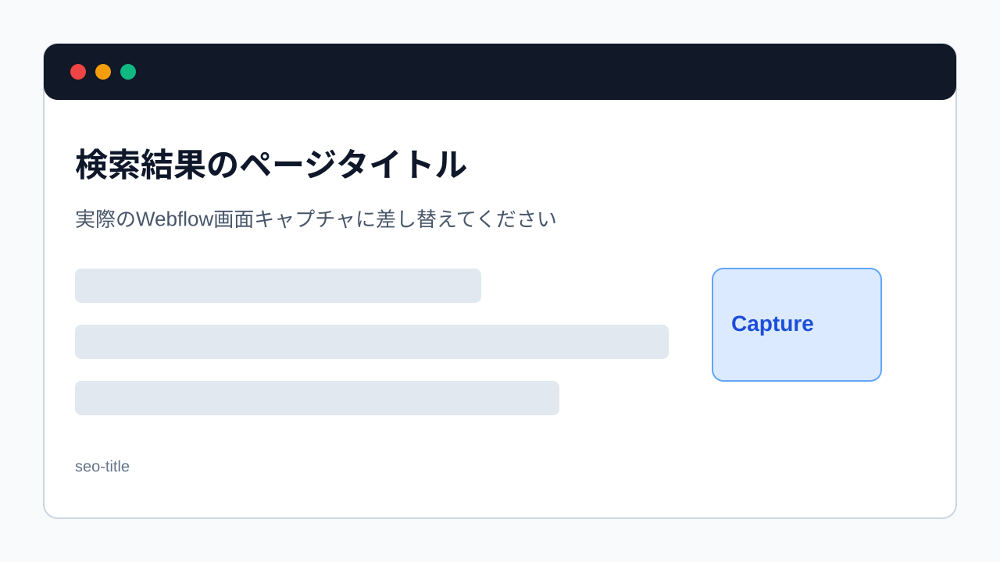

> 旧マニュアル番号: [No.47](/05-settings/01-seo-title/)

Webサイトの集客において、GoogleやYahoo!などの検索エンジンからの流入は非常に重要です。その検索結果に表示される「ページのタイトル（Title Tag）」は、ユーザーがクリックするかどうかを決める最も重要な要素の一つです。ここでは、各ページのタイトルを最適化する方法を解説します。

---

## 1. ページタイトル（Title Tag）とは？

-   **検索結果の青い文字:** Googleなどで検索した時に表示される、クリック可能な青い大きな見出しテキストのことです。
-   **ブラウザのタブ:** Webページを開いている時に、ブラウザのタブに表示されるテキストのことです。
-   **SEOの最重要項目:** 検索エンジンは、このタイトルタグを「このページが何について書かれているか」を理解するための最重要の手がかりとして利用します。

*※画像はイメージです。*

## 2. ページタイトルを設定する場所

各ページのSEO関連設定は、デザイナーモードではなく、**サイト設定（Site Settings）**または**ページ設定（Page Settings）**から行います。CMSアイテム（ブログ記事など）の場合は、CMSの編集画面から設定します。

### 静的ページ（トップページ、会社概要など）の場合

1.  **デザイナーモードを開きます。**
2.  左側のパネル群から**「Pages」**（ページのアイコン）をクリックします。
3.  ページ一覧が表示されるので、設定を変更したいページ（例: `About Us`）にカーソルを合わせ、表示される**歯車アイコン（Settings）**をクリックします。
4.  ページ設定パネルが開きます。その中の**「SEO Settings」**というセクションに**「Title Tag」**という入力欄があります。ここが設定場所です。

### CMSページ（ブログ記事、お知らせなど）の場合

1.  **CMSのアイテム編集画面を開きます。**
2.  編集パネルを一番下までスクロールすると、**「SEO Settings」**というセクションがあります。そこの**「Title Tag」**に入力します。

## 3. 効果的なページタイトルの付け方

-   **キーワードを含める:** ユーザーが検索しそうなキーワード（例: `Webflow 更新マニュアル`）を、タイトルのなるべく先頭に含めます。
-   **クリックしたくなる工夫:** 具体的な数字を入れたり（例: `5つのステップ`）、メリットを提示したり（例: `初心者でも簡単`）して、ユーザーの興味を引きます。
-   **会社名・サイト名を入れる:** タイトルの最後に `| 会社名` のようにサイト名を入れると、ブランド認知に繋がります。
-   **文字数:** PCでは約30文字、スマートフォンでは約35文字を超えると、末尾が「…」と省略される可能性が高いです。重要なキーワードは前半に配置しましょう。

**例:**
`【初心者向け】Webflow更新マニュアル | 株式会社サンプル`

## 4. 変更の反映

-   **静的ページの場合:** 変更後、サイト全体を**Publish**する必要があります。
-   **CMSページの場合:** 記事を**Publish**または**Save**すると反映されます。

**注意:** 変更がGoogleの検索結果に反映されるまでには、数日から数週間かかる場合があります。即座に変わるわけではありません。

---

**次のステップ:**
タイトルとセットで重要な、「[No.48](/05-settings/02-seo-description/) Google検索結果に出る「ページの説明文」を変更する方法 (SEO)」に進みましょう。
