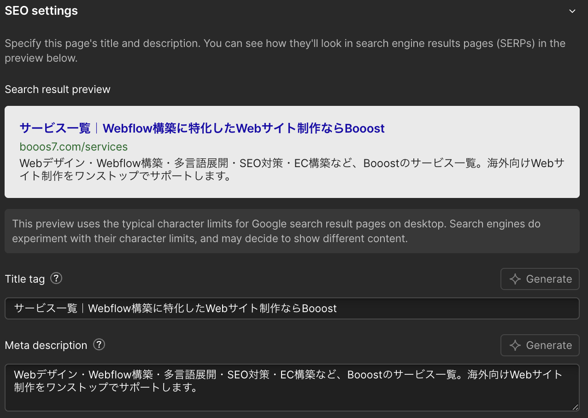
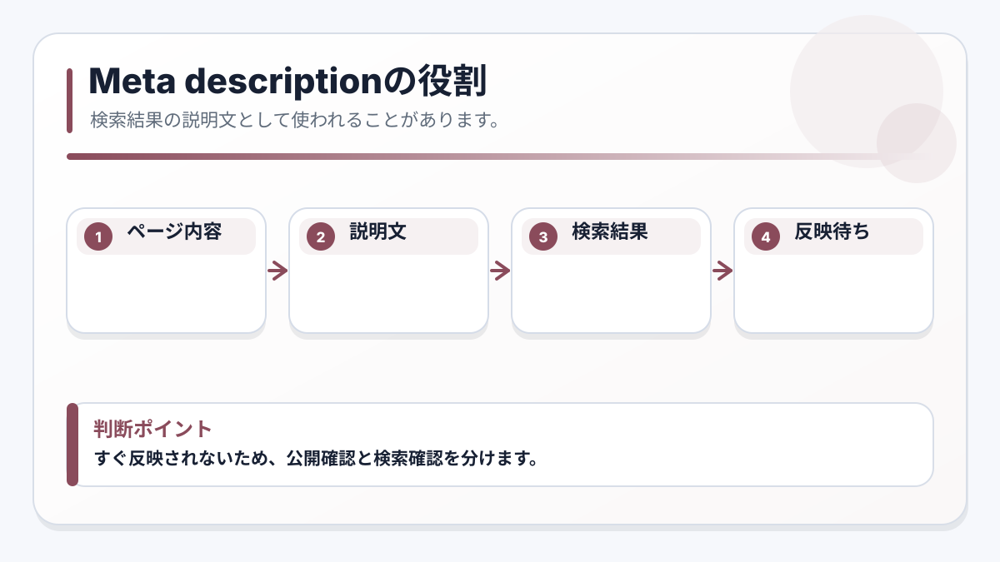

<!-- body-callout:start -->
:::tip[反映タイミングの目安]
Webflow上で保存しても、Google検索結果やSNSのプレビューはすぐに変わらないことがあります。Webflowの公開確認と、検索エンジンやSNS側の反映確認は分けて考えると混乱しにくくなります。
:::
<!-- body-callout:end -->

Google検索結果に表示される「ページの説明文（Meta Description）」は、ページのタイトルに次いで、ユーザーがそのページをクリックするかどうかを判断する重要な要素です。ここでは、この説明文を最適化する方法を解説します。

---

## 1. ページの説明文（Meta Description）とは？

-   検索結果のスニペット: Googleなどで検索した時に、ページのタイトルの下に表示される、そのページの内容を要約した短い文章のことです。
-   クリック率に影響: 検索順位には直接影響しないと言われていますが、ユーザーが「このページは自分の求めている情報があるか」を判断する材料となり、クリック率（CTR）に大きく影響します。

## 2. ページの説明文を設定する場所

[Google検索結果に出る「ページのタイトル」を変更する方法 (SEO)](/05-settings/01-seo-title/)で解説した「ページのタイトル」と同様に、各ページのSEO関連設定は、サイト設定（Site Settings）またはページ設定（Page Settings）から行います。CMSアイテム（ブログ記事など）の場合は、CMSの編集画面から設定します。
*実画面例: SEO関連の設定は、サイト全体の設定とページごとの設定があります。Meta Descriptionを変更する時は対象ページを間違えないようにします。*

### 静的ページ（トップページ、会社概要など）の場合

1.  デザイナーモードを開きます。
2.  左側のパネル群から「Pages」（ページのアイコン）をクリックします。
3.  ページ一覧が表示されるので、設定を変更したいページ（例: `Contact Us`）にカーソルを合わせ、表示される歯車アイコン（Settings）をクリックします。
4.  ページ設定パネルが開きます。その中の「SEO Settings」というセクションに「Meta Description」という入力欄があります。ここが設定場所です。

### CMSページ（ブログ記事、お知らせなど）の場合

1.  CMSのアイテム編集画面を開きます。
2.  編集パネルを一番下までスクロールすると、「SEO Settings」というセクションがあります。そこの「Meta Description」に入力します。

## 3. 効果的なページの説明文の付け方

-   ページの内容を正確に要約: そのページに何が書かれているのかを、簡潔かつ魅力的に伝えます。
-   キーワードを含める: ユーザーが検索しそうなキーワードを自然な形で含めます。ただし、キーワードを詰め込みすぎるとスパムと判断される可能性があります。
-   行動を促す言葉: 「詳しくはこちら」「解決策を見る」など、ユーザーにクリックを促す言葉を入れるのも効果的です。
-   文字数: PCでは約120文字、スマートフォンでは約80文字を超えると省略される傾向があります。重要な情報は前半に配置しましょう。

例:
`Webflowの基本的な更新方法を動画で分かりやすく解説。初心者でも簡単にサイトを更新できる手順をステップバイステップでご紹介します。`

## 4. 変更の反映

-   静的ページの場合: 変更後、サイト全体をPublishする必要があります。
-   CMSページの場合: 記事をPublishまたはSaveすると反映されます。

注意: 変更がGoogleの検索結果に反映されるまでには、数日から数週間かかる場合があります。即座に変わるわけではありません。Googleは、設定したMeta Descriptionを必ずしも表示するとは限らず、検索クエリに応じて自動生成する場合もあります。

---

次のステップ:
SEO対策の基本はこれでバッチリですね。次は、SNSでの見栄えを良くするための「[SNSでシェアされた時の画像（OGP画像）を変更する方法](/05-settings/03-ogp-image/)」です。

:::note[図解の見方]
すぐ反映されないため、公開確認と検索確認を分けます。
:::

