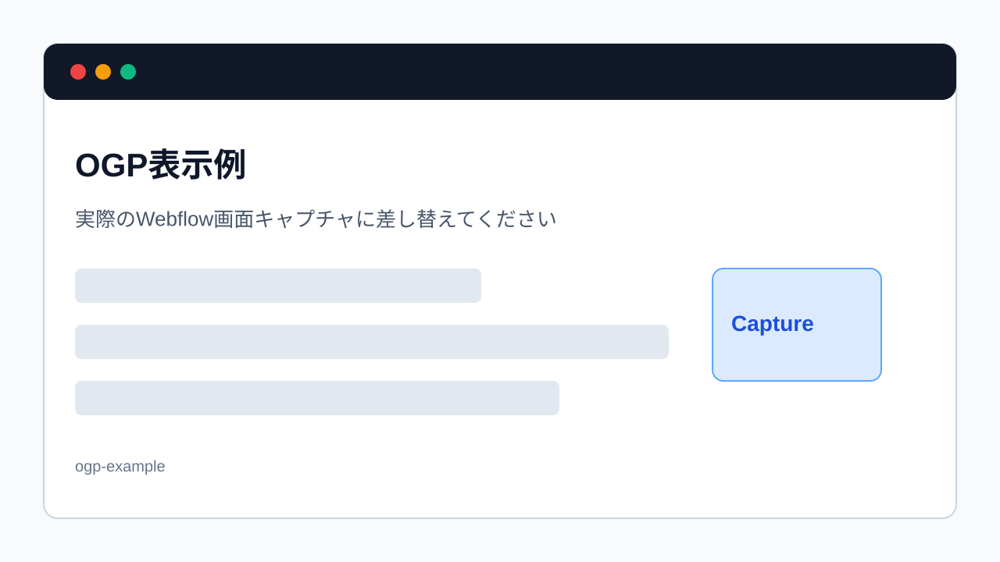

> 旧マニュアル番号: [No.49](/05-settings/03-ogp-image/)

FacebookやX (Twitter) などのSNSでWebサイトのURLがシェアされた際、自動的に表示される画像やタイトル、説明文は、その投稿がクリックされるかどうかを大きく左右します。これらは「OGP（Open Graph Protocol）」と呼ばれる設定によって制御されています。

---

## 1. OGPとは？

OGPは、WebページがSNSでシェアされた時に、どのように表示されるかを指定するための仕組みです。特に重要なのは以下の3点です。

-   **OGP画像 (og:image):** 投稿に表示される画像。視覚的なインパクトが最も大きいです。
-   **OGPタイトル (og:title):** 投稿に表示されるページのタイトル。
-   **OGP説明文 (og:description):** 投稿に表示されるページの説明文。

これらを適切に設定することで、SNSでの拡散効果を高めることができます。

*※画像はイメージです。*

## 2. OGP画像を設定する場所

OGP画像の設定場所は、ページのSEO設定と同じ場所にあります。

### 静的ページ（トップページ、会社概要など）の場合

1.  **デザイナーモードを開きます。**
2.  左側のパネル群から**「Pages」**（ページのアイコン）をクリックします。
3.  ページ一覧が表示されるので、設定を変更したいページにカーソルを合わせ、表示される**歯車アイコン（Settings）**をクリックします。
4.  ページ設定パネルが開きます。その中の**「Open Graph Settings」**というセクションに**「Open Graph Image」**という項目があります。ここが設定場所です。

### CMSページ（ブログ記事、お知らせなど）の場合

1.  **CMSのアイテム編集画面を開きます。**
2.  編集パネルを一番下までスクロールすると、**「Open Graph Settings」**というセクションがあります。そこの**「Open Graph Image」**に入力します。

## 3. OGP画像を設定する手順

1.  **「Open Graph Image」の画像アップロードエリアをクリック:**
    設定場所にある画像アップロードエリアをクリックします。

2.  **ファイル選択ウィンドウが開く:**
    お使いのパソコンのファイル選択ウィンドウが開きます。

3.  **OGP画像ファイルを選択:**
    あらかじめSNSシェア用に準備しておいた画像ファイルを選択し、「開く」ボタンをクリックします。

4.  **アップロードとプレビュー確認:**
    画像がWebflowにアップロードされ、設定欄にプレビューが表示されます。意図した画像が正しく設定されたかを確認してください。

## 4. OGP画像の推奨サイズ

-   **推奨サイズ:** `1200px × 630px` の画像が推奨されます。この比率で作成すると、主要なSNSで適切に表示されやすくなります。
-   **ファイル形式:** JPGまたはPNG。
-   **ファイルサイズ:** 1MB以下が望ましいです。

## 5. OGPタイトル・説明文の設定

OGPタイトルとOGP説明文は、通常、SEO設定の「Title Tag」と「Meta Description」が自動的に引き継がれます。もしSNS用に異なるタイトルや説明文を設定したい場合は、それぞれの入力欄に直接入力してください。

## 6. 変更の反映確認

設定を変更したら、以下のツールでSNSでの表示をシミュレーションできます。

-   **Facebook:** [Sharing Debugger](https://developers.facebook.com/tools/debug/)
-   **X (Twitter):** [Card Validator](https://cards-dev.twitter.com/validator)

URLを入力して「Debug」または「Preview card」をクリックすると、最新のOGP情報が取得され、どのように表示されるかを確認できます。

---

**次のステップ:**
SNSでの見栄えもバッチリですね。次は、Webサイトの重要な機能の一つである「お問い合わせフォーム」に関する「[No.50](/05-settings/04-form-submissions/) 「お問い合わせフォーム」から連絡が来たか確認する方法」です。
