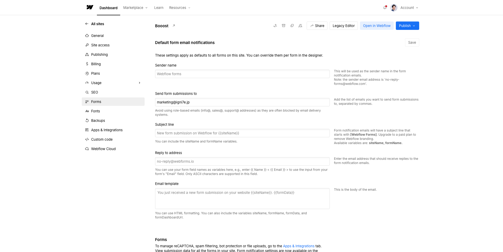

<!-- capture-callout:start -->
:::note[キャプチャー指示]
このページには、撮影後に以下のキャプチャーを入れてください。
- F-05: `src/assets/captures/manual/f-05-forms-list.png`。Site settings > Forms一覧。フォーム名、Submissions入口が分かる
- F-06: `src/assets/captures/manual/f-06-form-submissions-list.png`。Form submissions一覧。個人情報は隠す。日時とフォーム名だけ分かればよい

Webflow画面は数秒待ってから撮影し、Loading表示、個人情報、未公開情報が写っていない画像だけを使います。
:::
<!-- capture-callout:end -->

<!-- body-callout:start -->
:::note[個人情報の取り扱い]
フォーム送信内容や通知先メールアドレスには個人情報が含まれることがあります。画面共有やキャプチャーを送る時は、氏名、メールアドレス、問い合わせ本文が必要以上に写らないようにしてください。
:::
<!-- body-callout:end -->

> 旧マニュアル番号: [No.50](/05-settings/04-form-submissions/)

Webサイトに設置された「お問い合わせフォーム」は、お客様からの連絡を受け付ける重要な窓口です。フォームから送信された内容は、通常、指定されたメールアドレスに通知されるだけでなく、Webflowの管理画面内にも記録として残ります。ここでは、Webflow上でフォームの送信履歴を確認する方法を解説します。

---

## 1. フォーム送信の通知方法

お問い合わせフォームからメッセージが送信されると、主に以下の方法で通知されます。

-   <strong>メール通知:</strong>
    最も一般的な方法です。フォーム設定で指定されたメールアドレス（通常は会社の代表メールアドレスなど）に、送信内容が記載されたメールが届きます。まずはこのメールを確認するのが基本です。

-   <strong>Webflow管理画面での記録:</strong>
    メール通知と並行して、Webflowの管理画面内にも、すべてのフォーム送信履歴が自動的に記録・保存されます。メールが届かない、または見落としてしまった場合でも、ここで確認することができます。

## 2. Webflowでフォーム送信履歴を確認する手順

1.  <strong>Webflowのダッシュボードにログイン:</strong>
    まずはWebflowにログインし、ダッシュボード画面を開きます。

2.  <strong>フォーム履歴を確認したいサイトを選択:</strong>
    ダッシュボードに表示されているサイトの中から、フォーム履歴を確認したいサイトのサムネイルをクリックします。（この時は「Editor」や「Designer」ボタンではなく、サムネイル自体をクリックしてください）

3.  <strong>サイト設定画面を開く:</strong>
    クリックすると、そのサイトの概要や設定を行う画面が表示されます。左側のメニューの中から<strong>「Forms」</strong>（フォームのアイコン）をクリックします。

    :::note[キャプチャー差し込み位置]
    ここには「フォームメニュー」が分かる実画面キャプチャーを入れてください。ページ上部のキャプチャー指示にある保存ファイル名へ差し替えます。
    :::

    
    *実画面例: 左側メニューでFormsを選ぶと、フォーム関連の設定や送信履歴の確認に進めます。*

4.  <strong>フォーム送信履歴の一覧表示:</strong>
    「Forms」をクリックすると、そのサイトに設置されているフォームの一覧と、それぞれのフォームからの送信履歴（Submissions）が表示されます。

5.  <strong>詳細を確認:</strong>
    確認したいフォームの送信履歴をクリックすると、送信された日時、送信者の名前、メールアドレス、メッセージ内容など、詳細な情報が表示されます。

## 3. 確認時の注意点

-   <strong>定期的な確認:</strong> メール通知を見落とす可能性もあるため、定期的にWebflowの管理画面でフォーム送信履歴を確認する習慣をつけることをお勧めします。
-   <strong>スパム対策:</strong> フォームには、自動送信されるスパムメッセージが届くこともあります。内容をよく確認し、必要なメッセージと不要なメッセージを区別しましょう。

---

<strong>次のステップ:</strong>
フォームの確認方法はバッチリですね。次は、フォームからの通知を受け取るメールアドレスを変更したい場合の「[No.51](/05-settings/05-form-notification-email/) お問い合わせがあった時の通知メールアドレスを変更する方法」です。
