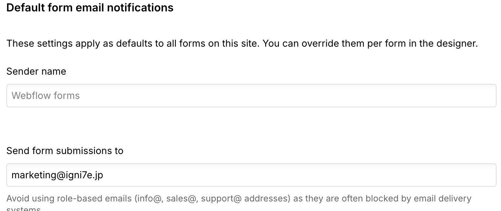

<!-- body-callout:start -->
:::note[個人情報の取り扱い]
フォーム送信内容や通知先メールアドレスには個人情報が含まれることがあります。画面共有やキャプチャーを送る時は、氏名、メールアドレス、問い合わせ本文が必要以上に写らないようにしてください。
:::
<!-- body-callout:end -->

お問い合わせフォームからメッセージが送信された際に、通知を受け取るメールアドレスを変更したい場合があります。担当者が変わったり、複数の部署で通知を受け取りたい場合などにこの設定を行います。

---

## 1. 通知メールアドレスの変更場所

通知メールアドレスの設定は、Webflowのサイト設定画面内で行います。DesignerやContent editor roleでの通常編集とは別の場所になります。

## 2. 通知メールアドレスを変更する手順

1.  <strong>Webflowのダッシュボードにログイン:</strong>
    まずはWebflowにログインし、ダッシュボード画面を開きます。

2.  <strong>通知設定を変更したいサイトを選択:</strong>
    ダッシュボードに表示されているサイトの中から、設定を変更したいサイトのサムネイルをクリックします。（「Editor」や「Designer」ボタンではなく、サムネイル自体をクリックしてください）

3.  <strong>サイト設定画面を開く:</strong>
    クリックすると、そのサイトの概要や設定を行う画面が表示されます。左側のメニューの中から<strong>「Forms」</strong>（フォームのアイコン）をクリックします。
    *実画面例: 通知メール設定は、対象サイトのFormsから確認します。*

4.  <strong>通知設定を変更したいフォームを選択:</strong>
    「Forms」をクリックすると、そのサイトに設置されているフォームの一覧が表示されます。通知設定を変更したいフォームの名前（例: `Contact Form`）をクリックします。

5.  <strong>「Email notifications」セクションを探す:</strong>
    フォームの詳細設定画面が開きます。画面を下にスクロールしていくと、「<strong>Email notifications</strong>」というセクションがあります。ここに、現在通知が送られているメールアドレスが表示されています。

    

    

    *実画面例: `Send form submissions to` の欄で、フォーム送信通知を受け取るメールアドレスを確認します。*

6.  <strong>メールアドレスを編集:</strong>
    -   既存のメールアドレスを削除したい場合は、そのメールアドレスの右側にある「×」アイコンをクリックします。
    -   新しいメールアドレスを追加したい場合は、「<strong>Add email address</strong>」ボタンをクリックし、表示された入力欄に新しいメールアドレスを入力します。
    -   複数のメールアドレスを追加することも可能です。

7.  <strong>変更を保存:</strong>
    メールアドレスの変更が完了したら、画面右上の青い<strong>「Save Changes」</strong>ボタンをクリックして、設定を保存します。

## 3. 変更後の確認

設定変更後、実際にテストでフォームを送信してみて、新しいメールアドレスに通知が届くかを確認することをお勧めします。

---

<strong>次のステップ:</strong>
通知メールアドレスの変更はこれで完了です。次は、フォームから送信されたデータをまとめて管理したい場合に便利な「[お問い合わせデータをまとめてダウンロードする方法 (CSV)](/05-settings/06-form-csv-download/)」です。
