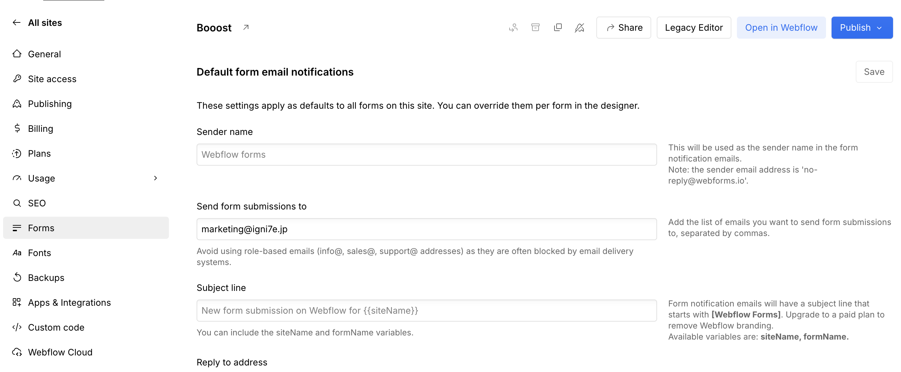

<!-- body-callout:start -->
:::note[個人情報の取り扱い]
フォーム送信内容や通知先メールアドレスには個人情報が含まれることがあります。画面共有やキャプチャーを送る時は、氏名、メールアドレス、問い合わせ本文が必要以上に写らないようにしてください。
:::
<!-- body-callout:end -->

Webflowのフォームから送信されたデータは、管理画面で個別に確認できるだけでなく、CSV（Comma Separated Values）形式のファイルとしてまとめてダウンロードすることができます。これにより、ExcelやGoogleスプレッドシートなどでデータを集計・分析したり、顧客管理システムに取り込んだりすることが可能になります。

---

## 1. CSVダウンロードのメリット

-   データ分析: 期間ごとの問い合わせ件数、特定のキャンペーンからの問い合わせ数などを集計し、マーケティング施策の効果測定に役立てることができます。
-   顧客管理: 問い合わせてきた顧客情報を一元的に管理し、営業活動やサポートに活用できます。
-   バックアップ: 万が一の事態に備え、フォームデータを手元に保管しておくことができます。

## 2. フォームデータをダウンロードする手順

1.  Webflowのダッシュボードにログイン:
    まずはWebflowにログインし、ダッシュボード画面を開きます。

2.  ダウンロードしたいフォームがあるサイトを選択:
    ダッシュボードに表示されているサイトの中から、フォームデータをダウンロードしたいサイトのサムネイルをクリックします。（「Editor」や「Designer」ボタンではなく、サムネイル自体をクリックしてください）

3.  サイト設定画面を開く:
    クリックすると、そのサイトの概要や設定を行う画面が表示されます。左側のメニューの中から「Forms」（フォームのアイコン）をクリックします。
    *実画面例: CSVダウンロードも、まず対象サイトのForms画面から進みます。*

4.  ダウンロードしたいフォームを選択:
    「Forms」をクリックすると、そのサイトに設置されているフォームの一覧が表示されます。データをダウンロードしたいフォームの名前（例: `資料請求フォーム`）をクリックします。

5.  「Export to CSV」ボタンをクリック:
    フォームの詳細設定画面が開きます。画面の右上に、「Export to CSV」というボタンがあります。これをクリックします。

    

6.  ダウンロードの開始:
    クリックすると、自動的にCSVファイルのダウンロードが開始されます。ファイル名は通常、`[フォーム名]-submissions-[日付].csv` のようになります。

7.  CSVファイルを開く:
    ダウンロードしたCSVファイルを、Excel、Googleスプレッドシート、Numbersなどの表計算ソフトで開きます。文字化けしている場合は、ファイルのエンコーディングを「UTF-8」で指定して開いてみてください。

## 3. ダウンロードデータの活用

ダウンロードしたCSVファイルには、フォームの各入力項目（名前、メールアドレス、メッセージ内容など）が列として、各送信データが行として記録されています。これを活用して、様々な分析や管理を行ってください。

---

## 理解度チェック

1. CSVダウンロードを行う場所として正しいものはどれですか？
   - A. 対象サイトのフォーム回答画面
   - B. ブラウザのブックマーク画面
   - C. Webflow Universityのトップページ

#### 答え

正解: A

フォーム回答は対象サイトごとに管理されています。フォームが複数ある場合は、フォーム名を確認してからダウンロードします。

2. CSVファイルを開いたときに日本語が文字化けした場合、確認することはどれですか？
   - A. UTF-8で読み込めているか
   - B. 画像の横幅が大きすぎないか
   - C. Slugが日本語になっていないか

#### 答え

正解: A

CSVの文字化けは文字コードが原因のことがあります。ExcelやGoogleスプレッドシートでUTF-8として読み込みます。

3. ダウンロード後の管理として適切なものはどれですか？
   - A. 日付やフォーム名が分かるファイル名で保管する
   - B. どのフォームのデータか分からない名前で保存する
   - C. ダウンロードしたら中身を確認せず削除する

#### 答え

正解: A

後から確認しやすいように、フォーム名と日付が分かる名前で保管します。個人情報を含む場合は取り扱いにも注意してください。

次のステップ:
お問い合わせフォームの管理はこれで完了です。次は、Webサイト運用でよくある疑問やトラブルの解決策をまとめた「G. トラブル解決」に進みます。まずは[「変更を保存したのに、サイトに反映されません！」なぜ？（キャッシュ解説）](/06-troubleshooting/01-cache-not-reflecting/)です。
