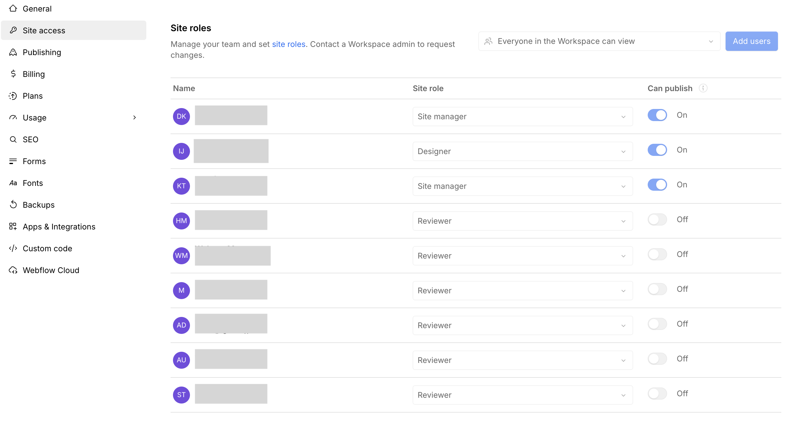

<!-- body-callout:start -->
:::caution[設定変更の注意]
Site settingsはサイト全体に影響する項目が多い画面です。SEO、フォーム、ドメイン、権限まわりは、変更前に現在の状態を控えてから作業します。
:::
<!-- body-callout:end -->

:::note[キャプチャー指示]
撮影する画面: Site settings内のSite access画面。
保存ファイル名: `f-08-site-access-overview.png`
撮影直前の状態: Site accessの読み込み完了後、メンバー一覧と権限列が見えている状態。
必ず写すもの: Site access見出し、Members一覧、Role、Can publish、Invite memberまたはInvite client。
写さないもの: 氏名、メールアドレス、他社メンバー、請求情報。
この画像で読者に確認してほしいポイント: 編集できる人と公開できる人を確認する画面。
:::

> 新規追加（標準スコープ補完）

社内で複数人がサイトを更新する場合、メンバーごとにWebflowのSeatとSite roleを割り当てます。これにより、誰がいつ編集したか、誰が公開できるかを管理できます。

---

## 1. 編集権限の種類

Webflowでは、Workspace roleとSite roleによってできることが変わります。日常運用でよく使うSite roleは次の通りです。

| 権限 | できること | 想定ユーザー |
|---|---|---|
| <strong>Content editor</strong> | テキスト、画像、リンク、CMS itemを更新 | クライアントの運用担当者 |
| <strong>Marketer</strong> | コンポーネントを使ったページ作成やコンテンツ更新 | マーケティング担当者 |
| <strong>Reviewer</strong> | 閲覧、コメント、レビュー | 承認担当者 |
| <strong>Designer</strong> | レイアウト、スタイル、構造の編集 | 制作会社・上級担当者 |
| <strong>Site manager</strong> | サイト設定、権限、公開、契約に近い管理 | 管理者 |

> <strong>ヒント</strong>: 通常のクライアント運用は <strong>Content editor</strong> が基本です。ページ制作まで任せる場合は Marketer、確認だけなら Reviewer を検討します。DesignerやSite managerは影響範囲が大きいため、必要な人だけに限定します。

## 2. Content editorを招待する手順

1. Webflowにログインし、WorkspaceのTeam settingsまたは対象サイトのSite accessを開きます。
   *実画面例: Site accessでは、サイトに入れるメンバーや権限を確認します。*

   :::note[キャプチャー指示]
   撮影する画面: 対象サイトのSite settings左メニューからSite accessを選ぶ直前、または選んだ直後の画面。
   保存ファイル名: `f-09-site-settings-site-access-menu.png`
   撮影直前の状態: Site settingsを開き、左メニューにSite accessが見えている状態。
   必ず写すもの: 対象Site名、Site settings、Site accessメニュー、左メニューの位置関係。
   写さないもの: 請求情報、個人メールアドレス、APIキー、他社Site名。
   この画像で読者に確認してほしいポイント: Membersや権限を確認する時に、Settingsのどこへ入るか。
   :::

2. <strong>Invite member</strong> または <strong>Invite client</strong> を選びます。

   :::note[キャプチャー指示]
   撮影する画面: Invite memberまたはInvite clientを開く直前のSite access画面。
   保存ファイル名: `f-10-invite-member-button.png`
   撮影直前の状態: Site accessで招待ボタンが見えており、まだ招待を送信していない状態。
   必ず写すもの: Invite memberまたはInvite client、Members一覧の見出し、Role列。
   写さないもの: 既存メンバーの氏名、メールアドレス、請求情報。
   この画像で読者に確認してほしいポイント: 新しい担当者を追加する入口。
   :::

3. 招待相手のメールアドレスを入力します。
4. SeatとSite roleで <strong>Content editor</strong> を選びます。
5. 必要に応じて <strong>Can publish</strong> をオンまたはオフにします。

   :::note[キャプチャー指示]
   撮影する画面: 招待または権限編集画面で、Site roleとCan publishを選ぶ部分。
   保存ファイル名: `f-11-role-can-publish-setting.png`
   撮影直前の状態: メール送信前、または権限保存前で止め、RoleとCan publishの選択肢が見えている状態。
   必ず写すもの: Site role、Content editor、Can publish、保存または招待前であることが分かるボタン。
   写さないもの: 招待相手の実メールアドレス、氏名、請求情報。
   この画像で読者に確認してほしいポイント: 編集権限と公開権限は別に設定すること。
   :::

6. 内容を確認して招待を送信します。

招待された相手には Webflow から招待メールが届きます。受信側の操作は「招待メールを確認しよう」と同じ流れです。

## 3. メンバーを削除・権限変更する手順

1. WorkspaceのTeam settingsまたは対象サイトのSite accessを開きます。
2. 対象メンバーを選びます。
3. Site role、Site access、Can publishを見直します。
4. 不要なメンバーはRemoveします。

:::note[キャプチャー指示]
撮影する画面: 既存メンバーの権限編集メニュー、またはRole変更メニュー。
保存ファイル名: `f-12-existing-member-role-edit.png`
撮影直前の状態: 対象メンバーの行を開き、RoleやCan publishを確認できる状態。保存や削除は実行しない。
必ず写すもの: Role変更メニュー、Can publish、Removeまたは権限変更に進む入口。
写さないもの: 氏名、メールアドレス、他社メンバー、請求情報。
この画像で読者に確認してほしいポイント: 編集できない・Publishできない時に既存メンバーの権限を見る場所。
:::

退職者など、サイト編集権限を持たせるべきでないメンバーは <strong>必ず削除</strong> しましょう。

## 4. Seatと人数の考え方

2026年現在、Legacy Editorは廃止に向けて移行中です。既存のLegacy Editorユーザーは、Limited seatまたはClient seatに移行され、Content editor roleが割り当てられる流れです。

- Client seatは、フリーランサー・代理店向けWorkspaceでクライアントに付与するSeatです。
- Limited seatは、Content editorやMarketerなど限定的な役割を付与するSeatです。
- 招待できる人数や料金はWorkspace planによって変わります。

> <strong>ヒント</strong>: 人数上限や料金は変更されるため、招待前にWebflow公式の最新プランとWorkspace設定を確認してください。

## 5. 招待時のベストプラクティス

- <strong>個人の業務メールアドレス</strong> を使う（共有メールは避ける）
- <strong>退職時は速やかに削除</strong>
- <strong>本当に必要なメンバーのみ</strong> に絞る
- 通常更新は <strong>Content editor</strong> を基本にする
- 公開権限が不要な人は <strong>Can publishをオフ</strong> にする
- DesignerやSite managerは必要な人だけに限定する

## 6. よくある質問 (Q&A)

#### Q. 招待メールが相手に届きません。

迷惑メールフォルダを確認してもらってください。それでも届かない場合は、Team settingsまたはSite accessから再送してください。

#### Q. 招待した相手のメールアドレスを変更したいです。

一度 <strong>Remove して、新しいアドレスで再招待</strong> してください。直接の変更機能はありません。

#### Q. 制作会社（IGNITE）の担当者は Designer 権限を持っていますか？

サイトのメンテナンス・改修作業のために、必要に応じてDesignerまたは管理権限を保持します。運用担当者には、作業範囲に応じてContent editor、Marketer、ReviewerなどのSite roleを割り当てます。

---

<strong>次のステップ:</strong>
独自ドメインがちゃんと接続されているか確認する方法を学びましょう → 「独自ドメインの接続状態を確認する」
