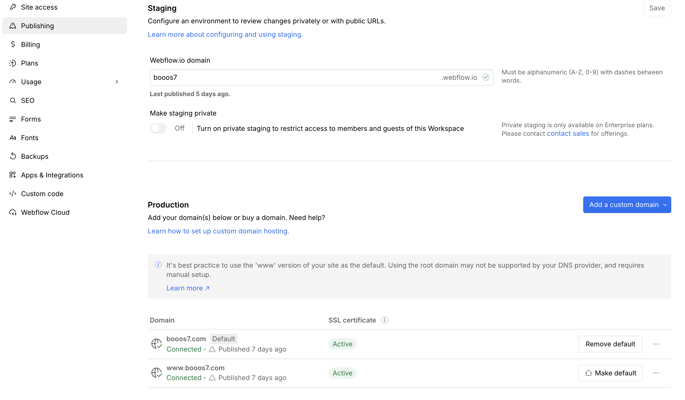
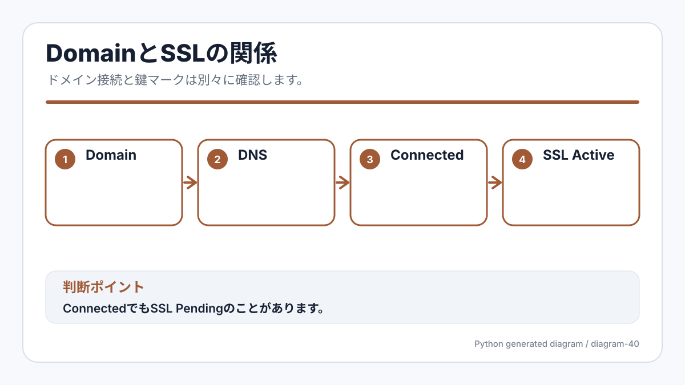

<!-- body-callout:start -->
:::caution[公開前チェック]
Publishする前に、公開先ドメイン、変更したページ、スマートフォン表示、リンク先を確認します。公開後は一般の閲覧者に見えるため、少しでも不安があればスクリーンショットを撮って確認してから進めます。
:::
<!-- body-callout:end -->

:::note[公式画像]
上の画像はWebflow公式Hostingページの画像です。Morbidoで確認する時は、公式画像で全体像をつかみ、実際のDomain / SSL状態はWebflowのPublishing設定で確認してください。
:::

> 新規追加（標準スコープ補完）

「`example.com` のような独自ドメインで自社サイトを公開している」場合、その接続状態と SSL 証明書（鍵マーク）が正しく機能しているかを定期的に確認しておきましょう。

---

## 1. なぜ確認が必要なのか？

独自ドメインは <strong>DNS（ドメイン管理）会社</strong> と <strong>Webflow（ホスティング）</strong> の間で連携設定されています。以下のような状況では設定が崩れることがあります：

- DNS 管理会社を引っ越した
- ドメインの更新（年次更新）を忘れた
- DNS の設定値が誤って変更された
- SSL 証明書の自動更新に失敗した

これらが発生すると <strong>サイトが表示されなくなる</strong> または <strong>「保護されていない通信」警告</strong> が出ます。

## 2. 接続状態の確認手順

1. Webflow にログイン → 対象サイトの <strong>Project Settings</strong> を開く
2. 左メニューから <strong>「Publishing」</strong> タブを選択
*実画面例: Publishingでは、公開先ドメインや公開状態を確認します。ドメインやSSLの状態を見る時の入口です。*

:::note[キャプチャー差し込み位置]
撮影する画面: Site settingsのPublishing / Domain設定、またはWebflow公式Hosting画像。
保存ファイル名: `b-36-official-hosting-domain.png`
撮影直前の状態: Production domain、SSL、Connected状態が分かる画面でロード完了後に撮る。
必ず写すもの: Production domain、Connected、SSL Active、Publishing画面であること。
写さないもの: DNS設定値の詳細、請求情報、カード情報、他社ドメイン。
:::

3. <strong>「Production」</strong> セクションを確認
4. 接続済みドメインの右側に <strong>緑のチェックマーク（Connected）</strong> が表示されているか確認
5. <strong>「SSL」</strong> ステータスが <strong>「Active（有効）」</strong> になっているか確認

### 状態の見方

| ステータス | 意味 | 対応 |
|---|---|---|
| 正常: Connected + SSL Active | 正常 | 何もしなくてOK |
| 注意: Connected + SSL Pending | 接続OK、SSL発行待ち | 数時間後に再確認 |
| 問題あり: Issues / Disconnected | DNS設定に問題 | [IGNITE公式サイトのお問い合わせフォーム](https://igni7e.jp/contact/) から連絡 |

## 3. ドメインの有効期限を確認する

Webflow 上では <strong>ドメインの有効期限は確認できません</strong>。ドメイン管理会社（お名前.com、ムームードメイン、Google Domains など）にログインして確認します。

> <strong>ヒント</strong>: <strong>ドメインの有効期限切れ</strong> は最も多い「サイトが急に見れなくなる」原因です。<strong>自動更新の設定</strong> を有効にしておきましょう。

## 4. SSL 証明書の確認

ブラウザで自社サイトを開き、URL バーに <strong>鍵マーク</strong> が表示されているか確認します。

- 鍵マーク表示 → SSL 正常
- 警告マーク表示 → SSL に問題あり（証明書期限切れなど）

警告が出ている場合は <strong>すぐに [IGNITE公式サイトのお問い合わせフォーム](https://igni7e.jp/contact/) からご連絡</strong> ください。

## 5. 主要ブラウザでの表示確認

念のため、主要ブラウザで表示確認することをおすすめします：

- Google Chrome
- Safari（Mac / iPhone）
- Microsoft Edge
- Firefox

特に <strong>iPhone の Safari</strong> で確認すると、SSL に問題がある場合に明確な警告が出ます。

## 6. よくある質問 (Q&A)

#### Q. 「Connected」なのにサイトが表示されません。

ブラウザのキャッシュ、または DNS 反映の遅延の可能性があります。<strong>スーパーリロード</strong> と <strong>時間を置いた再確認</strong> を試してください。それでも復旧しない場合は [IGNITE公式サイトのお問い合わせフォーム](https://igni7e.jp/contact/) からご連絡ください。

#### Q. SSL の更新は自分でやる必要がありますか？

Webflow がホスティングしている場合は <strong>自動更新</strong> されます。手動操作は不要です。

#### Q. ドメインの「DNS設定」を変更したいです。

<strong>絶対に自分で操作しないでください</strong>。誤った設定でサイトが見れなくなります。<strong>必ず [IGNITE公式サイトのお問い合わせフォーム](https://igni7e.jp/contact/) からご相談</strong> ください。

---

<strong>次のステップ:</strong>
検索エンジンへの表示制御（sitemap・noindex）について学びましょう → 「検索エンジンの表示制御（sitemap・noindex）」

:::note[図解の見方]
ConnectedでもSSL Pendingのことがあります。
:::

